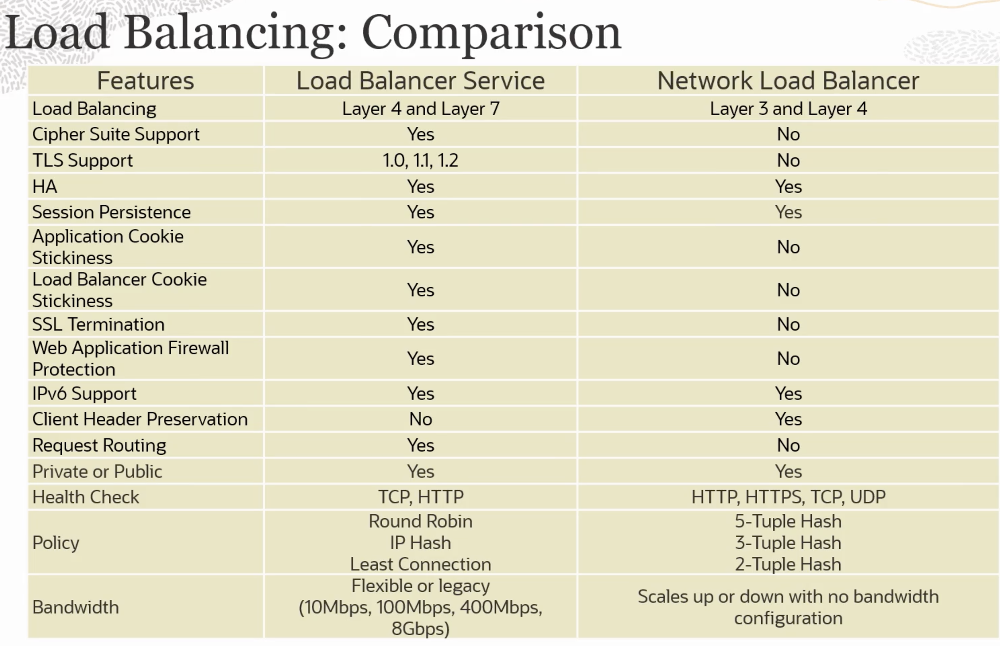
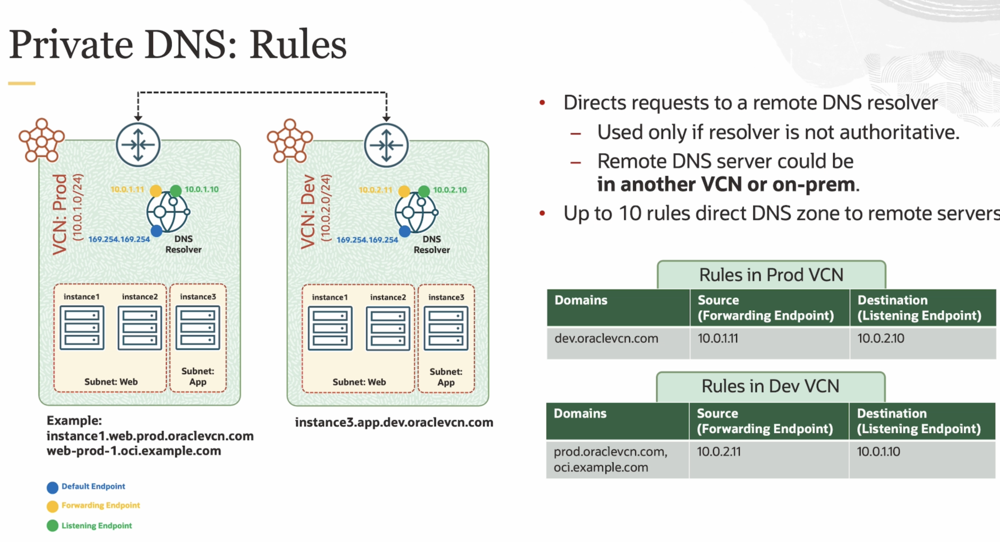
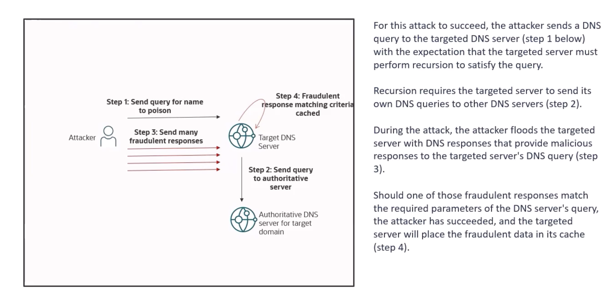
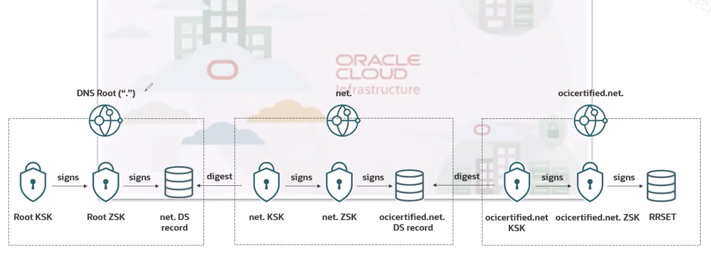
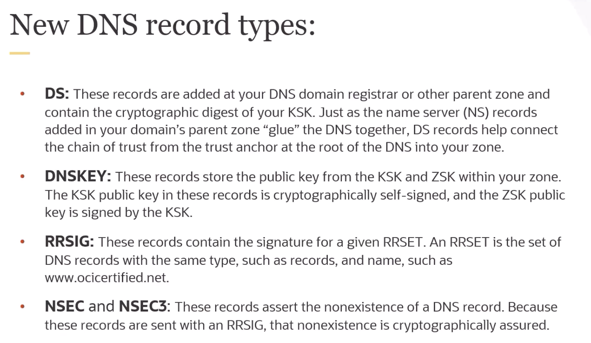

# Connecting my deep base in IPv6 to OCI 🌠

> *“Take the Internet where no other network has been before.†— Vinton Cerf*


## 1ï¸âƒ£ IPv6: From Theory to Cloud Reality

Everything we studied about IPv6—link-local communication, global prefixes, autoconfiguration, and the end of NAT—directly reappears inside Oracle Cloud Infrastructure (OCI).  
The difference is that OCI **virtualizes** each concept within its global fabric.

| IPv6 Concept | Classical Networking | OCI Equivalent |
|---------------|----------------------|----------------|
| **Link** | Your home Wi-Fi / Ethernet segment | An OCI **Subnet** (all VNICs on that subnet share one “linkâ€) |
| **Router (Gateway)** | Your home router’s `fe80::1` or `192.168.0.1` | OCI’s **VCN router**, always the first IP (`10.x.x.1`, or `fe80::1` in IPv6) |
| **Link-Local Address** | `fe80::/10`, auto-generated by each device | Each OCI VNIC gets one automatically; used for NDP and control traffic |
| **Global Unicast (GUA)** | `2000::/3`, routable on Internet | Oracle-assigned IPv6 prefix for your VCN; can reach the Internet directly |
| **Unique Local (ULA)** | `fd00::/8`, private scope | OCI-assigned or user-defined private IPv6 range, for internal communication |
| **No NAT Needed** | IPv6 has huge address space | OCI discourages NAT; use security lists and subnets for isolation |
| **Dual Stack** | IPv4 + IPv6 coexist | Each OCI subnet can support both simultaneously |

---

## 2ï¸âƒ£ Why `/56` and `/64` Matter (and why *64* not *72*)

IPv6 uses **128 bits** per address.

```

|<-------- Network Prefix (ISP) -------->|<-------- Interface ID -------->|
|---------------  /56  ------------------|------------- /64 --------------|

```

### ⤠The math explained
- **Total bits:** 128  
- **Site prefix (from ISP or Oracle):** `/56` → first **56 bits** define your “site†(e.g., your VCN).  
- **Subnet prefix:** `/64` → next **8 bits** (64−56) define individual subnets **within** that site.  
- **Remaining 64 bits** are the **Interface ID** per device (the host portion).  
  - That’s why you heard *“64 remainâ€* — the host space always uses 64 bits, not 72.  
  - The Interface ID must be 64 bits long to support SLAAC and Neighbor Discovery (NDP).

✅ So:
- `/56` → your whole *VCN* (site)
- `/64` → each *subnet*
- 64-bit host IDs → required by IPv6 autoconfiguration

Example:
```

2001:db8:abcd:1200::/56  → assigned to your VCN
2001:db8:abcd:1201::/64  → Subnet A
2001:db8:abcd:1202::/64  → Subnet B

```

---

## 3ï¸âƒ£ How OCI Uses the Prefix

- Oracle (like an ISP) **delegates a /56** to your tenancy or VCN.  
- You carve that `/56` into multiple `/64` subnets—each acting as a *link*.  
- Within each `/64`, every VNIC autogenerates:
  1. a **Link-Local** address (`fe80::…`),
  2. a **Global Unicast** address (from your `/64`),
  3. optionally a **ULA** for internal communication.

OCI follows the same logic as home routers do with prefix delegation (`DHCPv6-PD`).

---

## 4ï¸âƒ£ Inside a VNIC: What Really Happens

When a compute instance (your VM) boots in an IPv6-enabled subnet:

1. **Generates Link-Local (`fe80::…`)**  
   - Used to talk to OCI’s virtual router immediately.

2. **Sends Router Solicitation (RS) → `ff02::2`**  
   - Limited to that subnet (link-local scope).  
   - Oracle’s virtual router receives it.

3. **Receives Router Advertisement (RA)** from OCI router  
   - Advertises the `/64` prefix for that subnet.  
   - Includes the default gateway (`fe80::1`).

4. **Forms its Global IPv6 Address**  
   - Combines advertised `/64` prefix + 64-bit Host ID (randomized or stable).  
   - Performs Duplicate Address Detection (DAD).  

5. **Registers DNS & starts communication.**

This is identical to what your laptop does at home — only virtualized.

---

## 5ï¸âƒ£ Address Types in OCI

| Address Type | Example | Scope | Purpose |
|---------------|----------|--------|----------|
| **Link-Local** | `fe80::a2b3:ccff:fe9d:12e4` | One subnet | Automatic control plane, DHCP/DNS |
| **ULA (Unique-Local)** | `fd12:3456:789a::1` | Private VCN / enterprise | Internal services, not Internet-routable |
| **GUA (Global Unicast)** | `2001:db8:abcd:1201::42` | Global Internet | Public or hybrid workloads |
| **Multicast** | `ff02::1`, `ff02::2` | Link-local | NDP, discovery |
| **Anycast (rare)** | Same IP on multiple routers | Local region | High-availability routing endpoints |

---

## 6ï¸âƒ£ NAT, Security, and Dual-Stack in OCI

IPv6 makes **NAT obsolete**.  
OCI reinforces that:
- Private subnets use ULAs or unadvertised GUAs.
- Public subnets use GUAs and Internet Gateways.
- Security is enforced with **security lists** and **network security groups**, not address translation.

During migration, OCI supports **dual stack**:
- IPv4 (RFC 1918) for legacy workloads,
- IPv6 (/56 → /64 → /128) for modern deployments.

---

## 7ï¸âƒ£ Summary Visualization

```

ISP / Oracle assigns →   2001:db8:abcd:1200::/56   (VCN)
└─ Subnet A:             2001:db8:abcd:1201::/64   (public subnet)
└─ Subnet B:             2001:db8:abcd:1202::/64   (private subnet)

Each instance in Subnet A:
fe80::abcd:ef12:3456:7890   ↠link-local
2001:db8:abcd:1201::42      ↠global unicast
fd12:3456:789a::42          ↠ULA (optional)

```

---

## ✅ Key Takeaways for OCI Engineers

- **/56 per site (VCN)** → standard IETF recommendation.  
- **/64 per subnet (link)** → required for SLAAC and NDP.  
- **128-bit addressing** → 64 bits for network + 64 bits for host.  
- **No NAT** → security via policies, not address translation.  
- **Dual Stack** → coexistence of IPv4 and IPv6 for gradual migration.  
- **Same fundamental rules** as you learned for link-local discovery, RA/RS, and DAD—only now, the “router†is Oracle’s virtual gateway inside your VCN.

---

### 🧭 Mental Model
> OCI = an automated, virtualized IPv6 LAN + WAN  
> Your VCN = the “site†(/56)  
> Each subnet = a “link†(/64)  
> Each instance = a “host†(interface with /128 address)  
> The virtual router = `fe80::1`, performing Router Advertisements just like your home router.

---

### 🌱 Why this matters
When you move from packet-level IPv6 understanding to OCI network design,  
you are **not learning something new** — you are simply seeing the *same Internet principles* implemented at **cloud scale**, abstracted and automated.

---

## 🧠 1ï¸âƒ£ What we’re really looking at

Your home router gets a **/56 prefix from your ISP** (for example:
`2001:db8:abcd:1200::/56`).

It then subdivides that /56 into smaller blocks — **/64 subnets** — one for each internal “link.â€
Why /64? Because each link (each SSID, each wired LAN port group, etc.) must be a separate **Layer 2 broadcast domain**, and IPv6’s design mandates `/64` for autoconfiguration and neighbor discovery.

So the router becomes the architect: it takes your big parcel (/56) and draws property lines (each /64) for each internal network.

---

## 🠠2ï¸âƒ£ Back to your example: two SSIDs

Your router has (at least) two Wi-Fi networks:

| Network Name (SSID)        | Purpose                | Technically                |
| -------------------------- | ---------------------- | -------------------------- |
| **Winter is Coming**       | main/home network      | one **Layer 2 domain**     |
| **Winter is Coming Guest** | isolated guest network | another **Layer 2 domain** |

>When we say “Layer 2 linkâ€, we mean: Devices are connected on the same local data-link network — they can reach each other using **MAC addresses**, not IP routing. The moment a packet needs to cross a router — say, from your Wi-Fi to Google’s servers — Layer 3 (IP routing) takes over.

They don’t need to go through routers (Layer 3).
They’re just exchanging Ethernet (or Wi-Fi) frames directly inside that bubble.

Even though both radios may sit in the same box, they behave like **two separate links**.
Each one needs its own `/64` subnet.

So the router takes bits 57–64 of the /56 it received and uses them to label each subnet.

---

## 🔢 3ï¸âƒ£ The math: how it “fixes the next 8 bitsâ€

Your ISP:

```
Gives you 2001:db8:abcd:1200::/56
```

That means the first 56 bits are fixed.
You can vary bits **57–64** to create up to 2⸠= 256 unique subnets.

The router might do this:

| Subnet | Network Name           | Prefix                    |
| ------ | ---------------------- | ------------------------- |
| 0x01   | Winter is Coming       | `2001:db8:abcd:1201::/64` |
| 0x02   | Winter is Coming Guest | `2001:db8:abcd:1202::/64` |
| 0x03   | Wired LAN              | `2001:db8:abcd:1203::/64` |

When it sends Router Advertisements (RAs) on each Wi-Fi/port group, it advertises *that link’s own /64*.
Your laptop connected to “Winter is Coming†hears the RA for `…1201::/64`;
a guest phone on the guest Wi-Fi hears the RA for `…1202::/64`.

Each group can now do SLAAC safely and independently — devices in one subnet never send NDP multicasts into another.

---

## âš™ï¸ 4ï¸âƒ£ How the router *decides* which bits to use

Routers follow a simple rule set:

1. They know which internal interfaces they have (LAN, Guest Wi-Fi, VLANs, etc.).
2. For each interface, they pick a unique 8-bit subnet ID.
3. They append that to the ISP’s /56 to form the /64 prefix advertised on that interface.

So “based on what?†— based on the **interface mapping** inside the router’s configuration, not on traffic or MACs. It’s deterministic, not dynamic.

---

## 🧩 5ï¸âƒ£ What happens next

* Devices on “Winter is Coming†autoconfigure addresses from `2001:db8:abcd:1201::/64`.
* Devices on “Winter is Coming Guest†autoconfigure from `2001:db8:abcd:1202::/64`.
* The router keeps routing tables between them (or blocks them if isolation is enabled).
* Each device also keeps its `fe80::/10` link-local for control messages on that Wi-Fi link.

---

## ✨ 6ï¸âƒ£ Why it’s designed this way

IPv6 wanted to make home routers behave **hierarchically and predictably**:

* ISPs hand out **/56** (one per household/site).
* Routers subdivide that into multiple **/64s**, one per internal link (Wi-Fi 1, Wi-Fi Guest, Ethernet, etc.).
* Each /64 is the scope for **Neighbor Discovery**, **SLAAC**, and **multicast**.

That way:

* no two links ever share a multicast domain,
* no collisions between households,
* autoconfiguration “just works.â€

---

### 🧭 TL;DR

| Concept                     | Home Reality                 | IPv6 Logic                |
| --------------------------- | ---------------------------- | ------------------------- |
| **ISP gives /56**           | Whole household              | Site prefix               |
| **Router slices into /64s** | Each SSID / LAN              | Subnet prefix             |
| **Each /64 = one link**     | Separate Wi-Fi or VLAN       | Needed for SLAAC/NDP      |
| **Devices build /128**      | Your laptop’s IP             | Combine /64 + Host ID     |
| **Why fixed 8 bits?**       | To keep exactly 64 host bits | Required by IPv6 standard |

---

# â˜ï¸ IPv6 in Oracle Cloud Infrastructure — Connecting the Dots

## 🧭 1ï¸âƒ£ From Home Network to OCI VCN — Same Concept, Larger Scale

Your **home router setup** (ISP gives `/56` → router splits into `/64`s for each SSID)
is conceptually identical to **OCI’s VCN architecture**:

| Home Network Concept                      | OCI Equivalent                                      | Explanation                             |
| ----------------------------------------- | --------------------------------------------------- | --------------------------------------- |
| ISP gives `/56` prefix                    | Oracle assigns `/56` prefix to a **VCN**            | Same “site prefix†logic                |
| Router splits into `/64`s per Wi-Fi / LAN | OCI **Subnets** are each `/64`                      | Each subnet = one Layer-2 link          |
| Each SSID = separate link                 | Each **OCI subnet** = separate link                 | NDP, RA, and SLAAC happen per subnet    |
| Devices (laptops, phones)                 | **Compute instances (VMs)**                         | Each instance autoconfigures from `/64` |
| Home router sends RAs                     | OCI VCN’s **router** advertises prefixes internally | Same Neighbor Discovery workflow        |

So in OCI, your `/56` GUA allocation (e.g. `2603:c020:4000:8600::/56`)
is sliced into multiple `/64`s — one for each subnet:

```
Subnet A → 2603:c020:4000:8600::/64
Subnet D → 2603:c020:4000:8601::/64
```

Each subnet is an **independent link** with its own link-locals (`fe80::/10`) and RA scope.

---

## 🌠2ï¸âƒ£ Prefix Hierarchy Recap

| Level                    | IPv6 Range | Scope                    | Example                    |
| ------------------------ | ---------- | ------------------------ | -------------------------- |
| **VCN (site)**           | `/56`      | Global                   | `2603:c020:4000:8600::/56` |
| **Subnet (link)**        | `/64`      | Layer-2 boundary         | `2603:c020:4000:8601::/64` |
| **Instance (interface)** | `/128`     | Host ID (autoconfigured) | `2603:c020:4000:8601::3`   |

Just like your laptop at home gets one `/128` inside your `/64`,
an OCI compute instance gets one IPv6 interface ID inside its subnet’s `/64`.

---

## 🌠3ï¸âƒ£ Global Unicast (GUA) vs Unique Local (ULA)

| Address Type                 | Scope                 | OCI Use                | Internet Reachable? |
| ---------------------------- | --------------------- | ---------------------- | ------------------- |
| **GUA** (`2000::/3`)         | Global                | Oracle-assigned or BYO | ✅ Yes               |
| **ULA** (`fd00::/8`)         | Internal / enterprise | Admin-assigned         | ⌠No                |
| **Link-Local** (`fe80::/10`) | Local link only       | Auto-generated         | ⌠No                |

* OCI gives you a **GUA /56** for external connectivity (Internet Gateway).
* You can also define a **ULA /56** for internal-only communication (e.g., cross-region, FastConnect).
* **Each interface** always auto-generates a link-local (`fe80::...`) for NDP and router communication.

---

## âš™ï¸ 4ï¸âƒ£ Layer-2 Logic: “Link = Subnetâ€

Just as at home, **each Wi-Fi SSID is its own link**,
in OCI, **each subnet is its own link-local environment**.

* All VNICs inside `Subnet A (2603:c020:4000:8600::/64)`
  share one link-local multicast space for Neighbor Discovery (ICMPv6):
    That means:
    All devices on that same local network (that same Wi-Fi or subnet) can see each other’s “who’s there?†messages — like

    “Hey, who has this IP?†or “Are there any routers here?â€

    Those messages use multicast (sent to everyone on that link) and are only visible inside that one local network, not beyond it.
* No multicast or link-local traffic crosses between subnets.

---


## 🚦 5ï¸âƒ£ Routing Table Example (from diagram)

| Destination     | Target | Purpose                                           |
| --------------- | ------ | ------------------------------------------------- |
| `::/0`          | IGW    | Default route for all Internet-bound IPv6 traffic |
| `0.0.0.0/0`     | IGW    | IPv4 equivalent                                   |
| `2001::1234/64` | DRG    | Route to customer on-prem network                 |
| `2002::1234/64` | DRG    | Route to remote region VCN                        |

🔹 **IGW (Internet Gateway)** → North/South traffic
🔹 **DRG (Dynamic Routing Gateway)** → East/West (inter-VCN, on-prem, FastConnect)

---

## 🧱 6ï¸âƒ£ Dual Stack Operation

OCI subnets can be:

* **IPv4-only**
* **IPv6-only**
* **Dual-stack (IPv4 + IPv6)**

In the diagram:

* Subnets A & D are **dual-stack** (notice both 10.x.x.x and IPv6 prefixes).
* Subnets B & C are **IPv4-only** (no IPv6 prefix shown).

Dual stack ensures smooth migration — your IPv6 load balancer can front IPv4-only backend VMs.

---

## 🧩 7ï¸âƒ£ North–South vs East–West

| Direction       | Meaning                                                    | OCI Example                              |
| --------------- | ---------------------------------------------------------- | ---------------------------------------- |
| **North–South** | Traffic between OCI and external world (Internet, on-prem) | Internet Gateway (IGW) + FastConnect/VPN |
| **East–West**   | Traffic between OCI subnets or regions                     | Local/Remote Peering Gateways, DRG       |

The diagram is **North–South**, showing:

* Users accessing via IPv6 through **Internet Gateway**
* Backend systems reachable over **FastConnect/VPN**
* Cross-region traffic over **DRG → RPC (Remote Peering Connection)**

---

## 🔄 8ï¸âƒ£ Load Balancer Behavior

| Load Balancer Type   | IPv6 Behavior                            | Translation      |
| -------------------- | ---------------------------------------- | ---------------- |
| **Regular LB**       | Can front IPv6 and send to IPv4 backend  | ✅ Translates     |
| **Network LB (NLB)** | Dual-stack only (IPv6→IPv6 or IPv4→IPv4) | ⌠No translation |

So if users connect via IPv6 but backend VMs are IPv4-only → use **regular load balancer**.

---

## 🔠9ï¸âƒ£ Security Implications

IPv6 removes NAT — so every resource is globally addressable.
That’s why OCI enforces strict security at:

* **Security Lists / NSGs** for inbound/outbound control
* **No internet access** unless explicitly routed to IGW
* **DRG / VPN / FastConnect** for private GUA or ULA exchanges

---

## 🧠 10ï¸âƒ£ The Big Picture

```
ISP (Oracle IPv6 pool)
/56 GUA prefix
       │
       â–¼
VCN (Site)
2603:c020:4000:8600::/56
       │
 ┌────────────┬────────────â”
 │ Subnet A   │ Subnet D   │
 │ /64        │ /64        │
 │ Dual stack │ Dual stack │
 └─────┬──────┴──────┬─────┘
       │             │
  VM A, IPv6:8600::2  LB, IPv6:8601::3
       │             │
       └──────> IGW ─┘
             │
     Internet / End Users
```

And below:

* `DRG` connects to on-prem `/64`s (`2001::1234/64`)
* `RPC` peers with other region `/64`s (`2002::1234/64`)

---

## ✅ TL;DR Summary

| Concept                 | Home IPv6 Analogy      | OCI Equivalent                    |
| ----------------------- | ---------------------- | --------------------------------- |
| `/56` prefix from ISP   | Household allocation   | VCN-level allocation              |
| `/64` subnets           | Separate SSIDs or LANs | OCI subnets                       |
| Router Advertisement    | Home router            | VCN internal router               |
| Link-local (`fe80::`)   | Each SSID              | Each OCI subnet link              |
| GUA                     | Internet-visible       | Oracle-assigned                   |
| ULA                     | Private internal       | Admin-defined                     |
| Dual Stack              | IPv4 + IPv6 at home    | IPv4 + IPv6 on VNIC               |
| Internet Gateway        | Home router’s WAN      | IGW in OCI                        |
| DRG / VPN / FastConnect | WAN or peer link       | East–West or on-prem connectivity |

# Bring Your Own IP (BYOIP) in OCI — Complete Overview

**Bring Your Own IP (BYOIP)** lets you use **your own public IP address range** (CIDR block) inside Oracle Cloud Infrastructure (OCI) instead of using Oracle-assigned public IPs.

In other words:
> You can “import†a range of IP addresses that your company already owns — allocated by a Regional Internet Registry (RIR) such as **ARIN**, **RIPE**, or **APNIC** — and use those addresses on your OCI resources (load balancers, compute instances, firewalls, etc.).

This is not about private addressing — these are **public routable addresses** that you own.

## 🧩 Why Use BYOIP?

| Use Case | Why It Matters |
|-----------|----------------|
| **Seamless Migration** | Move an existing public service from on-prem to OCI **without changing its IP** (clients see the same address). |
| **Reputation Preservation** | Keep IPs already allow-listed by partners or associated with trusted email/domains. |
| **Regulatory or Branding Needs** | Some organizations must use their own registered IP space. |
| **IP Pool Management** | Get consecutive addresses for consistent resource allocation. |


## 📜 IPv4 BYOIP Requirements

| Parameter | Explanation |
|------------|-------------|
| **Minimum size** | `/24` block = 256 addresses (smallest CIDR OCI can announce globally). |
| **Larger blocks allowed** | `/23`, `/22`, etc. — anything larger than `/24`. |
| **Ownership** | Must be **allocated directly to you** by a Regional Internet Registry (ARIN, RIPE, etc.), or **authorized in writing** by the owner. |
| **Scope** | Imported to **one OCI region only** (cannot reuse the same block across multiple regions). |
| **Default limit** | Up to **20 IPv4 blocks per OCI tenancy** (contact Oracle for higher limits). |
| **Per-VCN limit** | Up to **5 IPv4 prefixes per VCN**. |
| **Account type** | Must be a **paid OCI account** (not free tier). |

🧭 *Why /24?*  
That’s the **minimum prefix size** that can be independently routed and advertised on the Internet using BGP.  
Anything smaller (like `/25` or `/26`) won’t propagate globally — routers would reject it.

## 🌠IPv6 BYOIP Requirements

| Parameter | Explanation |
|------------|-------------|
| **Minimum size** | `/48` block — standard minimum for IPv6 Internet advertisement. |
| **Ownership** | Same RIR rule applies — you must own or be delegated the prefix. |
| **Scope** | Imported to a **single OCI region**. |
| **Why larger than /56 or /64?** | `/48` gives you flexibility to subdivide into many `/64` subnets for your internal topology (like a full VCN). |

💡 ***Fun comparison***  
Remember how in IPv6 the **VCN (or site)** often gets `/56`, and each subnet `/64`?  
The BYOIP `/48` is one level above that — it gives OCI enough address space to slice many `/56`s internally if needed.

---

## âš™ï¸ How BYOIP Works Inside OCI

1. **You import** your owned CIDR range to OCI (after verification by the RIR or owner).
2. **Oracle announces** that range to the Internet via BGP on your behalf.
3. **OCI resources** (instances, load balancers, etc.) can now use those IPs as *Reserved Public IPs*.
4. **Routing and security** still work exactly like Oracle-assigned public IPs.


# 🌠Why the Internet Requires a /24 Minimum — A Tangible Example

Imagine you own this IPv4 block from RIPE:
> **203.0.113.0/24**  
> which includes all 256 addresses from **203.0.113.0 → 203.0.113.255**.

You bring this block to Oracle Cloud via **BYOIP**.


## 🧩 Step 1 — Oracle Advertises Your Block to the World (BGP)
When you finish verification, Oracle announces to the global Internet:

```

Network: 203.0.113.0/24
Path: Oracle → Upstream ISPs → Internet backbone

```

Now, every router on Earth knows:
> “To reach **any IP** between `203.0.113.0` and `203.0.113.255`,  
> send traffic to Oracle.â€

Routers don’t care which IP inside the block — they route by **prefix match**.

✅ **Result:**  
All traffic destined for that block is now delivered to OCI’s network.  
From there, OCI routes it internally to your exact VM.

## 🧠 Step 2 — Your Instance Uses One IP Inside the Block
Inside OCI:
- You reserve one address: **203.0.113.7**
- You attach it to your web server VM.

So when a customer types `http://203.0.113.7`,  
packets flow like this:

```

User → Internet → Oracle (route for 203.0.113.0/24)
Oracle → Your VCN → Your subnet → Your VM (203.0.113.7)

```

Even though the world only knows the block `/24`,  
Oracle internally knows *which specific IP* inside that block belongs to which instance.


## 🧨 Step 3 — What If You Tried to Bring a Smaller Block (/25)?
Say you only wanted **203.0.113.0/25** (first half of the /24).  
That’s just 128 addresses (203.0.113.0–203.0.113.127).

You announce:

```

Network: 203.0.113.0/25
Path: Oracle → Internet

```

The Internet’s backbone routers will say:
> ⌠“Sorry, /25 is too small — we drop that route.  
> We don’t propagate anything smaller than /24.â€

Why? Because global ISPs have **filters** to protect the routing table from exploding.  
If they allowed /25s, there would be **millions more routes** — making routing memory and CPU usage explode.

So your prefix **never leaves Oracle’s edge routers** — nobody can reach it.

Result:  
Your instance becomes **invisible to the Internet**, even though it technically exists.

## 🧮 Step 4 — The Hierarchy in Numbers

| Level | Example | CIDR | Size | Purpose |
|--------|----------|------|-------|----------|
| **Internet-routable block (BYOIP)** | 203.0.113.0/24 | /24 | 256 IPs | Globally advertised via BGP |
| **Cloud subnet** | 203.0.113.0/28 | /28 | 16 IPs | Internal OCI routing |
| **Instance address** | 203.0.113.7 | /32 | 1 IP | Assigned to your VM |

🧭 Global routers care only about the **/24** level.  
Everything below it is managed **inside Oracle Cloud**.


**In essence:**  
> BYOIP lets Oracle “register your district†(the `/24`) with the Internet.  
> Inside that district, you can freely assign, move, and manage *individual houses* (IP addresses) —  
> but the outside world only ever sees the **district boundary**.


| Concept                   | IPv4                                   | IPv6                                   |
| ------------------------- | -------------------------------------- | -------------------------------------- |
| Global routing works on   | Prefixes (not individual IPs)          | Prefixes (not individual IPs)          |
| Smallest routable prefix  | `/24` (256 IPs)                        | `/48`                                  |
| Why                       | To prevent routing table explosion     | Same reason, scaled up                 |
| You can still use one IP? | Yes — but it must belong to that `/24` | Yes — but it must belong to that `/48` |

💡 **In short:**

> You can absolutely have one fixed IP —
> but to make it visible to the Internet, it must live inside a *routable block* that BGP recognizes.
> The Internet doesn’t route to single IPs, it routes to **prefixes**.


## 🌠IPv4 vs IPv6 Quick Comparison

| Feature | IPv4 BYOIP | IPv6 BYOIP |
|----------|-------------|-------------|
| Minimum CIDR | `/24` | `/48` |
| Total IPs | 256 | 1.2×10¹ⶠ(65,536 /64 subnets) |
| Ownership Proof | Required | Required |
| Internet Routable | ✅ Yes | ✅ Yes |
| Typical Use | Legacy compatibility | Future-ready native stack |


## 🧠 Connecting It to Your Knowledge
Remember our discussion on **prefix delegation** at home (ISP → Router → Devices)?

Here’s how BYOIP mirrors that flow, but at **cloud scale**:

| Home Network Analogy | OCI Equivalent |
|-----------------------|----------------|
| ISP gives router a `/56` prefix | RIR allocates you a `/48` or `/24` |
| Router advertises `/64` to local devices | OCI divides `/48` into `/64` subnets for VCNs |
| Devices self-assign addresses (SLAAC) | OCI instances get IPv6s from subnet pool |
| Router performs NAT or prefix routing | OCI’s Internet Gateway advertises your BYOIP block to the Internet |

So BYOIP basically shifts *who controls the “root of the prefix treeâ€*:  
- At home → ISP owns it.  
- In OCI → **you** own it.

## Summary

**Bring Your Own IP (BYOIP)** in OCI enables:
- Full control of your **public IP space** (IPv4 and IPv6).  
- Seamless migration from on-prem environments.  
- Consistent IP reputation and routing identity.  
- Standards-compliant blocks:  
  - `/24` (IPv4)  
  - `/48` (IPv6)

> Think of it as plugging your company’s existing Internet real estate directly into the Oracle Cloud backbone —  
> preserving your identity, reachability, and operational continuity.

# 🌠From IPv6 Prefix Math to OCI’s Bring Your Own IP — The Big Picture

## 🧠 1ï¸âƒ£ What We Learned Before — Prefix Math & Minimum Sizes

In IPv6, we learned that every address is **128 bits** long.  
Those bits are divided into:
- **Network Prefix** (given by your ISP or cloud provider)
- **Interface ID** (usually 64 bits, derived from MAC or random)

### Typical IPv6 Structure

| Component | Example | Bit Length | Description |
|------------|----------|-------------|--------------|
| Global Prefix (from ISP) | `2001:db8:abcd::/56` | 56 bits | Identifies your *site* or VCN |
| Subnet ID (chosen by router) | `+ 8 bits → /64` | 8 bits | Identifies a subnet within your site |
| Interface ID | Remaining 64 bits | 64 bits | Identifies a device’s interface on that subnet |

✅ So: `/56` → `/64` means:
- Your **site/VCN** gets a `/56` block from your ISP.
- Your **router** splits it into `/64` subnets (each subnet = 18 quintillion addresses).

This is **why IPv6 has no NAT** — there’s more than enough room.

---

## 🧩 2ï¸âƒ£ Translating This to OCI’s Network Model

In Oracle Cloud Infrastructure (OCI):

| Home Analogy | OCI Equivalent |
|---------------|----------------|
| ISP delegates `/56` prefix to your router | OCI assigns `/56` to your **VCN** |
| Your router splits `/56 → /64` subnets for Wi-Fi / LAN | OCI splits `/56 → /64` subnets for each **OCI subnet** |
| Devices on each subnet self-assign via SLAAC | Compute instances auto-configure addresses |
| Link-local (`fe80::/10`) used for neighbor discovery | OCI networking stack also uses link-local for internal control traffic |

So, the numbers you saw in the OCI slides (`/56` for VCN, `/64` for subnets)  
are **not arbitrary** — they follow the same logic as your home IPv6 topology.  
They’re simply scaled to cloud infrastructure.

---

## 🚀 3ï¸âƒ£ Then Comes “Bring Your Own IP (BYOIP)â€

Now that you know `/56` and `/64` work *inside* OCI,  
you also learned that **OCI must first advertise a larger prefix to the Internet** —  
just like an ISP announces blocks to the world.

| Layer | Function | Typical Prefix | Why That Size |
|--------|------------|----------------|----------------|
| **Global Internet (BGP)** | Routes prefixes between clouds, ISPs, and enterprises | `/24` (IPv4) / `/48` (IPv6) | Minimum size accepted for global routing |
| **Cloud Provider (Oracle)** | Allocates space per customer | `/56` | Enough for 256 `/64` subnets |
| **Your Subnet** | Per network segment (like Wi-Fi or VLAN) | `/64` | Required for SLAAC and neighbor discovery |
| **Single Host Interface** | Individual instance address | `/128` | A single IPv6 endpoint |

🧭 The relationship looks like this:
```

/48 → /56 → /64 → /128
World   Cloud   Subnet   Instance

```

So when you **bring your own IP (/48)** to Oracle:
- OCI announces that block globally via BGP.
- Internally, it divides it into `/56`s for VCNs, and each VCN divides again into `/64`s for subnets.

That’s why:
> Even though the Internet only “sees†your `/48` (or `/24` in IPv4),  
> OCI internally manages smaller chunks for local routing.

## 🌠4ï¸âƒ£ Why the Minimum and Maximum Ranges Exist

| Concept | Min | Max | Explanation |
|----------|-----|-----|-------------|
| **IPv4 BYOIP block** | `/24` | `/16` (larger allowed) | /24 is the smallest prefix BGP will accept globally |
| **IPv6 BYOIP block** | `/48` | `/32` (larger allowed) | /48 is the smallest globally routable prefix |
| **VCN prefix (IPv6)** | `/56` | Fixed by Oracle | Each VCN gets one /56; subnets must be /64 |
| **Subnet prefix (IPv6)** | `/64` | Fixed by spec | Required for SLAAC and ICMPv6 neighbor discovery |
| **Instance address** | `/128` | Single | Unique address assigned to one interface |

## 🧮 5ï¸âƒ£ Connecting the “Numbers†to Real Routing Behavior

Let’s overlay both your **conceptual math** and **Internet reality**:

| Level | Example | Who Allocates | Visibility | Explanation |
|--------|----------|----------------|-------------|-------------|
| `/48` | BYOIP block from RIPE (publicly routable) | You (owner) | Internet | Advertised by OCI via BGP |
| `/56` | Assigned to your VCN | Oracle | Cloud-level | Defines your private OCI site |
| `/64` | Each OCI subnet | You | Internal | Each subnet = one Layer-2 link |
| `/128` | Your VM address | You | Local only | Interface-level identifier |

Everything *below /48* is invisible to the global Internet — it exists only *inside* OCI,  
just like everything below your home router’s prefix is invisible to your ISP.

## 🧩 6ï¸âƒ£ Unified Analogy — Home vs Cloud vs Internet

| Home Network | OCI | Internet |
|---------------|-----|----------|
| Your ISP gives you `/56` | Oracle gives you `/56` for your VCN | You bring `/48` to Oracle (BYOIP) |
| Router splits `/56 → /64` | OCI splits `/56 → /64` | Oracle advertises `/48` via BGP |
| Devices self-assign addresses | Instances auto-configure addresses | Global routers only see `/48` |
| Link-local (`fe80::/10`) handles local comms | Link-local used for internal discovery | Unseen globally |

I brought up Link-Local after the /48 → /56 → /64 hierarchy to remind you that:

> Even though those prefixes define routable structure (the “mapâ€),
the plumbing underneath still relies on the Link-Local layer to make discovery, auto-configuration, and routing even possible.

It’s not about external reachability — it’s about how every IPv6 stack bootstraps itself before touching the outside world.

## Final Mental Picture

```

Internet (BGP)
└── /48  ↠smallest globally routable IPv6 block (you own this)
└── /56  ↠Oracle allocates to each VCN
└── /64  ↠Each OCI subnet
└── /128  ↠Each instance (interface)

```

🧭 Summary:
> The “min and max†numbers you saw earlier weren’t random.  
> They exist to **balance scalability and reachability** —  
> `/48` ensures Internet routers don’t drown, `/64` ensures IPv6 hosts can auto-configure,  
> and `/56` is a comfortable middle ground for sites (VCNs) to carve up their address space.

**In essence:**  
- The **Internet** routes *prefixes* (`/24` IPv4, `/48` IPv6).  
- The **Cloud** subdivides them (`/56` → `/64`).  
- The **Instance** lives at the end (`/128`).  
- Your earlier “numbers section†was *the mathematical foundation* —  
  and your new “range understanding†explains *why the Internet enforces those boundaries*.


# 🌠Understanding “Allowed Assignment†in Public IP Comparison

| Characteristic | Ephemeral Public IPs | Reserved Public IPs |
|----------------|----------------------|----------------------|
| **Allowed assignment** | To VNIC’s **primary private IP only**. <br>• Limit: 1 per VNIC <br>• 2 per VM instance <br>• 16 per bare metal instance | To either **primary or secondary** private IP. <br>• Limit: 32 per VNIC |
## 🧩 1ï¸âƒ£ First: What “Assignment†Means
Every compute instance in OCI has one or more **VNICs** —  
these are the *virtual network interface cards* that connect your instance to a subnet.

Each VNIC has:
- **Private IPs** (used inside your VCN)
- Optionally **Public IPs** (used for Internet reachability)

Assigning a **public IP** means:  
> “Make this private IP reachable from the Internet.â€

So “Allowed assignment†defines:
- **Where** (which private IPs) you can attach the public IP  
- **How many** public IPs you can attach per VNIC or instance


## âš¡ 2ï¸âƒ£ Ephemeral Public IPs — Temporary & Restricted
- They can only be assigned to the **primary private IP** of a VNIC.
- You **cannot** assign them to secondary private IPs.
- Think of it as a **quick Internet identity** that disappears when the instance or its VNIC is deleted.

**Limits:**
- **1 per VNIC**
- **2 per VM instance** (because each VM can have two VNICs)
- **16 per bare metal instance** (because bare metal supports up to 16 VNICs)


## 3ï¸âƒ£ Reserved Public IPs — Persistent & Flexible
- Can attach to **any** private IP — primary or secondary.
- They persist even when detached — you can reassign them later.

**Limits:**
- Up to **32 public IPs per VNIC.**

🧠 Analogy:  
Reserved = your own SIM card with a fixed phone number.  
You can insert it into any phone (any instance) whenever you want.

## 🔠4ï¸âƒ£ Why OCI Makes This Distinction
It’s about **lifecycle control** and **flexibility**:

| Goal | Choose |
|------|---------|
| Short-lived instance (test, batch job, auto-scaling) | **Ephemeral** IP — no cleanup needed |
| Long-lived resource (website, database, API endpoint) | **Reserved** IP — keep the same address even if instance changes |

## ✅ Summary Insight
> “Allowed assignment†defines how *tightly coupled* a public IP is to a specific instance.

| Type | Scope | Flexibility | Lifecycle |
|------|--------|--------------|------------|
| **Ephemeral** | Only primary IP | Low | Dies with instance |
| **Reserved** | Any private IP | High | Persistent across reassignments |

# 🌠Oracle Cloud Infrastructure — Public IP Pools (with BYOIP)

## 🧩 1ï¸âƒ£ Where This Fits In
You’ve already learned that OCI offers **two types of public IPs**:
- **Ephemeral Public IPs** — auto-assigned, temporary, Oracle-owned.
- **Reserved Public IPs** — persistent, user-managed, and reassignable.

Now, **Public IP Pools** come into play **only when you bring your own IP block (BYOIP)** —  
that is, a **CIDR range you own** (like `203.0.113.0/24`) that’s registered to you through ARIN, RIPE, or another Regional Internet Registry.

## ğŸ—ï¸ 2ï¸âƒ£ What Is a Public IP Pool?

Think of a **Public IP Pool** as your **private warehouse** of public IP addresses inside OCI.  
It sits *inside* the larger BYOIP CIDR block you imported.

```

Your BYOIP CIDR:    203.0.113.0/24  (256 IPs total)
└── Public IP Pool A: 203.0.113.0/26   (64 IPs)
└── Public IP Pool B: 203.0.113.64/26  (64 IPs)
└── Public IP Pool C: 203.0.113.128/25 (128 IPs)

```

Each **pool** defines which IPs can be drawn when you:
- create **ephemeral** public IPs, or  
- allocate **reserved** public IPs.

So, OCI no longer draws from *Oracle’s shared global pool* —  
it draws from **your own registered address space**.

## âš™ï¸ 3ï¸âƒ£ Why Use It?

**Without BYOIP:**
- Oracle owns and manages the public IP ranges.
- Ephemeral IPs come from a **shared Oracle pool**.

**With BYOIP + IP Pool:**
- You manage your own range, your own pools.
- Ephemeral and reserved IPs come **from your block**.
- Those addresses carry your **brand reputation**, not Oracle’s.

🧠 Example use cases:
- You’re migrating a known service to OCI and don’t want your customers’ allow-lists to break.  
- You run multiple apps and want each app’s traffic to originate from its own predictable subnet.

## 🚀 4ï¸âƒ£ How It Works — Step by Step

### 🔹 Step 1: Import Your BYOIP CIDR
Bring in a block you own (e.g., `/24` minimum for IPv4, `/48` minimum for IPv6).  
OCI verifies ownership with the regional registry before allowing routing.

### 🔹 Step 2: Define IP Pools
Create **Public IP Pools** inside that CIDR:
- Each pool represents a smaller range (e.g., `/26`, `/27`).
- You can have multiple pools for different applications or environments.

### 🔹 Step 3: Allocate from the Pool
When creating resources (e.g., NAT Gateway, Load Balancer, VM), you can choose:
- **Ephemeral IP from your pool** → OCI automatically assigns one temporarily.  
- **Reserved IP from your pool** → You manually reserve and attach it to any resource later.

### 🔹 Step 4: Manage & Reorganize
You can:
- Create or delete pools anytime.
- Move IPs between pools.
- Keep unlimited reserved IPs (since these are your own addresses — no Oracle quota cost).

## 🔠5ï¸âƒ£ Practical Analogy

| Scenario | Without BYOIP | With BYOIP + Pool |
|-----------|----------------|------------------|
| Source of public IP | Oracle-owned global pool | Your own CIDR range |
| Who manages the reputation | Oracle | You |
| Ephemeral IPs | Random, shared across tenants | Allocated from your pool |
| Reserved IPs | Limited per region | Unlimited (you own them) |
| Routing | Oracle advertises its block | Oracle advertises *your* block on your behalf via BGP |

🧩 Analogy:  
Imagine Oracle runs a giant car-rental lot (its shared IP pool).  
BYOIP with public IP pools means **you bring your own fleet**, park it in Oracle’s garage,  
and decide which vehicle (IP) each driver (VM) takes — temporary or permanent.

## 🌠6ï¸âƒ£ Key Rules & Numbers

| Concept | IPv4 | IPv6 | Notes |
|----------|------|------|-------|
| **Minimum BYOIP block size** | `/24` | `/48` | Required for global advertisement via BGP |
| **Public IP Pool source** | Must belong to your BYOIP block | Same logic applies | Cannot use Oracle-owned ranges |
| **Ephemeral IPs** | Temporary; auto-deleted | Optional; from pool | Lifetime tied to resource |
| **Reserved IPs** | Persistent; reassignable | Unlimited from pool | Exists until deleted |
| **Routing visibility** | Advertised to Internet | Advertised via BGP | Oracle announces your CIDR globally |

## 🧭 7ï¸âƒ£ Why This Matters Architecturally

- Public IP Pools make **BYOIP operationally scalable**.  
  Without them, you’d have to manually assign every IP from your block.

- They support **hybrid architectures**:  
  You can use the same public IP range for both your **on-premises** and **OCI** resources.

- They support **auto-scaling scenarios**:  
  OCI automatically picks an ephemeral IP from your pool when spinning up new instances, ensuring that:
  - traffic always comes from your addresses,  
  - no manual reservation is needed.

## ✅ Summary Insight

> A **Public IP Pool** is a *management layer* between your **BYOIP block** and your **OCI resources.**  
> It lets you allocate ephemeral or reserved IPs *from your own CIDR space* rather than Oracle’s shared one —  
> preserving your brand’s address reputation, easing migration, and enabling flexible, large-scale IP management.

**Key takeaway:**  
> *Bring Your Own IP* defines **who owns the addresses**.  
> *Public IP Pools* define **how those addresses are handed out and managed inside OCI.**

# 📊 OCI IP Address Insights — Overview

## 🧩 1ï¸âƒ£ Purpose
**IP Address Insights** in Oracle Cloud Infrastructure (OCI) provides a **unified visibility layer** for all IP usage — across VCNs, subnets, and individual resources (VMs, NLBs, etc.).  
It helps you:
- Detect **address exhaustion** (CIDR nearing capacity).  
- Detect **underutilization** (wasted IP space).  
- Identify **overlapping or conflicting CIDRs**.  
- Search and trace any IP or resource across the region.

## 🧠 2ï¸âƒ£ Core Capabilities

### 🔹 **Subnet & VCN Utilization**
- Each VCN (e.g., `/16`) and each subnet within it (e.g., `/24`) displays how many IPs are allocated vs. total available.  
- You can set **threshold alarms** (e.g., 70%) to receive alerts when utilization passes a defined limit — via email, webhook, or OCI Events.

### 🔹 **IP Conflict & Overlap Detection**
- Automatically flags **CIDR overlaps** across VCNs (e.g., `10.0.0.0/16` reused in two networks).  
- Overlaps are harmless until you connect the VCNs (via DRG or LPG).  
  Once connected, overlapping ranges can break routing — so the tool warns you pre-emptively.

### 🔹 **Search & Discovery**
- Global search across all VCNs and subnets:  
  - Search by **IP address**, **resource name**, or **type** (e.g., “NLBâ€).  
  - Surfaces exactly where a resource or address lives (VCN + subnet).  
- Example: searching for `172.17.0.32` returns the VM and subnet that own it.

### 🔹 **Subnet View Enhancements**
- Each subnet view now includes a **detailed IP Address Table**:
  - Resource name and DNS name  
  - Private IPv4/IPv6  
  - Public IPv4 (if assigned)  
  - Associated VNICs and hostnames  
- Allows you to drill from region → VCN → subnet → resource hierarchy.

## 📈 3ï¸âƒ£ **Practical Use Cases**
| Scenario | Why It Matters |
|-----------|----------------|
| Network nearing IP exhaustion | Detect before deployments fail |
| Too much unused CIDR space | Resize or reclaim wasted ranges |
| Overlapping VCN CIDRs | Prevent routing failures when peering |
| Finding “lost†IPs or VMs | Rapid forensic search by IP or name |
| Compliance tracking | Document current IP utilization for audits |

## 🧭 4ï¸âƒ£ Example Workflow
1. Navigate to **Networking → IP Management → IP Address Insights**.  
2. Review overall **CIDR utilization** at the VCN and subnet level.  
3. Drill into a subnet to see each VM’s private and public IPs.  
4. Create an **alarm** if usage exceeds 70% of available addresses.  
5. Use the **Search** field to locate any IP or network resource globally.  
6. Check the **Overlaps** tab for potential CIDR conflicts.
## ✅ 5ï¸âƒ£ Summary Insight
> **IP Address Insights** transforms OCI networking from “configure and hope† 
> into “observe and optimize.† 
> It provides real-time transparency into address allocation, overlaps, and usage efficiency across all your IPv4 and IPv6 networks.


## 🔹 Step 1: Recall What We Already Know

| Concept           | What It Does                                                                                            | Layer(s)                 | Analogy                                                   |
| ----------------- | ------------------------------------------------------------------------------------------------------- | ------------------------ | --------------------------------------------------------- |
| **Proxy**         | Sits between client and server, forwards traffic, can inspect and modify it.                            | L4–L7                    | A receptionist who handles requests on behalf of servers. |
| **Reverse Proxy** | Client thinks it talks to the real server, but it actually talks to a proxy that represents the server. | L7                       | Atlassian Edge, NGINX, Envoy.                             |
| **Firewall**      | Filters or blocks unwanted packets based on rules.                                                      | L3–L4 (and sometimes L7) | Security guard at the gate.                               |
| **Service Mesh**  | Every service has its own small proxy (sidecar) for internal routing, security, and observability.      | L4–L7                    | A whole network of mini reverse proxies inside a cluster. |

Now, **load balancers** are close cousins of **reverse proxies** — but their main goal isn’t security or inspection; it’s **distribution** and **availability**.

---

## 🔹 Step 2: Two Main Species of Load Balancers in OCI

Oracle Cloud Infrastructure (OCI) offers:

1. **Load Balancer Service** – L4–L7, a **terminating reverse proxy**.
2. **Network Load Balancer (NLB)** – L3–L4, a **non-terminating forwarder**.

Let’s visualize this with your mental model of a proxy and firewall.

---

### 🔸 Load Balancer Service (L4–L7): *Terminating Reverse Proxy*

**What it does:**

* Terminates client connections → decrypts traffic (if SSL/TLS).
* Inspects HTTP headers, cookies, URIs.
* Opens **new** connections to backend servers, possibly reusing them (multiplexing).
* Can do path-based or host-based routing (like `/images` → backend A, `/payments` → backend B).
* Can attach a **Web Application Firewall (WAF)** or perform **SSL termination** (decrypt, inspect, re-encrypt).

**How it works in proxy terms:**

* It’s essentially an **intelligent reverse proxy with load distribution logic**.
* Like an Atlassian Edge proxy, but for your own cloud VCN (Virtual Cloud Network).
* The “termination†means:
  → TCP session ends at the load balancer.
  → New session(s) begin between the load balancer and your backend servers.
  → So the LB sits “in the middle†just like a proxy.

**Layers:**

* Operates up to **Layer 7** (Application): can see HTTP headers, cookies, and URIs.

**Performance:**

* Up to **8 Gbps throughput**, fully managed, automatically scales.

---

### 🔸 Network Load Balancer (L3–L4): *Transparent Pass-Through*

**What it does:**

* Works at IP and TCP level only.
* Does *not* decrypt or terminate connections.
* Simply rewrites destination IP/port and forwards packets to backend servers.
* Perfect for raw TCP or UDP, or massive throughput workloads.

**How it works in proxy terms:**

* It’s *not a proxy*. It’s more like a **smart switch/router** — it knows multiple backend targets and evenly distributes traffic without opening or managing sessions.
* Operates similar to a **stateless packet forwarder**, not a man-in-the-middle.

**Layers:**

* Up to **Layer 4** (Transport): can see IPs and ports, not HTTP headers.

**Performance:**

* Scales to **terabits per second**, used for extreme-scale or latency-sensitive systems.

---

## 🔹 Step 3: Connecting to Earlier Topics

| Earlier Concept                                  | OCI Equivalent                                | Connection                                                                                 |
| ------------------------------------------------ | --------------------------------------------- | ------------------------------------------------------------------------------------------ |
| **Reverse Proxy (Envoy, NGINX, Atlassian Edge)** | **OCI Load Balancer Service**                 | Both terminate connections, decrypt traffic, inspect HTTP headers, and can re-encrypt.     |
| **Firewall with Deep Inspection (3rd Gen)**      | **Load Balancer + WAF combo**                 | Firewall filters malicious payloads; load balancer can host a WAF module for that purpose. |
| **SOCKS Proxy**                                  | **NLB or tunnel mode**                        | SOCKS only forwards traffic (L4), similar to NLB’s behavior.                               |
| **Service Mesh (per-service proxy)**             | **Distributed L7 reverse proxies inside OCI** | Same principle — each load balancer instance acts as a proxy layer for backend services.   |

---

## 🔹 Step 4: Key Components You’ll Encounter

1. **Backend Servers:**

   * Your application servers, compute instances, or on-prem hosts.
   * The load balancer distributes traffic to them.

2. **Backend Sets:**

   * Logical groups of backend servers with common settings (health checks, policies).

3. **Listeners:**

   * The “front door.†Defines protocol, port, and certificate.
   * Example: Listener on port 443 for HTTPS.

4. **Certificates:**

   * Used for SSL termination or pass-through.
   * You can upload your own, or use OCI-managed ones.

5. **Health Checks:**

   * LB continuously pings each backend (HTTP or TCP) to ensure it’s alive.
   * Unhealthy backends are removed from rotation.

6. **Policies (Algorithms):**

   * **Round Robin** – next server in list.
   * **Least Connections** – least busy backend gets new traffic.
   * **IP Hash** – same client IP always maps to same backend (good for session stickiness).

7. **Session Persistence:**

   * Keeps a client bound to one backend (important for login sessions or shopping carts).

8. **Shape (Flexible Bandwidth):**

   * Define min and max throughput (e.g., 100 Mbps – 8 Gbps).
   * Automatically scales within those bounds.

9. **Public vs. Private LB:**

   * **Public:** has public IP (for Internet-facing apps).
   * **Private:** only has private IP (for internal app tiers or microservices).

---

## 🔹 Step 5: Visual Connection

```
Internet
   ↓
[OCI Public Load Balancer Service] ↠reverse proxy, terminates SSL, inspects L7
   ↓ distributes based on URI, health, policy
[Backend Set: Web servers, App servers]

Internal traffic
   ↓
[OCI Network Load Balancer] ↠forwards packets (L3/L4)
   ↓
[Backend VMs, Databases]
```

So if you’re building, say, a three-tier web app:

* Use a **public load balancer service** in front of your web servers (HTTPS termination, routing).
* Use a **private network load balancer** between your app tier and database tier (pure TCP, low latency).

---

## 🔹 Step 6: Philosophical Connection

All of this is built on **the same foundation we’ve been learning**:

| Level of Evolution                     | Representative Component            | What It Does                                         |
| -------------------------------------- | ----------------------------------- | ---------------------------------------------------- |
| Packet Filters (L3–L4)                 | OCI **Network Load Balancer**       | Fast, no inspection.                                 |
| Proxy Firewalls / Reverse Proxies (L7) | OCI **Load Balancer Service**       | Terminating proxy with inspection and routing logic. |
| Global Edge Networks (CDN / WAF)       | **Atlassian Edge / AWS CloudFront** | Worldwide reverse proxy tier.                        |
| Service Mesh                           | **Envoy/Linkerd inside clusters**   | Per-service mini L7 proxies.                         |

So Oracle’s Load Balancer is basically your **private Atlassian Edge** — a managed, high-availability reverse proxy layer you place inside your own cloud network.

---

✅ **In one sentence:**
Oracle’s **Load Balancer Service** is your application-aware reverse proxy (like Atlassian Edge but for your apps), while the **Network Load Balancer** is your raw, high-throughput L3/L4 traffic forwarder (like a smart switch).


## 🧭 Step 1: What You’re Seeing in the Diagram


This shows what happens when Oracle creates your **public load balancer**:

```
Internet
   ↓
[ Public IP → Listener ]
   ↓
[ Load Balancer Pair ]
   ├─ Active LB in AD-1
   └─ Failover LB in AD-2
   ↓
[ Backend Set ]
   ├─ Backend Server 1 (10.1.12.11)
   └─ Backend Server 2 (10.1.12.12)
```

* **Public IP / Listener:**
  This is the *only* public-facing entry point.
  The listener acts like the “front door†of your house — it listens for HTTP requests on a specific port (here: port 80).

* **Load Balancer Pair (Active–Passive):**
  OCI automatically deploys two load balancer instances — one active in **Availability Domain 1** (AD-1), and one in **AD-2** for failover.
  If AD-1 fails, the IP automatically routes to AD-2. You didn’t have to configure that — OCI handled it.

* **Backend Set:**
  This is your web tier — two VMs in a private subnet (so *not* exposed to the internet).
  The LB knows their private IPs and distributes traffic to them using **round robin** (or other chosen algorithm).

So:
**The public IP belongs to the load balancer**, not the backend servers.
That’s why when the instructor typed `68.223.120.98`, it didn’t hit a VM directly — it hit the *load balancer listener*.
>A VIP is the **public face of the load balancer**. It’s the IP address clients connect to — like 68.223.120.98 in the demo.
>
>Formally:
>
>VIP = **Virtual** IP address assigned to the load balancer’s network interface.
>
>It’s “virtual†because it isn’t tied to any single physical network card; Oracle can move it between load-balancer instances (active ↔ standby) instantly.

---

## 🌠Step 2: What Happens When the Instructor Opened the Browser


When the instructor typed:

```
http://68.223.120.98/
```

Here’s what happened under the hood:

1. **Browser sends HTTP request** → goes to the *public IP* of the **load balancer**.
2. The **load balancer (reverse proxy)** terminates the TCP session (like any L7 proxy).
3. The **listener** receives the request and applies the configured **policy** (round robin).
4. The LB forwards the request to one backend in the backend set (say `10.1.12.11`).
5. The web server replies:

   ```
   This is my Web Server -- oraclecloudvm1 -- running on OCI
   ```
6. The LB receives that response and sends it back to the client (browser).

When the instructor refreshed, the next request was forwarded to the second backend (`10.1.12.12`), which displayed:

```
This is my Web Server -- oraclecloudvm2 -- running on OCI
```

That’s how he knew which backend he was hitting — **each VM hosted a slightly different version of the same webpage**, with its hostname or VM name embedded in the HTML.

---

### 🔹 How That Page Was Made

Each web server probably had a simple HTML file like this:

**On oraclecloudvm1:**

```html
<html><body>
This is my Web Server -- oraclecloudvm1 -- running on OCI
</body></html>
```

**On oraclecloudvm2:**

```html
<html><body>
This is my Web Server -- oraclecloudvm2 -- running on OCI
</body></html>
```

So the instructor could easily see which backend served each request when refreshing the browser.

---

## 🧩 Step 3: Why You Access the LB IP, Not the Backend IP

Yes — in real life, when you access a website like **atlassian.com**, your DNS does *not* resolve to the backend server.
It resolves to the **public IP (or anycast IP) of a load balancer or reverse proxy**.

Let’s connect that to the earlier things we studied:

| Layer                     | Oracle Example            | Atlassian/AWS Equivalent          | Role                                                                           |
| ------------------------- | ------------------------- | --------------------------------- | ------------------------------------------------------------------------------ |
| **Edge/Proxy Layer**      | OCI Load Balancer Service | Atlassian Edge (Envoy), AWS ALB   | Terminate client connections, handle SSL, inspect headers, forward to backends |
| **Backend Layer**         | Web VMs in private subnet | Jira/Confluence application nodes | Process actual requests, not internet-facing                                   |
| **Network Routing Layer** | VCN + Regional Subnets    | AWS VPC / Edge Location Routing   | Controls internal routing, health checks, HA                                   |

So yes — the domain (e.g., `atlassian.com`) points to the **load balancer’s public IP** (or its equivalent in a global edge cluster).
That’s the first “reverse proxy†that accepts your request, terminates SSL, inspects your headers, and routes traffic internally to a healthy backend.

---

## âš™ï¸ Step 4: Listener = VIP (Virtual IP)

When the instructor said:

> “The listener is analogous to a VIP (Virtual IP).â€

He meant that:

* You’re not connecting directly to a specific VM.
* You’re connecting to a **virtual IP**, which logically represents multiple backend servers behind it.
* The LB decides which physical server to forward to.

This is why:

* The load balancer’s IP is static (or reserved).
* The backend VMs can scale up, down, or even be replaced — without clients noticing anything.

---

## 🧠 Step 5: Recap — What Each Piece Does

| Component                      | Purpose                                                                        |
| ------------------------------ | ------------------------------------------------------------------------------ |
| **Public IP**                  | What the user connects to (internet-facing entry point).                       |
| **Listener**                   | The LB process that listens for incoming requests on a specific port/protocol. |
| **Backend Set**                | Collection of backend VMs (same function, different IPs).                      |
| **Health Check**               | Continuously tests whether each backend is healthy.                            |
| **Policy (Round Robin, etc.)** | Determines which backend gets the next request.                                |
| **Regional Subnet Deployment** | Oracle automatically deploys the same LB in multiple ADs for redundancy.       |
| **Ephemeral IP**               | Temporary — goes away when LB is deleted.                                      |
| **Reserved IP**                | Persistent — stays even if LB is recreated.                                    |

---

## 🔠Step 6: How It All Relates to Our Firewall and Proxy Knowledge

| Concept from Earlier      | How It Applies Here                                                                                                                    |
| ------------------------- | -------------------------------------------------------------------------------------------------------------------------------------- |
| **Proxy (reverse proxy)** | The OCI load balancer is a terminating reverse proxy — it accepts, decrypts, and re-originates traffic.                                |
| **Firewall**              | The LB’s listener acts as an allowed ingress point. OCI’s security lists and NSGs define what ports/protocols are allowed to reach it. |
| **SOCKS or Bastion jump** | Backend VMs sit in private subnets — to reach them directly (e.g., via SSH), you’d need a bastion host or tunnel, not a public IP.     |
| **Service Mesh**          | Internally, Oracle’s own infrastructure uses similar concepts to connect LBs across regions (mesh of L7 reverse proxies).              |

---

✅ **In one sentence:**
in real-world architectures, you *always* connect to the **load balancer’s IP** (public or private), not to backend servers. DNS points to that load balancer, which behaves like a **reverse proxy** that terminates connections, inspects traffic, and forwards requests to the healthy backend.


## 🧭 Step 1: What *Bandwidth* Really Means

Think of your **load balancer** as a **highway interchange** and your **backend servers** as **toll booths**.

* **Bandwidth** = the **width of the highway** — how many cars (bits) can travel through per second.
* **Traffic** = the **cars** — the data packets moving across.
* **Throughput** = how many cars actually *make it through* the highway in one second (what you’re billed for).

---

## 🧱 Step 2: Units and Scale

* “8 **Gbps**†= 8 **Gigabits per second**.

  * 1 byte = 8 bits
  * So 8 Gbps ≈ **1 Gigabyte per second**.
  * That’s roughly 1000 MB/s — like streaming hundreds of HD videos simultaneously.

When you choose a load balancer shape in OCI, Oracle gives you a **flexible pipe**:

```
┌──────────────────────────────────────────â”
│   Minimum width: 10 Mbps                 │
│   Maximum width: 8 Gbps                  │
└──────────────────────────────────────────┘
```

That pipe automatically **expands or shrinks** based on real demand.

---

## âš™ï¸ Step 3: Making It Tangible With a Scenario

Imagine you have an **e-commerce app** on Oracle Cloud:

* 100 users browse normally → low traffic.
* A flash sale starts → suddenly 10 000 users open the site.
* Each user request = multiple HTTP calls (images, API requests, etc.).

Here’s how it plays out:

| Time  | Incoming Traffic                 | What Happens to Bandwidth                                     |
| ----- | -------------------------------- | ------------------------------------------------------------- |
| 09:00 | 50 Mbps total                    | LB stays near its **minimum** 10–50 Mbps range.               |
| 09:10 | Sudden surge (hundreds of users) | OCI automatically **widens the pipe** to 500 Mbps.            |
| 09:30 | Flash sale explodes              | OCI scales up to your **max bound** — maybe 1 Gbps or 8 Gbps. |
| 10:00 | Sale ends                        | Traffic drops; pipe shrinks again to ~50 Mbps.                |

You **only pay** for the bandwidth actually consumed, **but never exceed** your configured max (so your costs can’t explode).

---

## 📊 Step 4: Why You Set *Minimum* and *Maximum* Bounds

| Setting               | Purpose                                                                                   | Tangible Analogy                         |
| --------------------- | ----------------------------------------------------------------------------------------- | ---------------------------------------- |
| **Minimum Bandwidth** | Guarantees a base “lane width.†Prevents performance lag when first requests arrive.      | Keeping two lanes open even at night.    |
| **Maximum Bandwidth** | Price cap. Even if a tsunami of traffic comes, the highway won’t widen beyond this limit. | Speed limit sign — protects your wallet. |

So if you set:

* **Min:** 10 Mbps
* **Max:** 1000 Mbps (1 Gbps)
  You’re saying:

> “Start small but be ready to handle up to 1 Gbps, and never go beyond that.â€

---

## 🧠 Step 5: How the System Actually Enforces It

* **Oracle monitors connection rate** (requests per second, concurrent connections).
* As it detects load nearing the limit, it **allocates more backend capacity** (CPU, NIC, memory) behind the scenes.
* The scaling happens seamlessly — no manual resizing.
* When load drops, OCI releases resources to keep costs low.

---

## 🌠Step 6: Compare to Your Home Internet

| Type                             | Typical Bandwidth | Analogy                                         |
| -------------------------------- | ----------------- | ----------------------------------------------- |
| Home Wi-Fi (100 Mbps)            | ≈ 0.1 Gbps        | You and a few devices.                          |
| Small Company Link (1 Gbps)      | ≈ 125 MB/s        | A few hundred concurrent users.                 |
| OCI Load Balancer (up to 8 Gbps) | ≈ 1 GB/s          | Thousands of concurrent users or microservices. |

So Oracle’s 8 Gbps ceiling means your **load balancer highway can handle millions of HTTP requests per minute** before hitting its physical limit.

---

## 🧩 Step 7: What “Bounding Bandwidth†Looks Like in Practice

Let’s map this concept to configuration:

```yaml
Shape: flexible
MinimumBandwidthInMbps: 10
MaximumBandwidthInMbps: 1000
```

### When load is low:

* Your LB runs quietly, using maybe 20 Mbps.
* You’re billed only for that.

### When load spikes:

* OCI dynamically scales up to 1000 Mbps.
* You don’t need to manually upgrade the LB.

### When it’s over:

* Traffic drops → it scales back.
* You never exceed 1 Gbps = your “price guardrail.â€

---

✅ **In one sentence:**
Bandwidth in OCI load balancers is the *width of your data highway* — you set how narrow or wide it can stretch (min–max), Oracle automatically scales it within that range, and you’re charged only for the actual width being used.


## 🧭 Step 1: The Setting — What You Saw in the Demo

When the instructor typed:

```
http://68.223.120.98/
```

That **public IP belongs to the load balancer**, not to a VM.
So every time he hit **Refresh**, his browser opened a **new HTTP connection** to the **listener** running on that load balancer.

The load balancer then looked at its **backend set**:

```
BackendSet: WebTier
├── Backend 1 → oraclecloudvm1 (10.1.12.11)
└── Backend 2 → oraclecloudvm2 (10.1.12.12)
Policy: Weighted Round Robin
```

Each of those backends had passed their **health checks**, so both were eligible to receive requests.

---

## âš™ï¸ Step 2: What “Weighted Round Robin†Actually Does

Think of it as the **dealer at a poker table** — he gives one card to each player in turn, looping around.
That’s what the **Round Robin** scheduler does — one connection to backend A, the next to backend B, then back to A, then B again.

If you **add weights**, you’re telling it:

> “Give backend1 *more cards* per rotation than backend2.â€

Example:

```
Backend1 weight = 2
Backend2 weight = 1
```

Then the rotation looks like:

```
A → A → B → A → A → B → ...
```

In the demo, both servers had **equal weights**, so it was a pure **1:1 rotation**.

---

## 🌠Step 3: What Happened When He Clicked “Refreshâ€

Here’s the lifecycle of each refresh — packet by packet:

1. **Browser (client)** sends an HTTP request to `68.223.120.98`.
   → That request lands at the **load balancer listener** (port 80 of the LB).

2. The **load balancer** terminates the TCP session (because it’s a *reverse proxy*).
   It reads:

   * Source IP (client)
   * Destination IP (load balancer’s VIP)
   * Port (80)
   * Protocol (HTTP)
   * Headers (like `Host: 68.223.120.98`)

3. The **load balancing policy** (Weighted Round Robin) is consulted.
   → The LB keeps an **in-memory rotation counter** for that backend set.

4. The **first request** goes to backend 1 (VM1).

   * LB opens a new TCP connection to `10.1.12.11:80` = opens a new, separate TCP connection to a backend server — also on its port 80 (unless you configured otherwise). But those are different sockets; they just both happen to use port 80.
   * VM1 replies with its web page (`This is oraclecloudvm1`).
   * LB sends that response back to the browser.
> That’s why it’s called a **terminating reverse proxy** — it terminates the client’s connection, and re-originates another one internally. 
5. When the instructor clicks **Refresh**, it triggers **a new HTTP request** → new connection → next slot in the round robin.
   → This time, backend 2 (VM2) gets the turn.
   → VM2 responds: `This is oraclecloudvm2`.

6. The **cycle repeats**, alternating between VMs.

So yes — those refresh clicks are literally causing **new TCP sessions** to start and end, and each new session gets assigned to the *next backend* in the rotation queue.

---

## 🔠Step 4: What Happens If He Used **Least Connections**

Now imagine the policy was **Least Connections** instead.
In that case, the LB no longer cares about a fixed rotation.
It continuously checks **how many active connections** each backend currently holds.

| Backend                | Active Connections | Decision |
| ---------------------- | ------------------ | -------- |
| VM1                    | 3                  | Heavier  |
| VM2                    | 1                  | Lighter  |
| → Send next request to | **VM2**            |          |

This approach is ideal for:

* Long-lived connections (like WebSockets)
* Uneven backend performance (one faster CPU, one slower)
* Real-time balancing under changing load

But for short-lived HTTP requests (which close after each page load), the effect is almost identical to Round Robin, because all backends quickly return to zero connections between clicks.

---

## 🔑 Step 5: What Happens If He Used **IP Hash**

This policy adds **stickiness** based on the client’s IP address.

**Mechanism:**

* Load balancer takes the source IP (e.g., `203.0.113.42`).
* Runs a hash function over it.
* Maps it deterministically to one backend.

So:

```
hash(203.0.113.42) → VM1
hash(203.0.113.43) → VM2
```

Meaning:

* The *same user* (same IP) will always hit the *same backend*.
* Different users will likely hit different ones, depending on hash result.

This is useful when:

* You want **session persistence** (like login cookies stored in server memory).
* You want to **cache** user data locally per backend.

If the instructor used IP Hash, **refreshing from the same laptop** would *always* hit VM1, because his IP wouldn’t change.
He’d never see VM2 unless he changed his client IP (e.g., using a VPN).

---

## 🧩 Step 6: Why Refreshing Mattered

Each refresh:

* Tears down the old TCP connection.
* Starts a new one → goes back through the LB listener.
* Triggers another run of the load-balancing decision algorithm.

Because Round Robin doesn’t track clients — only sequence — every new connection from *anywhere* advances the rotation counter.

If other users were also browsing at the same time, the distribution could have looked like:

```
Client A (you) → VM1
Client B → VM2
Client C → VM1
Client D → VM2
```

and so on — always keeping the pattern balanced globally, not per-user.

---

## 💡 Step 7: Tangible Summary

| Policy                   | Logic                                                                 | What You’d See on Refresh                             | Real-World Analogy                                          |
| ------------------------ | --------------------------------------------------------------------- | ----------------------------------------------------- | ----------------------------------------------------------- |
| **Weighted Round Robin** | Sequentially assigns requests, weighted by backend capacity.          | Alternates between VMs.                               | A fair queue at a restaurant, one order per chef.           |
| **Least Connections**    | Sends new requests to the backend with the fewest active connections. | Usually alternates, but adapts if one VM gets busier. | The waiter who gives new customers to the least busy table. |
| **IP Hash**              | Uses client IP to pick backend deterministically.                     | Always the same VM unless your IP changes.            | The bouncer who always sends you to the same bartender.     |

---

✅ **In one sentence:**
When the instructor refreshed, each click created a new connection that the OCI load balancer’s **Weighted Round Robin** algorithm handed to the next backend in the rotation — if he had chosen **Least Connections**, the LB would have sent requests to whichever VM was least busy; if he had chosen **IP Hash**, his browser would have always hit the same VM because his client IP never changed.


## 🧭 Step 1: Recap — public vs private IP load balancer

| Type           | IP visibility                      | Who can reach it                                                        | Example                                   |
| -------------- | ---------------------------------- | ----------------------------------------------------------------------- | ----------------------------------------- |
| **Public LB**  | Public IP (routable on Internet)   | Internet clients, partners, public users                                | atlassian.com, api.company.com            |
| **Private LB** | Private IP (non-routable, RFC1918) | Only clients *inside* your VCN or connected networks (VPN, FastConnect) | Internal microservices, ERP, backend APIs |

So the **public IP** type is for *Internet-facing* traffic.
The **private IP** type is for *intra-cloud* or *hybrid* network traffic — when you don’t want external exposure.

---

## 🧱 Step 2: Typical use cases for a **private load balancer**

### 🧩 1. Internal microservice or middleware layer

Let’s say you have:

```
Frontend: public LB → web servers
Backend: private LB → application servers
Database: private subnet → DB nodes
```

The frontend VMs call the backend API via the **private LB’s private IP** (like 10.1.20.5), keeping all communication *inside the VCN*.
This protects your internal tiers from Internet traffic and enforces layer isolation.

---

### 🧩 2. Load balancing between on-prem and cloud systems

If your corporate data center is connected via **VPN** or **FastConnect** to your Oracle VCN,
then your on-prem servers can reach the private IPs in the VCN directly.

You can put a **private load balancer** in front of Oracle-hosted systems so that your on-prem clients reach them securely over private WAN links — not over the public Internet.

Example:

```
HQ ERP servers → FastConnect → OCI VCN → Private LB → Oracle App nodes
```

---

### 🧩 3. Multi-tier security zones

You can build something like:

```
Public subnet (Internet access)
    ↓
Public LB (public IP)
    ↓
Private subnet (no Internet)
    ↓
Private LB (private IP)
    ↓
App and DB subnets
```

The private LB here acts as a **controlled gate** between subnets — clients in the “web†zone can access backend apps only through that private LB, never directly.

---

### 🧩 4. Internal testing and staging environments

For dev/test workloads, you can spin up **private-only LBs** accessible only via your VPN or bastion host.
No external attack surface, but still identical behavior to production LBs.

---

## âš™ï¸ Step 3: How to *test* a private load balancer

Because it doesn’t have a public IP, you can’t hit it directly from your laptop on the Internet.
You need to be **inside the same VCN** (or peered network).

Here are 3 ways:

---

### 🔹 Method 1: Test from an OCI VM in the same VCN

1. SSH into a VM inside your VCN (for example, your bastion or app VM).
2. Use the private LB’s private IP:

   ```bash
   curl http://10.1.20.5
   ```

   or

   ```bash
   ping 10.1.20.5
   ```

   You should get a response from one of the backend servers, proving that the LB is routing internally.

---

### 🔹 Method 2: Test via your VPN or FastConnect

If your corporate office is connected to OCI via VPN/FastConnect,
you can hit the private IP directly from your on-prem terminal:

```bash
curl http://10.1.20.5
```

That works because the IP is reachable through the private tunnel.

---

### 🔹 Method 3: Use an OCI Bastion as a jump host

If you have no VPN, but you have a **bastion** (public VM in a public subnet):

1. SSH into the bastion:

   ```bash
   ssh opc@<bastion-public-ip>
   ```
2. From the bastion shell:

   ```bash
   curl http://10.1.20.5
   ```

   That simulates a client inside the network hitting the private LB.

---

## 🔠Step 4: Tangible example — public and private LBs together

```
Client (Internet)
     ↓
[Public LB: 138.1.45.200] —> Web servers (public subnet)
                                 ↓
                           [Private LB: 10.1.20.5] —> App servers (private subnet)
                                                         ↓
                                                    Database servers
```

* Public LB handles inbound HTTP(S) from users.
* Private LB balances requests between internal app nodes.
* App nodes query databases through private IPs, never leaving the VCN.

So your **public** and **private** LBs form a layered architecture:

* Public LB = front door.
* Private LB = internal hallway.

---

✅ **In one sentence:**
A **private load balancer** in OCI is used for traffic *inside* your network — between services, VCNs, or hybrid links — and you test it by sending requests from resources that are part of (or connected to) that same private network, not from the public Internet.



## 🧭 Where We Are in the Big Picture

| Type                                       | Layer     | What It Actually Does                                                                                | Analogy                                                     |
| ------------------------------------------ | --------- | ---------------------------------------------------------------------------------------------------- | ----------------------------------------------------------- |
| **Application LB (Load Balancer Service)** | Layer 4–7 | Terminates the TCP/SSL connection, reads headers, rewrites, routes based on HTTP paths or hostnames. | A receptionist who greets clients and directs them by name. |
| **Network LB (NLB)**                       | Layer 3–4 | Simply forwards packets — doesn’t open, read, or modify payloads.                                    | A traffic cop who just waves cars through specific lanes.   |

So:
**Load Balancer = terminating proxy** → understands the *conversation*.
**Network LB = packet distributor** → just forwards the *packets*.

---

## âš™ï¸ How the Network Load Balancer Works

### 1. No termination, no proxying

* It doesn’t decrypt TLS or handle cookies.
* It doesn’t “speak†HTTP or HTTPS.
* It just sees:

  ```
  Source IP
  Destination IP
  Source Port
  Destination Port
  Protocol (TCP/UDP)
  ```
* And based on that, it decides **which backend** should receive that flow.

So the client’s TCP session goes *end-to-end* directly to the backend.
The NLB is invisible in the middle — it never terminates the connection.

---

### 2. Hash-based distribution (2-tuple / 3-tuple / 5-tuple)

This is the “policy†Oracle mentioned.
It’s not round robin — it’s deterministic hashing of packet headers.

| Policy      | Hash input                                                             | Effect                                                                             | Example                                      |
| ----------- | ---------------------------------------------------------------------- | ---------------------------------------------------------------------------------- | -------------------------------------------- |
| **2-tuple** | Source IP + Destination IP                                             | All connections from same client → same backend.                                   | Sticky per client.                           |
| **3-tuple** | Source IP + Destination IP + Protocol                                  | Adds differentiation for TCP vs UDP.                                               | Slightly more entropy.                       |
| **5-tuple** | Source IP + Source Port + Destination IP + Destination Port + Protocol | Each new connection from same client (different port) may hit a different backend. | Maximizes spread; good for high concurrency. |

So the **hash decides**:
`hash(tuple) mod N = backend_index`

If you’re running hundreds of short TCP sessions (like IoT or game clients), **5-tuple** balances better.
If you have long-lived sessions per client (like VoIP calls), **2-tuple** keeps flow locality.

---

### 3. Scaling and cost model

* Scales automatically — **no “shape†or bandwidth setting**.
* Free service — no hourly or throughput charges.
* Can scale up to **hundreds of Gbps**, because it’s packet forwarding, not proxying.
* Oracle quietly deploys multiple instances under the hood across **availability domains** for HA.

---

## 🧱 Public vs Private NLBs

| Type            | IP address type                      | Who can reach it                         | Typical use                                                   |
| --------------- | ------------------------------------ | ---------------------------------------- | ------------------------------------------------------------- |
| **Public NLB**  | Has public IPv4/IPv6 on the listener | Internet clients                         | Fronting high-bandwidth public apps (CDNs, gateways).         |
| **Private NLB** | Only private IPs                     | Internal VCN clients or on-prem over VPN | Internal routers, firewalls, DB proxies, IoT control traffic. |

---

## 🧩 The “Transparent NLB†Scenario (the cool part)

This is a real-world design pattern you’ll encounter in security and routing setups.

### What “transparent†means

> The NLB **does not change** the packet’s source or destination IP addresses.

That’s crucial for appliances like **firewalls**, **IDS/IPS**, or **VPN gateways** that depend on seeing the *true* client IP.

Without transparency, a normal LB would make all traffic appear to come from itself.
With transparency, packets arrive exactly as the client sent them — only distributed across multiple backend devices.

### Example use case: Active-Active firewalls

```
Internet
   ↓
Transparent NLB
   ↓
 ┌────────────┬────────────┬────────────â”
 │ Firewall-A │ Firewall-B │ Firewall-C │  (active-active)
 └────────────┴────────────┴────────────┘
   ↓
Internal VCN
```

Each firewall sees the *real* client IP and can apply its own inspection rules.
The NLB just decides, via hash, which firewall gets each flow.

---

## 🧠 Why This Exists Next to the “Load Balancer Serviceâ€

| Capability                  | **Load Balancer Service (L4–L7)** | **Network Load Balancer (L3–L4)**           |
| --------------------------- | --------------------------------- | ------------------------------------------- |
| Connection termination      | Yes                               | No                                          |
| SSL/TLS decryption          | Yes                               | No                                          |
| Layer-7 routing (Host/Path) | Yes                               | No                                          |
| Source IP preservation      | No (appears as LB IP)             | Yes (preserved)                             |
| Scaling range               | up to ~8 Gbps                     | hundreds Gbps+                              |
| Cost                        | Billed per shape/bandwidth        | Free                                        |
| Ideal for                   | Web, API, HTTPS                   | Firewalls, routers, game servers, VoIP, IoT |

---

## 🧩 Tangible Test Example: Transparent NLB in Practice

Let’s imagine you’ve deployed two third-party firewalls in OCI (say Palo Alto A and B).

1. You create a **private NLB** with backend set = `{fw-A, fw-B}`.
2. Enable **transparent mode** (no SNAT, no address rewrite).
3. Attach route tables so that inbound packets from clients go through this NLB.
4. Each client’s flow → hashed to one firewall.
5. Both firewalls see the *real* source IP (important for logging/policy).
6. If one firewall fails health check → NLB stops sending flows to it instantly.

To test:

* SSH into a VM in the same subnet and run:

  ```bash
  traceroute 10.0.0.5
  ```

  You’ll see the NLB’s private IP, then one of the firewalls respond.
* Generate traffic (ping or curl) and check firewall logs — you’ll see your real source IP preserved.

---

## 🧩 Key takeaway — mental contrast

| Aspect               | **Load Balancer Service**      | **Network Load Balancer**                 |
| -------------------- | ------------------------------ | ----------------------------------------- |
| Acts as              | Reverse proxy                  | Packet forwarder                          |
| Layer                | 4–7                            | 3–4                                       |
| Reads payload?       | Yes                            | No                                        |
| Modifies connection? | Yes (terminates/re-originates) | No (transparent)                          |
| Preserves client IP? | Usually hidden                 | Preserved                                 |
| Cost                 | Paid (per bandwidth shape)     | Free                                      |
| Typical workloads    | Web/API                        | Firewall, router, high-throughput systems |

---

✅ **In one sentence:**
The **OCI Network Load Balancer** is a *non-proxying*, *Layer 3/4* traffic distributor that uses tuple-based hashing to spread connections across backend servers or appliances while preserving source IPs — perfect for ultra-high-bandwidth or transparent routing scenarios where you don’t need SSL termination or Layer 7 logic.


---

## 🧭 The Big Picture: What You’re Looking At

That diagram represents a **Network Load Balancer (NLB)** in **transparent mode**, sitting in the middle of your traffic flow — *not as a proxy*, but as a *traffic distributor*.

Here’s the mental picture:

```
Internet ğŸŒ
   ↓
Internet Gateway (IGW)
   ↓
Network Load Balancer (NLB VIP)
   ↓
[IPS1] or [IPS2]   ↠firewall/inspection appliances
   ↓
Spoke Subnet (App / Web VMs)
   ↓
Response traffic goes back → NLB → IPS → Internet
```

So the **NLB acts as a router-level distributor**: every packet entering or leaving the VCN is *forced* (by routing tables) to pass through it — and through one of the IPS (Intrusion Prevention System) firewalls.

---

## 🧱 Step-by-Step: What’s Happening Behind the Scenes

### 🟩 1. Incoming traffic (north → south)

1. A user on the Internet opens a website hosted in the VCN (e.g., `spoke1_vm1` = web server).

2. The **Internet Gateway (IGW)** receives the packet and checks its **route table**:

   ```
   Destination = 10.1.11.0/16
   Next hop = NLB_VIP
   ```

   → So the IGW *forwards the packet to the NLB*.

3. The **NLB** distributes the packet across its **backend set** of IPSs (IPS1 / IPS2) using *hash-based round robin* (transparent mode).

4. One IPS (say IPS2) receives the packet, **inspects it for threats**, and then forwards it to the **final backend web server**.

5. The **source IP and destination IP are preserved** — the IPS and backend see the real client IP (because it’s *transparent*).

---

### 🟨 2. Outgoing traffic (south → north)

1. The web server responds to the client (say HTTP 200 OK).
2. Its **subnet route table** says:

   ```
   0.0.0.0/0 → NLB_VIP
   ```

   So *even the return packets* must go through the NLB.
3. The NLB again forwards the traffic through *one of the IPS appliances* for inspection.
4. The IPS sends the clean packet back to the Internet through the IGW.

Thus, *both directions* of the flow traverse the IPS, ensuring **full inspection symmetry**.

---

## 🧩 Why It’s “Transparentâ€

Normally, a proxy (like the OCI Load Balancer service or a reverse proxy) **terminates** the connection, changes the IP, and opens a new one.
Here, the NLB:

* Does **not** alter source or destination IP.
* Does **not** terminate or decrypt the connection.
* Simply forwards the packets while maintaining session stickiness for flow consistency.

That’s why traceroute shows:

```
10.1.10.11 (untrusted VM)
↓
NLB (invisible)
↓
10.1.2.12 (IPS2)
↓
10.1.11.11 (web server)
```

You can’t even “see†the NLB hop — it doesn’t respond to ICMP — but it silently decides which IPS gets the flow.

---

## âš™ï¸ Route Table Magic (The Real Control Plane)

The entire architecture works because of **carefully crafted route tables**:

| Subnet                 | Route Rule                 | Target                                      |
| ---------------------- | -------------------------- | ------------------------------------------- |
| Internet Gateway (IGW) | `10.1.11.0/16` → `NLB_VIP` | All inbound app traffic passes through NLB  |
| Untrusted Subnet       | `0.0.0.0/0` → `IGW`        | Allows outbound traffic to Internet         |
| Spoke1 Subnet          | `0.0.0.0/0` → `NLB_VIP`    | Ensures return traffic goes through NLB     |
| Spoke2 Subnet          | `10.1.11.0/16` → `NLB_VIP` | Forces east–west inspection between subnets |

Each subnet is **forced** to send packets through the NLB, guaranteeing that nothing bypasses the IPS layer.

---

## 🧠 Tangible Understanding of the Test Commands

### 🔹 `traceroute 10.1.11.11`

* You see the first visible hop as **IPS1 or IPS2**, not the NLB.
* Why? Because NLB is invisible — it just decides which IPS gets the packet.

Each traceroute uses a *different source port* → different hash → possibly different IPS.
That’s why one trace hits IPS1, another hits IPS2.

### 🔹 `curl 10.1.11.11`

* The web server responds successfully (through IPS inspection).
* On IPS logs, you can see:

  * Real source IP (10.1.10.11)
  * Real destination IP (10.1.11.11)
  * HTTP session payloads if inspection is deep enough.

So you verify:
✅ traffic reaches backend,
✅ NLB is distributing flows,
✅ source IP is preserved,
✅ symmetry of path (both directions go through IPS).

---

## 🧩 Why the NLB Must Be *Private* for Transparent Mode

Transparent mode requires **source/destination preservation**, which can’t happen through a **public IP** (that would imply NAT).

Thus:

* The **NLB must be private**, meaning:

  * It has a **private IP (VIP)** inside the VCN.
  * It only handles internal routing.
* The Internet Gateway still owns the **public reachability**.

So:
**IGW (public)** → **Private NLB (transparent)** → **IPS (inspection)** → **App (private)**

That’s the clean separation of concerns.

---

## 🧩 Why This Architecture Is Powerful

✅ Centralized inspection (every packet through IPS/firewall)
✅ Horizontal scale (NLB distributes evenly to multiple IPSs)
✅ No NAT or SSL termination (preserves client IP)
✅ Free, automatic scaling (NLB has no throughput cost)
✅ Works for both *north–south* and *east–west* flows

In short:

> It’s a **distributed, transparent firewall fabric** built on Oracle’s network load balancer.

---

### 🧠 If You Were Explaining It in One Breath

> “In OCI transparent NLB mode, the load balancer doesn’t terminate or rewrite traffic — it just forwards it to multiple inspection appliances (IPS/firewalls) for symmetric routing and full visibility. The routing tables force all flows through the NLB, ensuring inspection for both inbound and internal subnet communication, all while preserving the original IPs.â€


## 🧩 Step 1 — Clarify what “transparent†actually means here

In **transparent mode**, the Network Load Balancer is not just *non-proxying* — it’s **fully invisible in the IP path**.

That means:

* The **source IP** and **destination IP** remain *exactly the same* end to end.
* The NLB doesn’t even appear as a hop (it doesn’t NAT, doesn’t SNAT, doesn’t DNAT).
* The backend appliance (like a firewall or IPS) must see the *true* client IP to apply rules or logs correctly.

So, for a packet:

```
Client (1.2.3.4) → Web server (10.1.11.11)
```

Even after going through the NLB + IPS, both devices still see:

```
src=1.2.3.4   dst=10.1.11.11
```

That’s what “transparent†means.
The NLB’s job is purely to decide *which path* (IPS 1 or IPS 2), not to alter the flow.

---

## 🧩 Step 2 — Why private NLB is required for that

Here’s the key:
👉 **Transparency depends on all endpoints being in the same private address space.**

If you used a **public NLB**, that would mean:

* The NLB owns a **public IP**.
* Internet clients send packets to that **public IP**, *not* to the private IP of the backend.
* The packet must therefore have its **destination IP rewritten** somewhere (because your backend web server doesn’t have that public address).

Let’s visualize:

### 🔹 Public NLB case

```
Client sends:   src=1.2.3.4  dst=68.233.120.98 (NLB’s public IP)
NLB forwards:   src=1.2.3.4  dst=10.1.11.11 (backend)
```

→ This required *destination NAT* (DNAT).
→ That breaks transparency, because the destination changed.

Even though NLB itself doesn’t *inspect* or *proxy* the traffic, it still must **translate addresses** between the public and private realms.
So transparency — meaning “no IP modification whatsoever†— becomes impossible.

---

### 🔹 Private NLB case

```
Client (10.1.10.11) → NLB VIP (10.1.2.175) → IPS (10.1.2.12) → Backend (10.1.11.11)
```

All addresses are *private and routable inside the same VCN*.
So:

* No NAT is performed.
* Routing tables alone decide the path.
* Every hop preserves the original source/destination IPs.

That’s why OCI enforces:

> “Source/destination preservation (transparent mode) is available **only** for private NLBs.â€

---

## 🧩 Step 3 — So what are **public NLBs** used for?

Public NLBs still exist — but for a different purpose.
They’re **entry points** for high-volume, latency-sensitive public traffic that doesn’t need SSL termination or L7 logic.

Examples:

* Large-scale gaming or streaming servers.
* IoT gateways.
* Real-time trading systems.
* Public API endpoints where the backend handles TLS directly.

Those systems care about raw throughput and stable latency — not about source-destination transparency within a private VCN.

Here’s how it looks:

```
Internet client → Public NLB (public IP)
                     ↓
               Backend servers (private IPs)
```

It’s still Layer 3/4, still non-proxying, but **not transparent** because the NLB does minimal DNAT to route public→private.

---

## 🧠 Step 4 — In short

| Feature      | **Public NLB**                                    | **Private NLB (Transparent)**                                      |
| ------------ | ------------------------------------------------- | ------------------------------------------------------------------ |
| IP type      | Public IPv4/6                                     | Private RFC1918                                                    |
| Typical use  | Internet-facing, high-bandwidth, low-latency apps | Internal inspection, routing, or service-to-service load balancing |
| NAT involved | Yes (DNAT public→private)                         | No (preserves IPs)                                                 |
| Transparency | ⌠Not possible                                    | ✅ Full source/dest preservation                                    |
| Works with   | Internet clients                                  | VCN resources, VPN, FastConnect                                    |
| Example      | Gaming, API Gateway                               | IPS/firewalls, east–west inspection                                |

---

## 🧩 Step 5 — How this “private = transparent†plays out

Think of it like driving through toll gates:

* **Public NLB** = toll booth on a border crossing; it *stamps your passport* (changes public↔private IP).
* **Private NLB** = checkpoint inside your campus; they *wave you through* without stamping anything.

Only when all parties share the same internal “road system†(private CIDR space) can you pass through without translation.

---

✅ **Bottom line:**

> Both public and private NLBs are non-proxying, but only a *private* one can be *fully transparent*, because transparency means “no NAT and no IP translation,†and that’s only possible when all participants live in the same private routing domain (VCN/VPN/FastConnect).


## 🧭 First, Recall the Baseline

Before these updates, the **Network Load Balancer** could only send traffic to **backends inside its own VCN**.

So if you had:

```
VCN-A (with NLB) → VCN-B (with backend servers)
```

You needed a **Local Peering Gateway (LPG)** to connect them — and even then, configuration was clunky.
Backends couldn’t live in a remote region or on-premises — the NLB had to sit right next to them in the same local network.

That limitation made designs rigid.

---

## 🚀 What Changed — The New Enhancements

Oracle basically said:

> “If the NLB can route packets to a backend via a DRG, we’ll let it load-balance them — no matter where they live.â€

So the **NLB’s backend pool** can now include targets that are reachable through a **Dynamic Routing Gateway (DRG)**, which is OCI’s unified router for:

* **VCN ↔ VCN** (same region)
* **VCN ↔ VCN across regions (remote peering)**
* **VCN ↔ On-premises networks (via VPN or FastConnect)**

Now, the NLB is no longer *bound* to its VCN.
It becomes a **regional or even global packet distribution hub**.

---

## 🧩 How to Visualize the Three Scenarios

### 1ï¸âƒ£ Cross-VCN Connectivity

**Scenario:**

* NLB is in `VCN-A`
* Backend servers live in `VCN-B`
* Both attached to the same **DRG**

**What happens:**
The NLB’s routing table sends packets for `10.1.1.0/24` (backend network) to the **DRG** instead of local subnets.

**Tangible image:**

> Think of DRG as a central “cloud router.†Both VCNs plug their Ethernet cables into it.
> The NLB just says, “If destination = 10.1.1.0/24, forward via that router.â€

**Why it matters:**
You can now centralize load balancing in one VCN (e.g., “Shared Services VCNâ€) while your actual apps live in isolated project VCNs.

---

### 2ï¸âƒ£ Cross-Region Support

**Scenario:**

* NLB in `Frankfurt`
* Backends in `Zurich`
* Both connected via **Remote Peering Connection (RPC)** between DRGs

**What happens:**
Traffic from the Frankfurt NLB travels over Oracle’s backbone to Zurich’s VCN via DRG-to-DRG tunnel.

**Mental image:**

> The DRG in Frankfurt whispers: “Hey Zurich DRG, deliver these packets to 10.1.1.0/24 for me.â€
> Zurich DRG forwards them as if they came from its own VCN.

**Use case:**
✅ Global failover designs
✅ Geo-redundant apps where one region handles overflow from another
✅ Centralized inspection in one region

---

### 3ï¸âƒ£ On-Premises Backends

**Scenario:**

* NLB in OCI
* Backend servers in your **data center** connected via:

  * **IPSec VPN**, or
  * **FastConnect (dedicated fiber link)**

**What happens:**
The NLB forwards traffic to on-premises IPs (e.g., `192.168.10.0/24`) through the DRG.
Packets travel over your hybrid connection; no NAT needed unless you configure it yourself.

**Tangible analogy:**

> Your OCI NLB becomes a remote “front door†to your on-prem app — it just routes the traffic down the private tunnel.

**Use case:**
✅ Gradual cloud migration
✅ Disaster recovery (on-prem backends for cloud front ends)
✅ Hybrid architectures

---

## âš™ï¸ What Happens When You Manually Add IPs as Backends

> “Rather than selecting your compute instances … you manually enter the IP address of your backends.â€

When you do that, **source preservation is automatically turned off.**

Why?

* Because source preservation only makes sense when all traffic lives in the same private address space (like in your transparent setup).
* Once the backend lives across a DRG boundary (different VCN, different region, or on-prem), OCI must perform **NAT** (source translation) to make routing symmetrical and stateful.

**So OCI disables it automatically.**
That ensures:

* Replies from the backend route correctly back through the NLB.
* Flow consistency is maintained (state tracking works).

---

## 🧠 Under the Hood: What Makes It Work

1. **Dynamic Routing Gateway (DRG)** = OCI’s universal router
   It connects multiple VCNs, regions, and on-premises networks.

2. **Route tables** define next hops:

   ```
   Destination: 10.1.1.0/24
   Target: DRG
   ```

   That’s how the NLB knows to reach remote backends.

3. **Security Lists / Network Security Groups** must allow traffic from the NLB subnet to those remote backend IPs (and vice versa).

4. **Health checks** still operate the same — the NLB probes the backend’s IP across the DRG.

---

## 🧩 Real-Life Analogy

Before enhancements:

> Every load balancer had to live in the same “office building†as its servers.
> You needed hallways (LPGs) just to walk to another floor.

Now:

> The NLB is connected to a **corporate WAN router (the DRG)**.
> If it can dial another building, city, or data center, it can send traffic there — automatically.

---

## ✅ Quick Comparison Table

| Feature                | Before                               | After Enhancements                          |
| ---------------------- | ------------------------------------ | ------------------------------------------- |
| Cross-VCN              | Only via Local Peering Gateway (LPG) | ✅ Via DRG directly                          |
| Cross-Region           | ⌠Not supported                      | ✅ Via Remote Peering (RPC)                  |
| On-Prem Backends       | ⌠Not supported                      | ✅ Via DRG + FastConnect / IPSec             |
| Source IP Preservation | Always available                     | ⌠Disabled when crossing DRG boundary       |
| Routing                | Local subnet only                    | ✅ Routed via DRG route tables               |
| Design Pattern         | Single-VCN load balancing            | ✅ Regional or hybrid network-wide balancing |

---

## 🧩 In One Sentence

> The new OCI NLB enhancements turn the NLB into a **network-wide traffic director**, able to distribute connections across VCNs, regions, and even on-premises environments — as long as it can route to those backends through a Dynamic Routing Gateway (DRG).
> When you manually add remote IPs, OCI disables source preservation to maintain proper routing symmetry.

---
## 🧩 1. What Problem DHCP Options Solve

Think of each **Compute Instance (VM)** as a newborn machine that wakes up inside your **Virtual Cloud Network (VCN)**.
When it boots, it needs to ask:

> “Hey, what’s my IP address?
> Who’s my DNS server?
> What’s my default gateway?â€

That entire conversation happens through the **Dynamic Host Configuration Protocol (DHCP)** — exactly like in your home Wi-Fi network, except here Oracle controls the DHCP server.

---

## 🧠 Tangible Analogy

Imagine your subnet as a **hotel floor** and Oracle Cloud as the **hotel management**.

* Every **room** = one VM
* The **reception desk** = DHCP server
* When you enter your room (boot your VM), you call reception:

  > “What’s my phone extension (IP address), Wi-Fi password (gateway), and the address of tech support (DNS)?â€

Oracle’s DHCP server answers based on what the **VCN’s DHCP options** say.

---

## 🧩 2. What You Actually Configure

There are **two separate configuration layers** involved:

| Layer            | Purpose                                                          | Example                     |
| ---------------- | ---------------------------------------------------------------- | --------------------------- |
| **VNIC**         | Assigns the actual IP address of your VM                         | e.g., 10.0.0.12             |
| **DHCP Options** | Assigns *network metadata* — like DNS, domain name, gateway info | e.g., DNS = 169.254.169.254 |

So if you just need to change your **VM’s IP**, you edit the VNIC.
If you want to change **how it resolves names** or **what default domain it uses**, you edit the DHCP options of the subnet.

---

## 🧭 3. The Key Fields in OCI’s DHCP Options

| DHCP Setting                 | What It Controls                                            | Default Behavior                                      | Example Customization                                                |
| ---------------------------- | ----------------------------------------------------------- | ----------------------------------------------------- | -------------------------------------------------------------------- |
| **Domain Name Server (DNS)** | Where your instance sends name resolution queries           | The OCI *link-local resolver* → `169.254.169.254`     | Replace with your internal DNS servers (e.g. `10.1.2.10, 10.1.2.11`) |
| **Search Domain**            | The default domain appended to hostnames                    | `<subnet-name>.oraclevcn.com`                         | Change to something like `corp.local`                                |
| **Default Gateway**          | Where packets go when the destination is outside the subnet | Automatically set to your subnet’s route table target | You rarely touch this manually                                       |

In simple terms:

> DHCP Options control “*how my VMs talk to the rest of the network and resolve names*.â€

---

## 🧩 4. What Happens in Practice

When your VM boots:

1. It sends a DHCP Discover message: “Who am I?â€
2. OCI DHCP server replies with:

   ```
   IP: 10.0.0.12
   Gateway: 10.0.0.1
   DNS: 169.254.169.254
   Domain: subnetA.oraclevcn.com
   ```
3. Your OS writes this info into local config files:

   * `/etc/resolv.conf` (DNS settings)
   * `/etc/sysconfig/network-scripts/ifcfg-eth0` (IP & gateway)

That’s how your VM learns its identity and networking behavior.

---

## âš™ï¸ 5. Why They Mention “Refresh Every 24 Hoursâ€

Your VM’s **DHCP lease** expires periodically — by default, around **24 hours**.
When it renews, it rechecks if anything changed in your DHCP options.

So if you:

* Modify your subnet’s DHCP options (e.g., switch DNS to a custom one)
* Don’t want to reboot

→ you can simply **wait for the next renewal** or manually restart the DHCP client.

---

## 🚨 6. The Warning About “Don’t Stop the DHCP Serviceâ€

Your block storage (boot volume, attachments, etc.) depends on network identity.
If you stop the DHCP client or lose your IP:

* The VM can’t reach OCI metadata endpoints.
* You could lose volume or update access until it’s restarted.

So OCI warns:

> “Never disable the DHCP client inside your VM unless you know how to reassign static IPs manually.â€

---

## 🧠 7. Special Case: Oracle Linux & `/etc/resolv.conf`

This file (`/etc/resolv.conf`) is where Linux keeps DNS resolver settings.
But in Oracle Linux (and most cloud images), this file is **auto-overwritten** every time the DHCP lease is renewed.

So:

* If you manually edit `/etc/resolv.conf`, your changes disappear in 24 hours.
* To make them permanent, configure them via OCI DHCP Options (or via `/etc/dhcp/dhclient.conf`).

---

## ✅ 8. The Key Takeaways

| Concept                                        | What It Means                                     |
| ---------------------------------------------- | ------------------------------------------------- |
| DHCP options live at the subnet level          | All VMs in the same subnet share these DHCP rules |
| IP address assignment lives at the VNIC level  | Each VM’s NIC has its own static private IP       |
| Default DNS = OCI resolver at 169.254.169.254  | Auto-managed by Oracle                            |
| You can override DNS & domain via DHCP options | For custom DNS architecture                       |
| Changes apply on reboot or after DHCP renewal  | ~24 hours, or manual restart                      |
| Never disable DHCP client on a running OCI VM  | You may lose connectivity                         |

---

## 🪠Think of It Like This

> DHCP options are **network-wide environment variables** that OCI pushes to your VMs.
> The VNIC gives them their “name badge,†and DHCP options tell them *which building directory and phonebook to use.*


## 🌠1. The Core Idea — What OCI Public DNS Actually Does

In simple words:

> OCI Public DNS is Oracle’s global phonebook for the **entire Internet** — not just inside your VCN.

Whenever you register a domain (say `mycompany.com`) and want people worldwide to reach your cloud apps, web servers, or APIs, you need to **publish** DNS records like:

| Record Type | Example                                    | Purpose                               |
| ----------- | ------------------------------------------ | ------------------------------------- |
| `A`         | `www.mycompany.com → 146.235.12.55`        | Maps a domain name to an IPv4 address |
| `AAAA`      | `api.mycompany.com → 2001:db8::abcd`       | Maps to an IPv6 address               |
| `CNAME`     | `blog.mycompany.com → mycompany.github.io` | Alias for another domain              |
| `MX`        | `mycompany.com → mail.mycompany.com`       | Mail routing                          |
| `TXT`       | SPF, DKIM, or verification entries         |                                       |

Those records live in what’s called a **DNS zone**, and OCI Public DNS hosts these zones globally.

So when anyone, anywhere types:

```
ping www.mycompany.com
```

— the query might hit Oracle’s DNS servers to resolve it.

---

## 🧩 2. IP Anycast — The Invisible Superpower

Now here’s what makes Oracle’s public DNS *fast and resilient*.

Normally, one IP address points to one server somewhere on Earth.
But **Anycast** turns that rule upside down:

> The *same* IP address exists in multiple regions simultaneously.

So when your laptop asks that DNS IP for a record:

* It’s automatically routed (by the Internet’s backbone routers) to the *closest* OCI region.
* If that region goes offline, traffic shifts seamlessly to the next closest region.

**Think of it like:**

> One phone number, many call centers. You always reach the nearest available one.

This gives Oracle’s Public DNS both:

* **High availability** (if one region dies, others take over)
* **Low latency** (because you always reach the nearest node)

---

## 🧠 3. What Makes a “Public Zoneâ€

Inside OCI DNS, a **zone** is simply a *container* of DNS records.

You can think of it as a folder named after your domain:

```
Zone: mycompany.com
 ├── A → 146.235.12.55
 ├── CNAME → blog.mycompany.github.io
 └── MX → mail.mycompany.com
```

When you create this zone and publish it in OCI DNS, Oracle automatically:

* Hosts it across its global DNS network (via Anycast)
* Answers queries from the internet on your behalf

It doesn’t matter where your servers actually are — OCI DNS can point to:

* OCI instances
* AWS EC2s
* Azure VMs
* On-prem web servers

As long as they’re **publicly reachable**, DNS doesn’t care.

---

## 🧩 4. Primary vs. Secondary DNS — What That Actually Means

These terms describe *who holds the authoritative copy* of your zone data.

| Mode                              | OCI’s Role                                              | How It Works                                                                   |
| --------------------------------- | ------------------------------------------------------- | ------------------------------------------------------------------------------ |
| **Primary + Secondary (Default)** | OCI hosts the master zone and replicates it globally.   | You add records in OCI Console, and OCI DNS serves them from multiple regions. |
| **OCI as Primary Only**           | OCI holds the master; another DNS provider mirrors it.  | Useful if you want redundancy with, say, Cloudflare or Route53.                |
| **OCI as Secondary**              | Another provider holds the master; OCI just mirrors it. | You push zone transfers to OCI (via AXFR protocol).                            |

**Why it matters:**

* Using both (hybrid setup) gives **fault tolerance** — if one DNS provider is down, the other still answers.
* Enterprises often do this to split responsibilities or for disaster recovery.

---

## 🧱 5. How You Add or Import DNS Records

You have two main methods:

### 📌 Console

Through the OCI UI:

* Create a zone (e.g. `example.com`)
* Add records manually (A, CNAME, MX, etc.)

### 📌 CLI (Command Line)

Import existing zones from files.

These files use **BIND format**, which is the traditional DNS zone file syntax used everywhere.

Example:

```
$ORIGIN example.com.
@   3600 IN A     203.0.113.10
www 3600 IN CNAME example.com.
mail 3600 IN MX   10 mail.example.com.
```

This follows **RFC 1035**, the official DNS record format specification.

---

## âš™ï¸ 6. Exporting and Importing

* **Import:** You can upload BIND zone files from console *or* CLI.
* **Export:** Only via **CLI**, using something like:

  ```bash
  oci dns zone export --zone-name-or-id example.com
  ```

  This downloads a BIND-format file you can move elsewhere (e.g., Route53, Cloudflare, etc.)

---

## 🌠7. Where It Fits in a Real Architecture

Let’s visualize two contrasting DNS setups:

### 🔹 (A) Default Cloud-Native Setup

```
Internet User
    ↓
OCI Public DNS (Anycast)
    ↓
A record → 152.67.200.11 (your Load Balancer)
    ↓
OCI Load Balancer → Web Server(s)
```

Everything — from DNS to web servers — lives in OCI.

---

### 🔹 (B) Hybrid Multi-Cloud Setup

```
Internet User
    ↓
OCI Public DNS (Anycast)
    ↓
A record → 35.174.100.22 (AWS API)
CNAME record → mycompany.azureedge.net (Azure CDN)
MX record → mail.google.com (Gmail)
```

Here, OCI’s DNS simply acts as a global **directory**, but your resources live anywhere.

---

## 🧠 8. Why “Public†Matters

OCI has two distinct DNS layers:

| Type            | Who Can Query It       | Purpose                                   |
| --------------- | ---------------------- | ----------------------------------------- |
| **Public DNS**  | Anyone on the internet | Your public domain names (`example.com`)  |
| **Private DNS** | Only inside your VCN   | Internal hostnames (`db01.oraclevcn.com`) |

The **public one** is what you configure in registrars (like GoDaddy or Namecheap) under “nameservers.â€

Example:

```
ns1.p68.dns.oraclecloud.net
ns2.p68.dns.oraclecloud.net
...
```

Once you set those, the entire Internet knows that *Oracle* is authoritative for your domain.

---

## 🧩 9. Why IP Anycast Is Mentioned So Often

DNS is the first step in every Internet connection. If your DNS is slow, *everything* feels slow.

So IP Anycast makes DNS resolution:

* **Fast** (nearest node answers)
* **Redundant** (if one region fails, another takes over)
* **Global** (same IP works from Tokyo, Frankfurt, São Paulo)

It’s how big providers like Cloudflare, Google, and Oracle achieve sub-20 ms DNS responses worldwide.

---

## ✅ 10. Summary — Simplified but Precise

| Concept                 | What It Means                                    | Real-World Analogy                                |
| ----------------------- | ------------------------------------------------ | ------------------------------------------------- |
| **Zone**                | A container of DNS records for a domain          | A folder holding your website’s phonebook entries |
| **Record**              | The mapping from name → IP or alias              | “www = 152.67.200.11†                            |
| **Public DNS**          | Global service that resolves names for everyone  | Internet’s phonebook                              |
| **Private DNS**         | Internal name resolution inside your OCI network | Company intranet directory                        |
| **Primary / Secondary** | Who owns or mirrors the authoritative records    | Master copy vs backup copy                        |
| **BIND Format**         | Standard file format for DNS zone data           | Spreadsheet layout for all records                |
| **IP Anycast**          | One IP, many servers worldwide                   | One hotline number, multiple call centers         |



## Big Picture

This diagram explains **how Private DNS resolution works across multiple VCNs** (Virtual Cloud Networks) inside OCI.
It shows how a query from one private network (VCN Prod) can resolve names that live inside another private network (VCN Dev) — *without ever touching the public Internet.*

## The Scenario

There are **two VCNs**:

| VCN         | CIDR        | Purpose                                         |
| ----------- | ----------- | ----------------------------------------------- |
| `VCN: Prod` | 10.0.1.0/24 | Production network hosting production workloads |
| `VCN: Dev`  | 10.0.2.0/24 | Development/test network                        |

Each VCN has:

* Its own **private DNS resolver** (`169.254.169.254` is the OCI **link-local** DNS service = meaning it only exists inside your private network (your VCN) and never leaves Oracle’s internal fabric, when your VM (compute instance) boots, OCI automatically injects this resolver IP into its DHCP configuration – under `/etc/resolv.conf`).
>The 169.254.x.x range is special in IP networking. It’s defined by RFC 3927 as “link-localâ€.
* Multiple **instances (VMs)** in subnets like “Web†or “App.â€

## What Problem They’re Solving

By default:

* Instances in `Prod` can only resolve internal names ending in `.prod.oraclevcn.com`.
* Instances in `Dev` can only resolve names ending in `.dev.oraclevcn.com`.

But in many enterprise setups:

* You want cross-resolution:
  e.g., a test app in Dev should be able to reach a production API under `prod.oraclevcn.com`, or vice versa.

**Private DNS Rules** make this possible *without exposing anything publicly.*

## The Three Key Components

OCI uses three endpoint types to control DNS direction and scope.

| Endpoint Type           | Color     | Function                                                               | Example in Diagram                         |
| ----------------------- | --------- | ---------------------------------------------------------------------- | ------------------------------------------ |
| **Default Endpoint**    | 🔵 Blue   | The built-in OCI DNS resolver for that VCN (`169.254.169.254`).        | Present automatically in both VCNs         |
| **Forwarding Endpoint** | 🟡 Yellow | Acts as a *DNS client* — forwards queries to another resolver.         | 10.0.1.11 in `Prod` and 10.0.2.11 in `Dev` |
| **Listening Endpoint**  | 🟢 Green  | Acts as a *DNS server* — listens for DNS queries from another network. | 10.0.1.10 in `Prod` and 10.0.2.10 in `Dev` |

**You always need at least one forwarding endpoint and one listening endpoint** to connect DNS across VCNs.

## Step-by-Step Example: “Prod wants to resolve Devâ€

Let’s walk through the **first rule** shown in the table.

**Goal:**
An instance in `Prod` (10.0.1.0/24) wants to resolve a hostname like:

```
instance3.app.dev.oraclevcn.com
```

**Flow:**

1. Instance in `Prod` sends DNS query → `169.254.169.254` (its VCN’s DNS resolver).
2. The resolver in `Prod` checks:

   * “Am I authoritative for `dev.oraclevcn.com`?â€
   * If **no**, look at forwarding rules.
3. A DNS rule in `Prod` says:

   ```
   Domain: dev.oraclevcn.com
   Source (Forwarding Endpoint): 10.0.1.11
   Destination (Listening Endpoint): 10.0.2.10
   ```
4. So `Prod`’s DNS resolver *forwards* this query to `10.0.2.10`, the listening endpoint in `Dev`.
5. `Dev`’s DNS resolver checks:

   * “Am I authoritative for `dev.oraclevcn.com`?â€
   * Yes → returns the IP of `instance3.app.dev.oraclevcn.com` (e.g., 10.0.2.33).
6. The resolver in `Prod` caches that result and replies to the requesting instance.

✅ Result: The Prod instance successfully resolves a private Dev hostname.

## The Reverse Case: “Dev wants to resolve Prodâ€

The **second rule** (in the lower table) does the mirror operation:

| Domains                               | Source (Forwarding Endpoint) | Destination (Listening Endpoint) |
| ------------------------------------- | ---------------------------- | -------------------------------- |
| `prod.oraclevcn.com, oci.example.com` | 10.0.2.11                    | 10.0.1.10                        |

Here:

* `Dev` forwards `.prod.oraclevcn.com` queries to `Prod`.
* `Prod` acts as the authoritative resolver for those hostnames.

This allows **bidirectional private DNS resolution** between VCNs.

## What “Used Only If Resolver Is Not Authoritative†Means

“Authoritative†simply means:

> “This DNS server owns the zone and has the official records for it.â€

So if a VM in Prod asks its resolver for:

```
instance1.web.prod.oraclevcn.com
```

— the resolver in Prod will *not forward* it, because it’s authoritative for its own `prod.oraclevcn.com` zone.

But if it asks:

```
instance3.app.dev.oraclevcn.com
```

it *isn’t* authoritative for that zone, so it uses the **forwarding rule** to reach Dev’s resolver.


## In Short

> Private DNS rules in OCI let multiple VCNs (or on-prem networks) **share name resolution** securely and hierarchically — without exposing anything to the public Internet.

You create **forwarding + listening endpoints**, pair them through **rules**, and OCI handles the bidirectional flow like a private distributed DNS federation.

Excellent — let’s zoom into the **last two best practices** from that slide and break them down *tangibly and contextually* within OCI networking.

## â‘¡ “Consider a dedicated subzone for resources in OCIâ€

### What it means

Oracle recommends that you **namespace** your internal resources — that is, give all your OCI resources their own **dedicated DNS zone** (subdomain).

For example:

* If your company’s public domain is
  `customer.com`,
  then create a **private subzone** like
  `oci.customer.com` or
  `us-phoenix-1.oci.customer.com`.

That way, internal OCI resources like databases, application servers, or internal APIs get private hostnames such as:

```
db1.us-phoenix-1.oci.customer.com
app1.us-phoenix-1.oci.customer.com
```

### Why this matters

It separates **internal cloud-only DNS resolution** from your **public-facing DNS**.
Let’s make that tangible with an example:

#### Without subzones:

You might name your private compute instance:

```
db1.customer.com
```

That could easily **collide** with your public DNS if someone also defines `db1.customer.com` in your external DNS zone.

#### With subzones:

You isolate private resources under their own hierarchy:

```
db1.oci.customer.com
```

This makes it:

* Easier to delegate authority to OCI’s Private DNS (it only manages `oci.customer.com`).
* Clearer in terms of separation between **on-prem**, **cloud**, and **internet** resources.
* Safer — no accidental exposure or naming overlap between public and private domains.


### How it works under the hood

You create a **Private Zone** in OCI DNS called, for example, `oci.customer.com`.
The built-in link-local resolver (`169.254.169.254`) then automatically resolves private hostnames that match this zone **only inside your VCN**.

Externally, the internet’s DNS doesn’t know anything about it.

If you later need multiple regions or environments, you can expand it:

```
us-phoenix-1.oci.customer.com
eu-frankfurt-1.oci.customer.com
dev.oci.customer.com
prod.oci.customer.com
```

That hierarchical naming structure scales nicely as your cloud architecture grows.


## â‘¢ “Be mindful of reverse DNS zones and resolution, to include Private Zones and forwarding rulesâ€

### What reverse DNS is

**Reverse DNS (rDNS)** means resolving *backwards* —
instead of “name → IPâ€, it’s “IP → nameâ€.

For example:

```
Normal DNS: db1.oci.customer.com → 10.0.1.5
Reverse DNS: 10.0.1.5 → db1.oci.customer.com
```

This is important for:

* Logging (many services store hostnames instead of IPs)
* Security auditing (tracing inbound/outbound connections)
* Email servers (some require reverse lookup consistency)
* Compliance (some monitoring tools verify rDNS)

### How reverse DNS works in OCI Private DNS

Every private zone can optionally include **reverse lookup zones** (PTR records).
A reverse zone for the 10.0.0.0/16 range would look like this:

```
Zone name: 1.0.10.in-addr.arpa
Record: 5.1.0.10.in-addr.arpa → db1.oci.customer.com
```

When your VM or monitoring tool does a reverse lookup on 10.0.1.5, the Private DNS service returns `db1.oci.customer.com`.

### Why OCI mentions “include Private Zones and forwarding rulesâ€

Because reverse lookups must *follow the same routing logic* as normal lookups.

For example:

* If **Prod VCN** resolves forward queries for `dev.oci.customer.com` by forwarding to **Dev VCN**,
  then reverse queries (PTR lookups) must also forward to **Dev’s DNS resolver**,
  or else they’ll fail.

So, when you configure **Private DNS forwarding rules** (like in your previous diagram),
you should **mirror them** for reverse zones too.

That means:

```
Forward rule: dev.oci.customer.com → Dev VCN resolver
Reverse rule: 2.0.10.in-addr.arpa → Dev VCN resolver
```

This ensures that both “forward†and “reverse†name resolutions behave consistently across networks.


---
>***“Let’s take a domain I own — ocitsammut.com — and host its DNS records on Oracle’s Public DNS infrastructure.â€***

## **Step 1 — Zone Creation**

### a. What is a Zone?

A **DNS zone** is just a container that holds all the DNS records for a domain.
Example:

```
Zone: ocitsammut.com
Records:
   www → 129.146.23.11
   mail → 129.146.23.12
```

### b. What the instructor does

* Clicks “**Create Zone**â€.
* Chooses **Public Zone** (visible to the Internet, not just inside OCI).
* Chooses **Primary Zone** (meaning Oracle Cloud DNS is the main authority).

> âš™ï¸ â€œPrimary†= OCI stores and answers DNS queries directly.
> “Secondary†= OCI mirrors another DNS provider for redundancy.

### c. Registers ownership

He uses his real registered domain `ocitsammut.com`.

👉 Note: you can’t create a public zone unless you actually own that domain at a domain registrar (like GoDaddy or Namecheap).

## **Step 2 — Name Servers Assignment**

When he creates the zone, OCI automatically gives him a set of **authoritative name servers (NS records)**:

```
ns1.p201.dns.oraclecloud.net
ns2.p201.dns.oraclecloud.net
ns3.p201.dns.oraclecloud.net
ns4.p201.dns.oraclecloud.net
```

These are globally distributed servers — part of OCI’s **Anycast DNS network**, meaning:

> The same IP address for `ns1.p201...` exists in many data centers worldwide, so clients reach the closest one.

#### The Magic Behind “The Same IP in Many Data Centersâ€:

## 🧠 1. The core idea — Anycast vs. Unicast

Let’s first zoom out conceptually:

| Model                | IP Address                 | Where It Lives                                         | Routing Behavior                                                                                                                |
| -------------------- | -------------------------- | ------------------------------------------------------ | ------------------------------------------------------------------------------------------------------------------------------- |
| **Unicast (normal)** | One IP → one machine       | Bound to a single network interface in one data center | All packets anywhere in the world get routed to *that one specific place*                                                       |
| **Anycast**          | One IP → multiple machines | Same IP *advertised* from multiple data centers        | The global Internet routing system (BGP) automatically sends your packets to the *closest* data center based on routing metrics |

## 🧩 2. What’s really happening with OCI’s DNS Anycast

Let’s take `ns1.p201.dns.oraclecloud.net`.
It might have an IP like `150.136.0.1` (example).

### In practice:

* Oracle deploys **multiple identical DNS servers** all around the world:
  Frankfurt, London, Ashburn, Mumbai, Sydney, etc.
* Every one of those DNS servers is configured with **the same IP address** on their network interfaces — say, `150.136.0.1`.

Now, how can that possibly work without collisions?

## ğŸ›°ï¸ 3. The BGP trick (Border Gateway Protocol)

Here’s the clever part:

Each Oracle data center **announces** to the Internet via **BGP** (the routing protocol used between ISPs and large networks):

> “I can reach the IP prefix that includes 150.136.0.1.â€

Example announcement:

```
Announcing network: 150.136.0.0/24
From location: Frankfurt
```

The same prefix is announced by other Oracle PoPs:

```
150.136.0.0/24 via Ashburn (USA)
150.136.0.0/24 via Mumbai (India)
```

Every Internet router on the planet then builds its routing table to decide:

> “Which path to 150.136.0.1 has the lowest cost / fewest hops / best latency?â€

So when you — sitting in Berlin — query `ns1.p201.dns.oraclecloud.net`,
your packets don’t go all the way to Ashburn, USA.
Your ISP’s routers see a **BGP route** that says “The Frankfurt Oracle edge is closer,â€
and send your DNS packet *there*.

Meanwhile, a user in Sydney will be routed to the Sydney edge —
**same IP, different location**.

## 4. Why the IP “stays the sameâ€

It’s not one machine having the IP everywhere.
It’s multiple servers **advertising reachability** for that IP prefix at once.

BGP then dynamically decides which “copy†your packet will reach.

That’s the definition of Anycast:

> *Many servers share one IP, and routing finds the closest one.*

## 🧱 5. Inside Oracle Cloud Infrastructure (how they design it)

Within OCI’s backbone, they’ll have:

* Multiple **edge POPs (Points of Presence)** where these DNS servers live
* Each connected to **regional OCI data centers**
* Each advertising the **same prefix** to the Internet via their peering ISPs

Each POP has **redundant subnets, routers, and VCN-like segmentation**,
but to the global Internet, they all look identical — they’re all “the owner†of `150.136.0.0/24`.


## 📦 6. When a packet arrives

Let’s make this tactile:

1. Your laptop → local resolver → sends UDP packet to `150.136.0.1:53`
2. Your ISP → follows BGP → finds “nearest Oracle edge announcing 150.136.0.0/24â€
3. Packet lands at Oracle Frankfurt edge server
4. Oracle DNS server (running BIND or their proprietary resolver) answers
5. Response goes back directly to you (same path, reversed)

All that happens in milliseconds.

## 🧰 7. What happens if a region goes offline?

Suppose Oracle’s Frankfurt edge fails.

Then its local routers stop announcing `150.136.0.0/24`.

Immediately, BGP converges, and global Internet routers send traffic instead to the **next-best** Oracle edge (say, Amsterdam).

Your client still queries `150.136.0.1` —
but now that same IP logically resolves to a different physical location.
No configuration changes required.

That’s the power of Anycast — same IP, multi-region redundancy, automatic rerouting.

## 🧩 8. Visual analogy

```
                    Internet
                        │
        ┌────────────────────────────────â”
        │        BGP Routing Table        │
        └────────────────────────────────┘
          │            │             │
          â–¼            â–¼             â–¼
      Frankfurt     Ashburn       Mumbai
   [150.136.0.1]  [150.136.0.1]  [150.136.0.1]
     (Oracle DNS)   (Oracle DNS)   (Oracle DNS)
```

Every node responds to the **same IP**,
but BGP ensures each client lands on the geographically or topologically nearest one.

## âš™ï¸ 9. Why this matters for DNS

DNS is **read-heavy**, latency-sensitive, and globally distributed — perfect for Anycast:

* No stateful connection to maintain (UDP queries)
* Redundant, stateless servers
* Global users everywhere

That’s why most global DNS providers (Cloudflare, Google DNS, AWS Route 53, OCI Public DNS) all use **Anycast** for their authoritative servers.

### What he must do next (outside OCI)

At his **domain registrar**, he must update the DNS delegation to point to these Oracle Cloud name servers.

That’s the key “handoff†that tells the world:

> “For anything under ocitsammut.com, ask Oracle Cloud DNS.â€

Until he does that, no public client will actually reach Oracle for DNS.


## **Step 3 — Viewing Zone Details**

After creation, OCI shows:

* **Zone type**: public, primary
* **Serial number**: a version counter (increments each time you modify the zone)
* **Name servers**: the 4 Oracle endpoints
* **Creation time, OCID, compartment**

Think of it like the metadata summary of your DNS hosting environment.

## **Step 4 — Adding DNS Records**

He now adds **resource records** (the heart of DNS).

### Example he gives:

Record:

```
Name: www.ocitsammut.com
Type: A
Value: <some public IP>   (e.g., 152.67.31.25)
```

That tells the world:

> “The website for [www.ocitsammut.com](http://www.ocitsammut.com) is hosted at this IP address.â€

OCI supports all standard record types:

| Record Type       | Purpose                                                               |
| ----------------- | --------------------------------------------------------------------- |
| **A**             | Maps hostname → IPv4 address                                          |
| **AAAA (Quad-A)** | Maps hostname → IPv6 address                                          |
| **CNAME**         | Alias to another hostname                                             |
| **MX**            | Mail exchanger (email routing)                                        |
| **NS**            | Delegates part of the namespace                                       |
| **TXT**           | Miscellaneous data (SPF, DKIM, etc.)                                  |
| **ALIAS**         | Special Oracle record for apex-level IP mapping (like root of domain) |

## **Step 5 — Publishing and Serial Increment**

After adding the record:

* He clicks **Publish Changes**.
* OCI increments the **serial number** (from 1 → 2).
  This signals: “Zone contents have changed.â€

If there were secondary DNS servers (replicas), they’d see this new serial number and sync automatically.

## **Step 6 — Going Live (DNS Propagation)**

Now, assuming he updated his **registrar’s nameservers** to point to Oracle’s,
when someone types:

```
www.ocitsammut.com
```

into a browser, here’s the actual path:

1. **Browser → ISP DNS resolver**
   → “Who’s authoritative for ocitsammut.com?â€
2. **Resolver → Oracle Cloud DNS Anycast servers**
   (ns1.p201... etc.)
3. **Oracle Cloud DNS → returns IP** of the A record he created.
4. **Browser → opens HTTP connection** directly to that IP.

So, Oracle DNS is the **final authority** on where that domain points.

Phenomenal question — and this is where we step into the **“plumbing of the Internetâ€** itself.
You're asking:

> “How does my ISP’s DNS resolver *know* where to send packets for `ns1.p201.dns.oraclecloud.net`, if that IP actually lives in many Oracle data centers around the world?â€

Let’s make that answer **tactile and hierarchical**, from your laptop up to Oracle’s global routing.
# 🧭 How Your ISP Resolver Finds the Closest Oracle Anycast Server
## 1. Starting point: You ask for `www.ocitsammut.com`

When you type a URL, your machine sends a DNS query to your **local resolver** (usually run by your ISP, or a public resolver like 8.8.8.8 or 1.1.1.1).

This resolver’s job is to recursively find who knows the answer — and it does so using **the DNS hierarchy**:

```
Root (.)
 → .com
   → ocitsammut.com
     → www.ocitsammut.com
```

At each level, it must contact a **nameserver** (NS).

## 2. Getting to Oracle’s nameserver (ns1.p201.dns.oraclecloud.net)

When the resolver reaches the `.com` level, it gets told:

> “For the domain `ocitsammut.com`, the authoritative servers are:
> ns1.p201.dns.oraclecloud.net
> ns2.p201.dns.oraclecloud.net
> ...â€

Now it needs to send a UDP packet to, say,
`ns1.p201.dns.oraclecloud.net`.

That name itself has an **A record** — which resolves to a public IP, like `150.136.0.1`.

So far, everything’s standard.

## 3. Now — the key question: “Where is 150.136.0.1?â€

This is not handled by DNS anymore.
This is pure **Internet routing**, controlled by **BGP (Border Gateway Protocol)** —
the same global routing system that tells all ISPs where every public IP range lives.

When Oracle decides to deploy its DNS globally, it:

1. **Owns a public IP prefix**, e.g., `150.136.0.0/24`
2. **Announces it to the world** via **BGP peering** sessions from many cities

Each Oracle Point of Presence (PoP) — say, Frankfurt, Tokyo, and Ashburn — connects to the Internet backbone and says:

> “Hi, I can deliver traffic to 150.136.0.0/24.â€

Every Internet router (including your ISP’s upstream routers) hears those announcements and stores them in its **global routing table** — which today has over **1 million routes**.

## 4. How the “closest path†is decided

Each router evaluates **which Oracle announcement is closest or cheapest** according to routing metrics:

* Fewer AS hops (autonomous system hops)
* Lower latency or administrative cost
* Local peering preference

Example:

| Location         | BGP Path                   | Router’s Decision      |
| ---------------- | -------------------------- | ---------------------- |
| Oracle Frankfurt | AS16509 → AS31898 → ASXXXX | ✅ Best path for Berlin |
| Oracle Ashburn   | AS701 → AS31898 → ASXXXX   | ⌠Longer path          |
| Oracle Sydney    | AS7474 → AS31898 → ASXXXX  | ⌠Way longer           |

So your ISP’s routers pick the Frankfurt path — **not because of DNS logic**, but because **the Internet’s routing system** already knows the best path to that IP prefix.

## 5. Your resolver’s packet takes that path

When your ISP’s DNS resolver (say, `145.12.0.2`) sends a UDP packet to `150.136.0.1` (the Oracle DNS Anycast IP):

* The packet leaves your ISP
* It traverses the Internet backbone
* The routers forward it along the “best path†(shortest BGP route)
* It arrives at **Oracle’s nearest edge PoP (Frankfurt)**, which has a DNS server bound to that IP

From your perspective, it’s magic:

> Same IP. Always works. Always hits something nearby.

## 6. What happens if the Frankfurt node fails?

If the Frankfurt node or its peering link goes down:

* That router **withdraws its BGP announcement** for `150.136.0.0/24`
* Within seconds, all Internet routers forget that Frankfurt path
* The next closest path (e.g., Amsterdam) automatically takes over

Your resolver doesn’t even notice —
it keeps sending packets to `150.136.0.1`, and now they’re just delivered to another Oracle data center.

## 7. Inside Oracle’s design

Oracle’s DNS edge locations (like AWS Route 53 or Cloudflare) are part of **Oracle Edge Services**, not your customer VCNs.

They live in **separate backbone subnets**, outside user VCNs, on global routers that peer directly with major ISPs.

So when we say:

> “The same IP address exists in many data centers,â€

we mean:
Each data center has **a router advertising the same /24 prefix** to the global Internet — not that the IP exists in multiple VCNs like yours.

Your VCNs use **private CIDRs** inside OCI; these DNS Anycast ranges live in **Oracle’s global public IP blocks**, completely managed by Oracle Networking.

## 8. Why your ISP resolver doesn’t “know†but simply *follows the routes*

It’s important to note:

* Your ISP resolver doesn’t have to *ask* where to send traffic.
* It just sends an IP packet.
* The **routers in between** decide how to deliver it based on the **global BGP table**.

That’s why the same DNS IP “magically†routes you to the nearest server.
It’s not DNS logic, it’s routing topology.

## Visual Summary

```
Your ISP Resolver
     │
     â–¼
Local ISP Router
     │
     â–¼
Uses BGP table:
  150.136.0.0/24 → via DE-Frankfurt Oracle Edge
     │
     â–¼
Oracle Frankfurt Edge
 (ns1.p201.dns.oraclecloud.net)
     │
     â–¼
DNS Response
```

Meanwhile in Sydney:

```
Same query → BGP path to AU-Sydney Edge
```

Both talk to “150.136.0.1†—
but one goes to Frankfurt, the other to Sydney.


>Did my ISP’s resolver find out about ns1.p201.dns.oraclecloud.net when I created the zone in OCI GUI?

**No.**

>When you created the zone, only Oracle knew.
Your ISP’s resolver learned about it after you **updated your domain registrar**, which then updated the global .com DNS registry.
From there, the standard DNS hierarchy told every resolver where to find Oracle’s authoritative servers.

## In short

| Step                                         | What decides it                      | Responsible system |
| -------------------------------------------- | ------------------------------------ | ------------------ |
| Which DNS server IP to use                   | Provided by OCI (ns1.p201...)        | DNS                |
| Which physical data center handles the query | Determined by shortest BGP route     | Internet routing   |
| What happens if one fails                    | BGP removes route → reroutes traffic | BGP convergence    |
## Summary

```
Root DNS (.)
 └── .com TLD
      └── ocitsammut.com  → Delegated to Oracle NS
             ├── ns1.p201.dns.oraclecloud.net
             ├── ns2.p201.dns.oraclecloud.net
             ├── ns3.p201.dns.oraclecloud.net
             ├── ns4.p201.dns.oraclecloud.net
             │
             ├── www.ocitsammut.com  → 152.67.31.25 (A)
             ├── mail.ocitsammut.com → 152.67.31.26 (MX)
             └── (optional) CNAMEs, TXT, etc.
```

# 🧭 Private DNS Demo

## 🧱 1. Context: What problem is Oracle solving here?

In cloud networks, each **VCN** (Virtual Cloud Network) is like a **private data center**.
By default, each VCN has its own **DNS resolver** (at `169.254.169.254`).

But:

* These DNS resolvers can **only resolve** names inside their *own* VCN.
* They **cannot see** internal names from another VCN (e.g., prod ↔ dev).

So, if your dev environment wants to connect to something inside prod (e.g., `web-prod-1.oci.example.com`), DNS normally fails.

👉 **Private DNS + forwarding rules** solve that problem.

## 🧩 2. The Building Blocks (OCI Terms and Roles)

| Component           | Analogy                                            | Role                                                                              |
| ------------------- | -------------------------------------------------- | --------------------------------------------------------------------------------- |
| **Zone**            | Like a DNS folder (e.g., `oci.example.com`)        | Holds DNS records                                                                 |
| **View**            | Like a container for related zones                 | Lets you attach multiple zones together                                           |
| **VCN Resolver**    | Like an internal DNS service for the VCN           | Handles all DNS requests at `169.254.169.254`                                     |
| **Endpoint**        | A network interface (private IP) for that resolver | Allows forwarding traffic between VCNs                                            |
| **Forwarding Rule** | A routing rule for DNS queries                     | Tells the resolver: “If you see `*.oci.example.com`, forward to another resolver†|

## 🧩 3. Phase 1 — Create a Private Zone

**Action in the Console:**

* Created zone: `oci.example.com`
* Created view: `private-view.example.com`

**Result:**
You now have an internal “mini DNS server†inside OCI that knows:

```
web-prod-1.oci.example.com → 10.0.1.95
```

That record exists only inside OCI’s private DNS system, not on the public Internet.

## 🧩 4. Phase 2 — Attach that view to a VCN Resolver (Production VCN)

**Goal:** Make the `prod` VCN aware of this private DNS zone.

Steps:

1. Navigate to the **prod VCN**.
2. Open its **VCN Resolver**.
3. Under *Associated Private Views*, attach the new private view.

Now:

* Any VM in `prod VCN` that performs DNS lookups (e.g., via `/etc/resolv.conf` → `169.254.169.254`)
* Automatically resolves `web-prod-1.oci.example.com` → `10.0.1.95`

✅ At this point:
Private DNS works inside *prod* only.

## 🧩 5. Phase 3 — Enable Another VCN (Dev) to Use That DNS

**Problem:**
VMs in `dev VCN` don’t know `web-prod-1.oci.example.com`. Their resolver doesn’t have that zone.

**Solution:**
Use **DNS Forwarding**.

This lets the `dev` resolver forward certain DNS queries to another resolver — like chaining DNS servers in a corporate network.

## âš™ï¸ Phase 4 — Attach a Forwarding Endpoint to the Dev Resolver

Remember: a resolver normally only listens on `169.254.169.254`, which is **not reachable** by other VCNs.

So you must create a **network interface** (endpoint) for it.

**Action:**

* Create **forwarding endpoint** in `dev VCN`
* Attach it to subnet (e.g., `web subnet`)
* Assign it a private IP, say `10.0.2.10`

Now this resolver can communicate across VCNs.

## 🧩 6. Phase 5 — Create Forwarding Rules

This is the heart of the demo.

**Action:**

* Define a **rule** for domains:

  ```
  *.oci.example.com
  *.prod.oraclevcn.com
  ```
* Source endpoint: `dev` resolver (`10.0.2.10`)
* Target: the **prod resolver endpoint**, which listens at `10.0.1.10`

Meaning:

> If the `dev` VCN resolver sees a DNS query ending in `.oci.example.com`,
> forward it to the resolver listening in the `prod` VCN.

## 🧭 7. Phase 6 — Verify the Behavior

The instructor switches to a **compute instance** in the `dev` VCN and tests name resolution.

**Command:**

```bash
ping web-prod-1.oci.example.com
```

**What happens behind the scenes:**

1. The dev VM sends DNS query → `169.254.169.254` (default resolver)
2. Resolver checks: “Does my local view know this name?â€
3. It doesn’t — but finds a **matching forwarding rule**
4. Forwards query → target resolver at `10.0.1.10` (in prod VCN)
5. Prod resolver looks it up in the zone → finds `10.0.1.95`
6. Sends the DNS answer back through the chain → dev VM receives the IP
7. Ping succeeds 🚀

That’s how DNS *inside OCI* “crosses VCN boundaries†securely.

## 🔠8. Phase 7 — Second Verification (prod internal record)

The instructor also tests:

```bash
ping web-prod-1.prod.oraclevcn.com
```

And it also resolves — because a similar forwarding rule was made for `.prod.oraclevcn.com`.

## 🧱 9. Why All This Complexity Exists

| Problem                                        | Old World                                                   | OCI Private DNS Solution                           |
| ---------------------------------------------- | ----------------------------------------------------------- | -------------------------------------------------- |
| VCNs can’t see each other’s internal hostnames | You’d edit `/etc/hosts` manually or run your own DNS server | Use **OCI Private DNS + Views + Forwarding Rules** |
| You want isolation between environments        | Each VCN can have its own private zones                     | Separate views per VCN                             |
| You want controlled sharing                    | Attach selected views or forward selected subdomains        | Fine-grained DNS control                           |

## 🌠10. Summary Flow (Visual)

```
                ┌────────────────────────────â”
                │      Public Internet       │
                └────────────────────────────┘
                            │
                            â–¼
                    ┌─────────────â”
                    │  DEV VCN    │
                    │  Resolver   │
                    │  (Forwarding)│
                    └──────┬──────┘
                           │
                           â–¼
                ┌────────────────────────────â”
                │  PROD VCN Resolver          │
                │  (Has View + Zone)          │
                │  oci.example.com            │
                └─────────┬──────────────────┘
                          â–¼
                 web-prod-1 → 10.0.1.95
```




## **Kaminsky-style DNS spoofing attack**


### **Step 1: Attacker sends a DNS query to the target resolver**

The attacker asks the **target DNS server** to resolve something random like:

```
xyz123.fakebank.com
```

Because it’s a recursive resolver, it doesn’t know the answer yet — it will have to go ask the **authoritative DNS**.

🧠 Goal: Trigger the resolver to start an *outbound* DNS lookup that the attacker can race against.

---

### **Step 2: The target DNS server queries the real authoritative DNS**

The resolver sends a request out to the legitimate authoritative nameserver for `fakebank.com`.

This outbound query includes:

* **Transaction ID** (a 16-bit random number)
* **UDP source port** (randomized for security)
* The domain name being asked for

🧠 This combination acts like a “handshake key.â€
Whoever replies with a packet containing the *matching transaction ID and source port* will be trusted as the real answer.

---

### **Step 3: The attacker floods the resolver with forged responses**

Before the real authoritative DNS reply arrives, the attacker **sends thousands of fake DNS responses** pretending to be that authoritative server.

Each fake packet guesses different combinations of:

* Transaction ID (1 in 65,536 chance)
* Source port (another random value)

Each fake response says something like:

```
xyz123.fakebank.com → 10.0.66.6
(fake authoritative answer)
```

and might also inject:

```
fakebank.com NS ns.attacker.com
ns.attacker.com A 10.0.66.6
```

🧠 Goal: Win the race — get one forged reply accepted *before* the real one arrives.

---

### **Step 4: If a forged response matches, the resolver is poisoned**

If one forged response happens to guess both the correct transaction ID and source port, the resolver accepts it as valid and **caches it**.

From that moment:

```
fakebank.com → 10.0.66.6
```

is stored locally.

All future users relying on that resolver are silently redirected to the attacker’s IP — even though their browsers requested the legitimate domain.

That’s why it’s called **cache poisoning**.

---

## âš™ï¸ Why Recursion Is Required

This attack only works if the **target server is recursive** — meaning it performs lookups on behalf of clients and caches results.
Authoritative-only DNS servers don’t query others, so they can’t be tricked with spoofed replies.

---

## 🧠 What the Attacker Gains

Once the fraudulent record is cached, the attacker can:

* Redirect traffic to a phishing or malware site
* Intercept login credentials
* Hijack software update requests
* Launch further attacks (e.g., MITM)

---

## 🔒 Modern Defenses

| Defense                                 | How it helps                                                        |
| --------------------------------------- | ------------------------------------------------------------------- |
| **DNS ID + source-port randomization**  | Increases entropy (harder to guess correct combo)                   |
| **DNSSEC**                              | Uses digital signatures; resolvers reject unsigned or tampered data |
| **Limiting recursion**                  | Allow recursion only for internal clients                           |
| **0-TTL for external queries**          | Prevents long-term caching of poisoned data                         |
| **Rate limiting / response validation** | Reduces chance of race-win attacks                                  |

---

## 🧭 In Short

| Step | Description                               | Goal of attacker                           |
| ---- | ----------------------------------------- | ------------------------------------------ |
| 1    | Ask target resolver to look up a name     | Trigger outbound recursive query           |
| 2    | Target resolver queries authoritative DNS | Opens a “window of opportunity†           |
| 3    | Attacker sends many forged DNS replies    | Try to guess correct transaction ID & port |
| 4    | One forged reply matches → cached         | Poison resolver, redirect users            |




- Root box (left)

    - Root KSK (keeps the ultimate trust anchor) → signs Root ZSK or signs DNSKEY RRset → root zone holds DS for .net (signed by root).

- net box (middle)

    - net KSK/ZSK sign .net zone, and the .net zone contains a DS record (digest) for ocicertified.net.

- ocicertified.net box (right)

    - ocicertified.net KSK signs the DNSKEY RRset. ocicertified.net ZSK signs the actual DNS records (A, MX, etc.) and produces RRSIGs. Resolver validates RRSIGs using DNSKEY, confirms DNSKEY via DS in parent, and that DS is validated via parent signatures up to root.

- NSEC/NSEC3 = Certified “No Such Citizen†Letters

    - If you ask for a record that doesn’t exist, the office doesn’t just say “no†— it gives you a signed declaration that the person truly doesn’t exist in their database.That’s what NSEC and NSEC3 records do — prevent fake names from being invented by attackers.

---
# 🧭 1. What “Traffic Management†Actually Means

Normally, when someone types `www.example.com`, DNS just returns **one IP address**.

But what if you have:

* 2 or more data centers (Ashburn + Frankfurt),
* different customer classes (free vs premium),
* or migration in progress (old infra → new infra)?

Traffic management lets you decide *which IP to give back*, dynamically — based on geography, performance, health, user type, or percentage weights.

This happens at the **DNS layer**, not after connection. It’s intelligent DNS routing.

---

# âš™ï¸ 2. Key OCI Components

| Component           | Meaning                                                | Real-life analogy                                                               |
| ------------------- | ------------------------------------------------------ | ------------------------------------------------------------------------------- |
| **Steering Policy** | Defines *how* DNS decides where to send traffic        | Like the rulebook for a call center deciding which office answers each customer |
| **Attachment**      | Connects a steering policy to a DNS zone               | Like assigning the rulebook to a specific phone number                          |
| **Rules**           | The “if-this-then-that†logic                          | “If caller is from Germany → route to Berlin office†                           |
| **Answers**         | The actual DNS records (A, AAAA, etc.) returned by DNS | The physical office addresses your customers are sent to                        |

---

# 🧩 3. Types of Steering Policies (Core Behaviors)

### **1ï¸âƒ£ Load Balancer Policy (Weighted)**

* Splits traffic between multiple endpoints based on weights (percentages).
  Example:

  * Frankfurt: 70%
  * Tokyo: 30%

🧠 *Think of it as “share of users handled by each region.â€*

Use case → **Scaling, canary deployments, A/B testing**

---

### **2ï¸âƒ£ Failover Policy**

* Has one **primary** and one (or more) **secondary** endpoint(s).
* Traffic goes to the primary — unless a health check fails, then DNS instantly “fails over†to the backup.

🧠 *Like your standby generator — it only turns on if the main power line fails.*

Use case → **Disaster recovery**

---

### **3ï¸âƒ£ Geolocation Policy**

* Routes users to the nearest or most appropriate endpoint based on **where their query originates** (country, region).

🧠 *Like international customer support — users in Germany get routed to the German support center.*

Use case → **Localization (language, latency)**

---

### **4ï¸âƒ£ ASN (Autonomous System Number) Policy**

* Routes based on the **network provider** (the ISP or carrier).
* Example: traffic from ASN 3320 (Deutsche Telekom) → German node.

🧠 *Like saying “If the call comes through Vodafone’s network, send it to our Vodafone-optimized data center.â€*

Use case → **Carrier-specific routing**

---

### **5ï¸âƒ£ IP Prefix Policy**

* Routes based on the **client’s IP range**, not ASN.
* Example: all users with IPs in 10.1.0.0/16 → Frankfurt.

🧠 *Like VIP customers with special phone numbers — you treat them differently.*

Use case → **Private network routing or customer-tier segmentation**

---

# 🧱 4. Typical Use Cases

| Scenario                             | Description                                                                                |
| ------------------------------------ | ------------------------------------------------------------------------------------------ |
| **Failover**                         | If one site is down, send traffic to backup.                                               |
| **Cloud Migration / Canary Testing** | Gradually move traffic — e.g., 90% on-prem, 10% cloud; then 80/20, 70/30, etc.             |
| **Load Balancing for Scale**         | Split requests between regions based on capacity or demand.                                |
| **Hybrid Environments**              | Keep some workloads on-prem, some in OCI.                                                  |
| **Worldwide Geolocation Steering**   | Send users to the nearest OCI region for low latency.                                      |
| **Zero-Rating Services**             | Differentiate users by subscription level — premium users get faster routes or redundancy. |

---

# 🩺 5. Health Checks — The “Eyes and Ears†of Traffic Management

Traffic management policies depend on knowing whether endpoints are alive or overloaded.
OCI’s **Health Checks service** constantly tests endpoints and feeds that status back to DNS.

### 🩻 Health Check Components

| Component           | Function                               | Example                                                         |
| ------------------- | -------------------------------------- | --------------------------------------------------------------- |
| **Monitor**         | Continuous periodic checks (HTTP/ICMP) | “Ping this web server every 30s†                               |
| **On-Demand Probe** | One-time test, triggered via API       | “Check this endpoint right now†                                |
| **Vantage Points**  | Oracle’s global check locations        | Like sensors around the world (Ashburn, Tokyo, Frankfurt, etc.) |
| **Protocols**       | HTTP or ICMP                           | Choose based on service type (web vs network)                   |

Health checks support:

* **Availability monitoring** → “Is it up?â€
* **Performance monitoring** → “Is it slow or nearing threshold?â€
* **On-demand testing** → “Diagnose this endpoint now.â€

If a primary fails → **failover policy** kicks in automatically.

---

# 🌠6. HTTP Redirect Service

This is a *different but related* DNS-based feature.

It lets you:

* Redirect `example.com` → `www.example.com`
* Redirect `old.example.com` → `new.example.com:8080`
* Permanently redirect deprecated domains (HTTP 301)

OCI achieves this using **Alias records** + hidden redirect web servers managed by Oracle.
When a client resolves your DNS name, OCI’s hidden servers issue the correct HTTP redirect response.

🧠 *Think of it as a DNS-level “forwarding address†for websites.*

---

# 💡 7. Tangible Analogy — Airport Traffic Control

Think of your **global infrastructure as a network of airports**.

| DNS Concept         | Airport Analogy                                                   |
| ------------------- | ----------------------------------------------------------------- |
| **Steering Policy** | The flight control system deciding which runway to send planes to |
| **Load Balancer**   | Evenly distributes arriving planes among multiple runways         |
| **Failover**        | If one runway is closed, divert to another airport                |
| **Geolocation**     | Route planes to the nearest airport for passengers                |
| **ASN/IP Prefix**   | Special VIP airlines get dedicated terminals                      |
| **Health Checks**   | Radar ensuring each runway is operational                         |
| **HTTP Redirect**   | “Passengers: your gate has changed, please go to Gate 301.†      |

Everything is managed at the **control tower (DNS)** before the aircraft even lands (connects).

---

# 🧩 8. Summary Table — Policies vs Use Cases

| Policy Type         | What It Does                       | Typical Use Case               |
| ------------------- | ---------------------------------- | ------------------------------ |
| **Load Balancer**   | Splits traffic by weight           | Distribute load, scale, canary |
| **Failover**        | Redirects when main endpoint fails | Disaster recovery              |
| **Geolocation**     | Routes by client region            | Localization, latency          |
| **ASN / IP Prefix** | Routes by network or IP            | ISP-specific steering          |
| **Zero-Rating**     | Routes by subscription class       | Tiered services                |
| **HTTP Redirect**   | Forwards HTTP to new URL           | Domain restructuring           |

## 🧭 High-Level Overview

The instructor demonstrated **Geolocation Traffic Steering** + **Health Checks** in OCI DNS.

Together, these two features make global web traffic *dynamic* and *self-healing*:
Users are automatically sent to **the closest healthy web server** — even if one fails.

Think of it as a *smart DNS director* that knows:

> “Where are you, and which server is alive near you right now?â€

---

## 🧱 The Hierarchy of What Was Built

| Layer                     | Role                                                             | Example in Demo                                                                                 |
| ------------------------- | ---------------------------------------------------------------- | ----------------------------------------------------------------------------------------------- |
| **1. DNS Zone**           | The root domain managed by OCI Public DNS                        | `unofficialoci.com`                                                                             |
| **2. Answer Pools**       | Lists of backend IPs (A records) that can answer requests        | Phoenix → `144.24.x.x` <br> Ashburn → `150.101.x.x`                                             |
| **3. Steering Rules**     | Logic mapping regions to answer pools                            | North America → Ashburn first, Phoenix second <br> Asia/Oceania → Phoenix first, Ashburn second |
| **4. Health Checks**      | Active monitoring of endpoints                                   | HTTP GET to both web servers every 30s                                                          |
| **5. Policy Attachment**  | The steering policy is attached to the DNS zone                  | `unofficialoci.com` now uses this policy                                                        |
| **6. Dynamic Resolution** | At query time, DNS evaluates the user’s location + health status | Seattle → Phoenix (healthy & closest) <br> Miami → Ashburn (healthy & closest)                  |

---

## 🌠Step-by-Step Sequence (Chronologically)

### **Step 1: Preconfigured Infrastructure**

* 2 web servers exist:

  * **Ashburn (East Coast)**
  * **Phoenix (West Coast)**
* The DNS zone `unofficialoci.com` already exists in OCI Public DNS.
* VCN + subnet + DNS setup already done.

---

### **Step 2: Create Health Checks**

* Navigate: **Observability & Management → Health Checks**
* Create a new **HTTP health check**:

  * Targets:

    * Phoenix → picked from the list
    * Ashburn → entered manually by IP
  * Vantage Points: East Coast & West Coast (to simulate global coverage)
  * Method: HTTP GET on port 80
  * Interval: every 30 seconds
* Result: OCI now probes both servers continuously from multiple regions.

🧠 *Health checks = OCI’s eyes around the world.*

---

### **Step 3: Create the Geolocation Steering Policy**

* Navigate: **Networking → DNS Management → Traffic Management → Steering Policies**
* Choose **Geolocation Steering**.
* Add **Answer Pools**:

  * Phoenix pool → IP of Phoenix server
  * Ashburn pool → IP of Ashburn server
* Add **Steering Rules**:

  * **Rule 1:**
    Regions → Africa, Europe, North America

    * Primary = Ashburn
    * Secondary = Phoenix
  * **Rule 2:**
    Regions → Asia, Oceania, South America

    * Primary = Phoenix
    * Secondary = Ashburn
* Attach previously created **Health Check policy**.
* Attach it to the **domain** `unofficialoci.com`.

🧠 *Now DNS knows: “Users in X region go to Y IP — unless it’s down, then switch.â€*

---

### **Step 4: Observe Normal Behavior**

* Seattle user queries →
  DNS returns Phoenix IP (closest + healthy).
  `nslookup unofficialoci.com` → `144.24.x.x`
* Miami user queries →
  DNS returns Ashburn IP.
  `nslookup unofficialoci.com` → `150.101.x.x`
* `curl` commands confirm content origin:

  * Miami → “Hello from Ashburnâ€
  * Seattle → “Hello from Phoenixâ€

✅ **Geolocation steering working as expected.**

---

### **Step 5: Simulate a Failure**

* Instructor manually **stopped the Ashburn web server**.
* Within 30–60 seconds (based on health check interval),
  OCI detects Ashburn as **unavailable** (health check turns red).
* Now:

  * Seattle user → still Phoenix (unchanged).
  * Miami user → **fails over to Phoenix** (automatically redirected).

🧠 *DNS dynamically changed its answer for Miami users once Ashburn failed.*

---

### **Step 6: Verification**

* New `nslookup unofficialoci.com` from Miami → now returns Phoenix IP.
* `curl unofficialoci.com` → “Hello from Phoenix.â€
* No manual DNS edits — OCI DNS + health checks handled it automatically.

---

## 🧩 What’s Really Happening Behind the Scenes

| Process                       | What Happens                                                   |
| ----------------------------- | -------------------------------------------------------------- |
| **DNS Query Arrives**         | OCI DNS inspects the resolver’s source IP.                     |
| **Geolocation Lookup**        | Determines the client’s region (e.g., Miami → US-East).        |
| **Steering Policy Evaluated** | Checks the region’s rule (Ashburn primary, Phoenix secondary). |
| **Health Status Checked**     | If Ashburn healthy → return Ashburn IP; else Phoenix.          |
| **DNS Answer Returned**       | The closest healthy endpoint’s IP is sent to the client.       |

All of this happens **in milliseconds**, at the DNS resolution stage.

---

## âš™ï¸  Architecture Mental Model

```
         🌠User in Miami
                │
                â–¼
      OCI DNS (Traffic Mgmt Engine)
         ├─ Looks up geolocation → US-East
         ├─ Checks Ashburn health → FAIL âŒ
         ├─ Finds backup → Phoenix ✅
         â–¼
        Returns Phoenix IP to user
```

---

## 🧠 Conceptual Analogy

Think of **OCI DNS Traffic Steering** as a **smart hotel receptionist**.

* You manage two hotels (Ashburn and Phoenix).
* When a guest (user) calls for a room (DNS query), the receptionist:

  1. Checks where the guest is calling from (geolocation).
  2. Checks which hotel has rooms available (health check).
  3. Sends them to the nearest available hotel.

If the Ashburn hotel floods, the receptionist **automatically redirects** all new guests to Phoenix.

That receptionist is OCI DNS Traffic Management.
The health inspectors it relies on are the **OCI Health Checks**.

---

## ✅ Core Takeaways

| Concept                         | Function                                                                          |
| ------------------------------- | --------------------------------------------------------------------------------- |
| **Geolocation Steering Policy** | Directs users to the geographically closest region                                |
| **Health Checks**               | Continuously monitor endpoint health                                              |
| **Failover Integration**        | If primary region fails, DNS automatically switches to backup                     |
| **Answer Pools**                | Store the IPs (A records) for each region                                         |
| **Rules**                       | Define which region → which pool mapping                                          |
| **Dynamic Behavior**            | All decisions are made live during DNS resolution                                 |
| **Recovery**                    | Once the failed region is healthy again, DNS automatically restores it as primary |

## 🩺 1ï¸âƒ£ The Essence: What a “Health Check†Actually Does

A **health check** is a recurring probe that OCI sends from its global “vantage points†(Ashburn, Frankfurt, Tokyo, etc.) to your **endpoint (web server, load balancer, or VM)**.

Each probe tries to **confirm that your target is reachable and behaving as expected**.

Different protocols check different “depths†of health.

---

## âš™ï¸ 2ï¸âƒ£ The Three Main Types: Ping (ICMP), Curl (HTTP GET), and Deep HTTP(S)

| Check Type                           | Protocol Layer              | What It Tests                                                  | Tool Analogy                                                            | Depth of Verification         |
| ------------------------------------ | --------------------------- | -------------------------------------------------------------- | ----------------------------------------------------------------------- | ----------------------------- |
| **Ping (ICMP)**                      | Network Layer (Layer 3)     | Can we reach this IP? Is it alive?                             | Like calling someone’s phone to see if it rings                         | 🟢 Basic reachability         |
| **HTTP (via `curl`)**                | Application Layer (Layer 7) | Can we reach this *web service* and get the expected response? | Like talking to the person to see if they respond coherently            | 🟠 Content & logic validation |
| **HTTPS (via `curl -k` or similar)** | Application Layer + TLS     | Same as above but includes SSL handshake                       | Like verifying not only the conversation but also the person’s identity | 🔵 Deep validation            |

Let’s break them apart.

---

## 🌠3ï¸âƒ£ ICMP (“Pingâ€) Health Check

### Mechanism:

* OCI sends an **ICMP Echo Request** packet to your endpoint (e.g., 150.101.12.3).
* If the server/network responds with **ICMP Echo Reply**, it’s marked “healthy.â€
* If replies stop for several consecutive intervals → “unhealthy.â€

### What It Proves:

✅ The host is reachable over the network.
⌠It does *not* prove your web app is running — only that the machine (or its NIC) is alive.

### Real-world analogy:

> “I called your number, it rang — so your phone’s connected. But I don’t know if you’re conscious or speaking sense.â€

### Useful For:

* Network-level diagnostics
* Simple reachability checks
* Non-HTTP endpoints (e.g., DB servers, VPN gateways)

---

## 🌠4ï¸âƒ£ HTTP / HTTPS Health Check

### Mechanism:

OCI’s health service actually performs **an HTTP GET or HEAD request** to a URL you specify.

Example configuration:

```plaintext
Protocol: HTTP
Port: 80
Method: GET
Path: /index.html
```

OCI vantage points send periodic requests like:

```
GET /index.html HTTP/1.1
Host: yourapp.example.com
```

Then it checks:

* Did the server respond?
* Was the HTTP response code OK (e.g., 200)?
* Was latency below the threshold?
* Optionally: did the body contain an expected keyword?

If any of these fail → endpoint marked unhealthy.

---

### `curl` = How You Manually Simulate an HTTP Health Check

`curl` is a **CLI HTTP client**. When you saw the instructor use:

```bash
curl unofficialoci.com
```

It did exactly what OCI Health Checks do:

1. Open TCP connection on port 80
2. Send HTTP GET request
3. Receive the HTML response
4. Display content (like “Hello from Ashburnâ€)

So `curl` = *manual health check from your terminal.*

---

### Example Diagnostic Commands:

```bash
curl -I http://unofficialoci.com
```

> Just get headers (faster).
> Useful for checking if server sends HTTP 200 OK.

```bash
curl -v http://unofficialoci.com
```

> Verbose output → shows DNS resolution, TCP handshake, and headers.
> Great for debugging if your health check fails.

```bash
curl https://unofficialoci.com --insecure
```

> Same, but over HTTPS (ignores SSL certificate errors).
> Mimics HTTPS health checks.

---

## 🧩 5ï¸âƒ£ How OCI Uses These Checks

Each OCI **vantage point** runs these probes every X seconds (e.g., 30s).

1. **Ping (ICMP):** Just checks connectivity.
2. **HTTP GET:** Opens a TCP session, verifies HTTP 200 OK, optional keyword match.
3. **HTTPS GET:** Adds TLS handshake validation (certs, ciphers, etc.).

OCI aggregates the results:

* If **most vantage points** report success → endpoint = *healthy*.
* If failures exceed threshold → endpoint = *unhealthy* → **failover** triggers.

---

## 🧠 6ï¸âƒ£ Tangible Layer View

```
         OCI Health Check Engine
           │
   ┌───────┼──────────────────────────────â”
   │                                       │
Ping (ICMP)                         HTTP / HTTPS
(L3 check)                          (L7 check)
   │                                       │
Confirms: “Host reachable?†        Confirms: “App responding correctly?â€
   │                                       │
   └─────────► DNS Steering uses results ◄─┘
```

---

## 🧰 7ï¸âƒ£ Why Use Different Types

| Type                                    | Why You’d Use It                    | Example                        |
| --------------------------------------- | ----------------------------------- | ------------------------------ |
| **ICMP (Ping)**                         | Simple, lightweight, low overhead   | Internal or network-only nodes |
| **HTTP**                                | Verify a web service without TLS    | Public HTTP endpoints          |
| **HTTPS**                               | Verify secure web apps              | Modern production websites     |
| **TCP (custom ports)** *(if supported)* | Check any service that opens a port | e.g., port 4433, custom APIs   |

---

## 🔠8ï¸âƒ£ Combined Use — OCI Smart Decision Logic

OCI lets you **combine** health check results with your **DNS steering** rules:

Example:

```text
Rule:
   If region == North America:
       Route to Ashburn
   Else:
       Route to Phoenix
Health Policy:
   If Ashburn health check == FAIL:
       Route to Phoenix
```

So:

1. DNS decides based on location.
2. Health check decides if that target is valid.
3. Together, OCI always returns “the nearest *healthy* endpoint.â€

---

## 💡 9ï¸âƒ£ Analogy to Real Life

Imagine two hospitals (Ashburn, Phoenix) and a patient (user) calling 911.
The dispatcher (OCI DNS) decides **which hospital to send the ambulance to.**

To make that decision, the dispatcher:

1. **Pings (ICMP):** “Is the hospital building even connected to power?â€
2. **HTTP:** “Can reception answer the phone?â€
3. **HTTPS:** “Can the doctor authenticate himself and say he’s ready?â€

If one hospital fails any of these — redirect ambulance to the other.

---

## 🧾 10ï¸âƒ£ Summary Table

| Health Check Type | Checks                          | Layer | Typical Use                    | Trigger for Failover               |
| ----------------- | ------------------------------- | ----- | ------------------------------ | ---------------------------------- |
| **Ping (ICMP)**   | Basic network reachability      | L3    | Lightweight connectivity tests | When host stops responding         |
| **HTTP (GET)**    | Web response (status 200)       | L7    | Web services                   | When status not 200 or no response |
| **HTTPS**         | Secure response + SSL handshake | L7    | HTTPS apps                     | When TLS/handshake fails           |
| **curl (manual)** | Human-initiated test            | L7    | Diagnostics & debugging        | –                                  |
---

## 🧩 **Question 1**

> “Assume you have provisioned an OCI Load Balancer and view it via the Web GUI.
> What can you use the Move Resource feature for?â€

### ⌠Your answer:

> “To move the Load Balancer to another region.â€

### ✅ Correct answer:

> “To move the Load Balancer to another compartment.â€

### 🧠 Explanation:

**Compartment ≠ Region.**

* OCI resources are *regional*, but they exist *inside a compartment* (a logical grouping for access control and organization).
* The **Move Resource** feature lets you *reassign ownership* of a resource between **compartments within the same region**.
* You **cannot** move a resource to another region — because OCI regions are physically separated data centers.

Think of it like moving a folder (the load balancer) between two project folders inside the same account — not shipping the server to another country.

---

## âš™ï¸ **Question 4**

> “You are configuring a Network Load Balancer (NLB) in OCI to distribute traffic among backend servers.
> The application requires session persistence based on both source and destination IP addresses, source/destination ports, and protocol.
> Which NLB configuration option should you select?â€

### ⌠Your answer:

> “IP Hashâ€

### ✅ Correct answer:

> “5-Tuple Hashâ€

### 🧠 Explanation:

Let’s visualize what each one actually does.

| Hash Policy                     | Fields Used                                                            | Behavior                                               | Use Case                         |
| ------------------------------- | ---------------------------------------------------------------------- | ------------------------------------------------------ | -------------------------------- |
| **2-Tuple Hash**                | Source IP + Destination IP                                             | Sticky to same source/destination pair, ignoring ports | Simpler, coarse balancing        |
| **3-Tuple Hash**                | Source IP + Destination IP + Protocol                                  | Adds differentiation by protocol                       | e.g. TCP vs UDP distinction      |
| **5-Tuple Hash**                | Source IP + Source Port + Destination IP + Destination Port + Protocol | Highest granularity — each unique connection (socket)  | Best for **session persistence** |
| **IP Hash** *(in some systems)* | Only the source IP                                                     | Every user always goes to same backend                 | Simpler but too rigid            |

So in OCI’s **Network Load Balancer**, when they say “requires session persistence based on both source and destination IP addresses, source and destination ports, and protocol,â€
→ that matches **exactly the 5-Tuple definition.**

It’s like saying:

> “I want to keep this exact TCP socket conversation pinned to the same backend.â€

That’s 5 fields → 5-Tuple.

---
