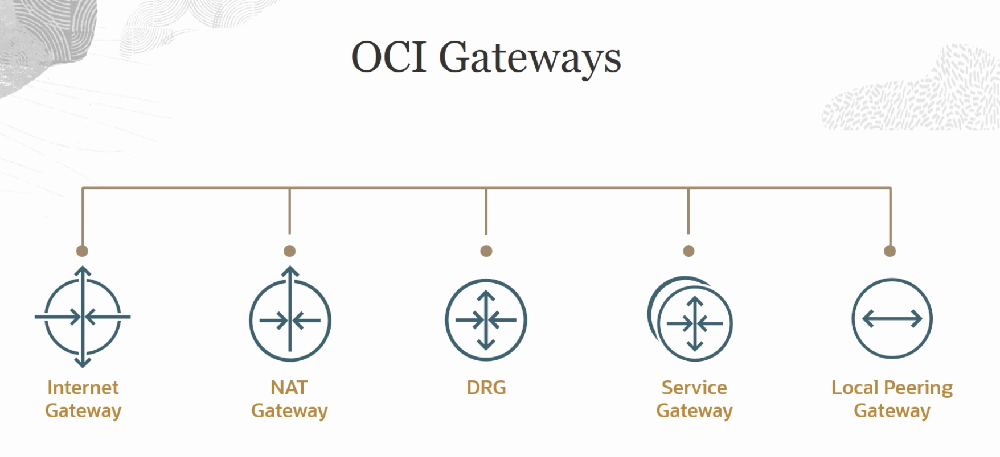
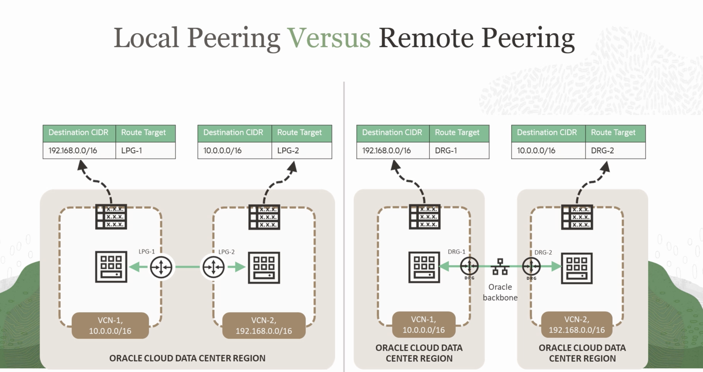
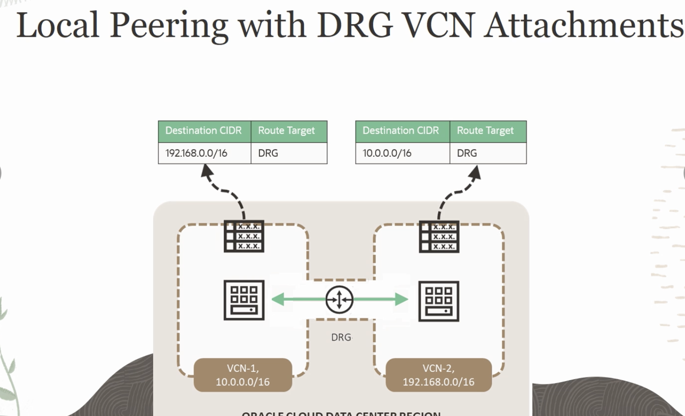
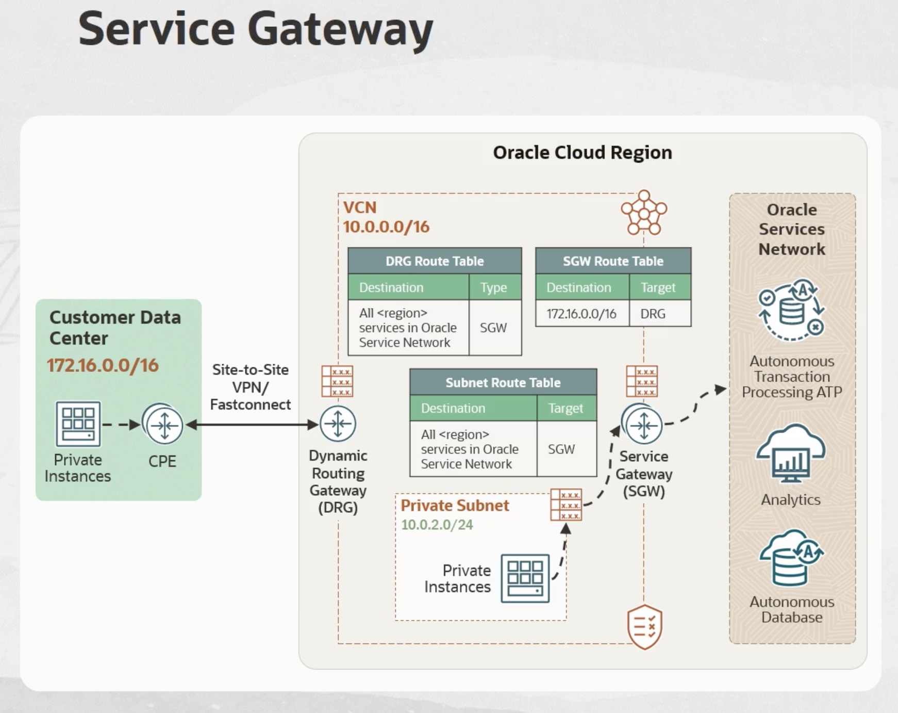
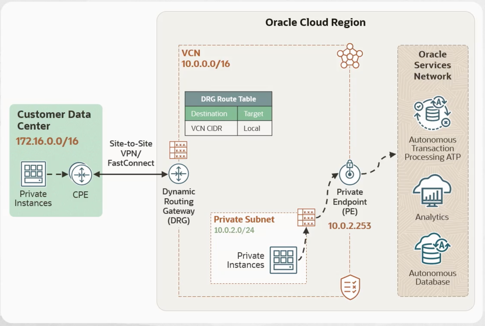
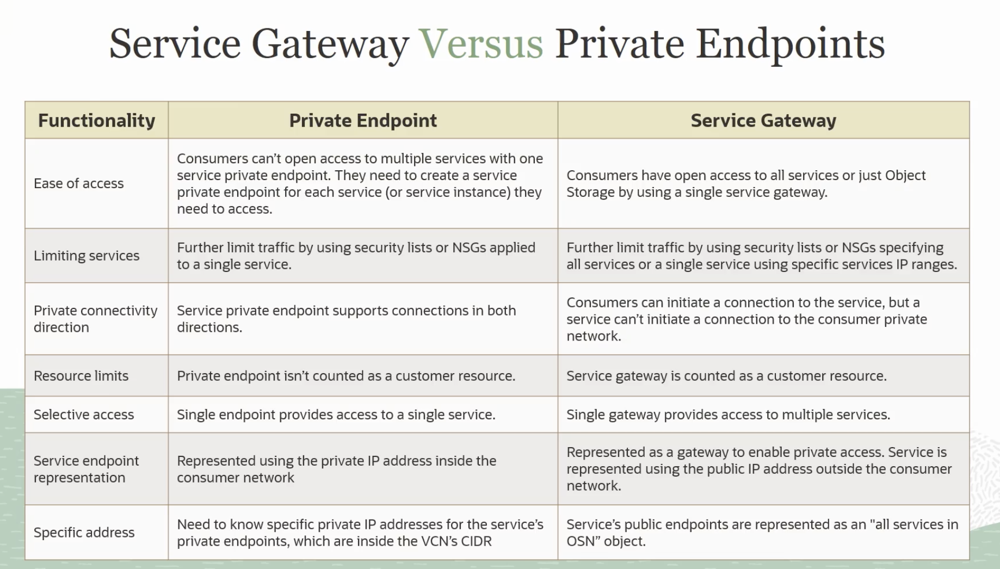
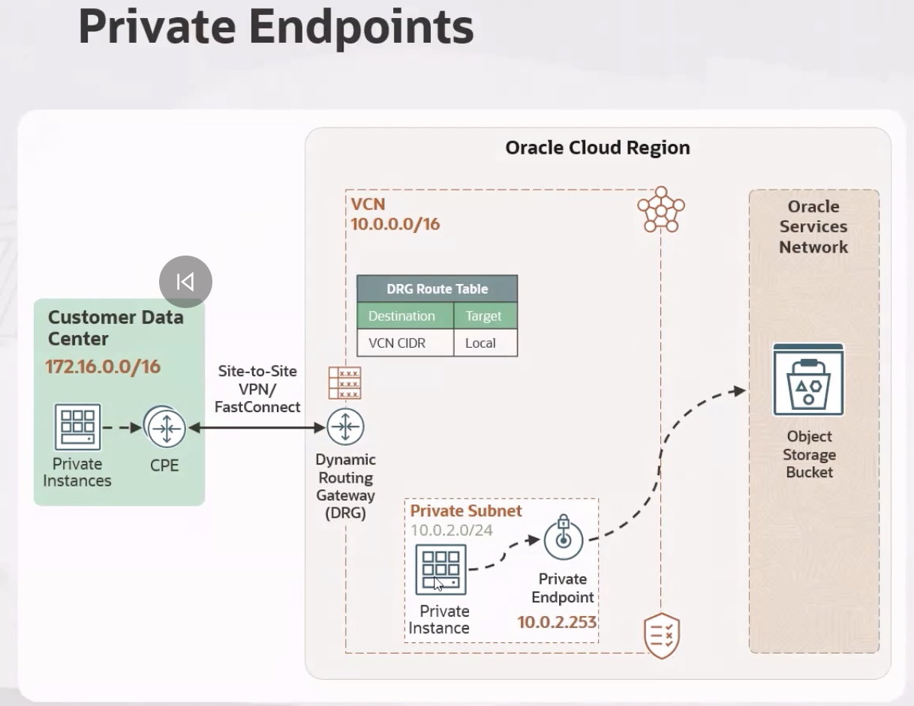
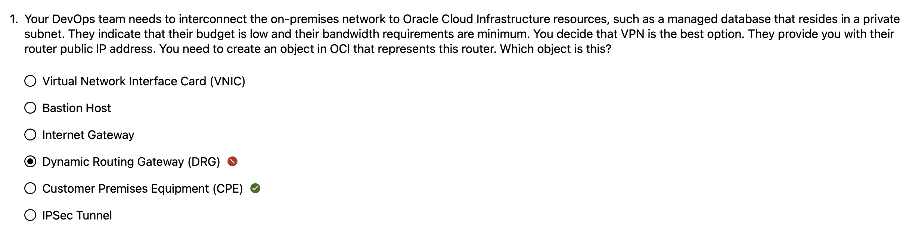

Interet gateway: You can even have a public subnet if you want to label it that a public subnet. But if you don't have an internet gateway associated to that public subnet and if you don't have route rules that would take you out to the open internet, then pretty much that public subnet will be not reachable from anywhere in the open internet. So it is an optional component that you can add to your Virtual Cloud Network.
only one per vcn
Only VCN resources can use the internet gateway. That means that if you're communicating through another gateway to on-premises, let's say your local area network, and then those resources communicate to the VCN, they cannot hop out to the open internet via the internet gateway. So transitive routing is not supported on the internet gateway.

A route must be added for the gateway in the public subnet to be used. So a route rule must be added to the route table.

Now you cannot add or move an internet gateway if you have your VCN on a security zone. A security zone is a configuration that you put in place that does not allow to any movement or any modification to be enabled. So you cannot add or move out an internet gateway away from that security zone.

the NAT gateway, it is used when you want to communicate your resources that sits on a private subnet on your Virtual Cloud Network out to the open internet. So they can initiate traffic out to the open internet. Let's say that you might have a database node that needs to get a patch, or it needs to get an update, or it needs to get an upgrade of the version. So this is when you need the NAT gateway.

So you initiate the traffic from your private resources on a private subnet out to the open internet. And then because you're initiating the traffic, traffic coming in is going to be allowed through the NAT gateway. And you can also use this for resources that sits on a public subnet that do not have a public IP address. Remember that our resource that you create, even if they're in the public subnet, they all come with a private IP address. So the NAT gateway gives it the entire private subnet access to the internet without assigning them a public IP address.

So hosts can initiate outbound connections to the internet and receive responses. Again, traffic cannot initiate outside of your VCN into the resources that you allocated on a private subnet. You can't have more than one NAT gateway.

when you use the NAT gateway, you do not need an internet gateway. That's it. The NAT gateway is the only resource that you need to initiate traffic out to the open internet without the internet gateway. We know that other cloud service providers on top of the NAT gateway, the NAT gateway communicates with the internet gateway.
So supports a maximum and we're talking about how many concurrent connections you can have, up to 20,000 concurrent connections. So if you want to go beyond that, then that might be when you need a second NAT gateway. 

The service limit is always one. The service limits, if you need more, then you need to increase the service limit.

It's not possible for you to use the NAT gateway for transitive routing.

So resources within the VCN means that if you have a connection from this VCN connecting via FastConnect to on-premises or via remote peering connection to remote VCN, those resources, let's stay with the remote peering connection. Those resources and that other VCN cannot communicate to this VCN and then use the NAT gateway to go to the open internet. They will need to have their own NAT gateway on their own VCN or resources on-premises via FastConnect cannot leverage this network address translation gateway.


## 🧭 OCI NAT Gateway & Ephemeral Private Cloud Shell — Comprehensive Walkthrough

### **Overview**

This demonstration explains how a **Network Address Translation (NAT) Gateway** enables compute instances in a **private subnet** to reach the public internet without exposing themselves to inbound traffic.
It also shows how to use **Cloud Shell’s Ephemeral Private Network** to securely connect to private instances within a Virtual Cloud Network (VCN).

---

### **1. Scenario Setup**

The instructor begins by creating a **Virtual Cloud Network (VCN)** in the *Phoenix* region using the **VCN wizard**, which automatically generates:

* A **public subnet** (with an Internet Gateway)
* A **private subnet** (with a NAT Gateway)
* **Default route tables** and **security lists**

A compute instance named **MyPHXVM** is launched inside the private subnet:

* It receives only a **private IP address** (no public IP).
* It’s therefore **not directly reachable from the internet**.

This scenario sets the stage for demonstrating outbound internet access and private internal connectivity.

---

### **2. Why the NAT Gateway Exists**

By design, private subnet instances can’t reach the internet directly.
The **NAT Gateway** solves this problem by performing outbound-only translation:

| Direction                                       | Behavior                                                                            |
| ----------------------------------------------- | ----------------------------------------------------------------------------------- |
| **Outbound (from private instance → internet)** | Allowed. The NAT Gateway replaces the instance’s private IP with its own public IP. |
| **Inbound (from internet → private instance)**  | Blocked. No return path exists.                                                     |

This enables patching, software installation, or API access from private compute instances without exposing them publicly.

---

### **3. Enter Cloud Shell — Public vs. Ephemeral Private Modes**

When Cloud Shell first launches, it defaults to a **public network context**:

* Runs on Oracle’s public management network.
* Has internet access.
* **Cannot** reach private VCN subnets.

To connect to a **private instance** (like MyPHXVM), the instructor switches Cloud Shell into **Ephemeral Private Network** mode.
In this mode, OCI dynamically provisions a **temporary private endpoint** *inside the selected VCN and subnet*.

From that moment:

* Cloud Shell behaves as if it were a VM inside the VCN.
* It can SSH directly into private instances, because traffic stays within the same VCN fabric.
* No route rule is required for this internal communication.

---

### **4. The Connection Process**

1. The instructor pastes the **private RSA key** (for MyPHXVM) into Cloud Shell using `vi`, saving it as `MyPHXKey`.
2. He executes `chmod 400 MyPHXKey` — making the file readable only by the owner, as SSH rejects keys with overly open permissions.
3. Using the VM’s private IP (`10.2.1.215`), he connects:

   ```bash
   ssh -i MyPHXKey opc@10.2.1.215
   ```
4. SSH succeeds immediately because:

   * The **Cloud Shell private endpoint** and **MyPHXVM** are in the same VCN and subnet.
   * **Intra-VCN routing is automatic** (no explicit route rule needed).
   * The subnet’s **security list** allows inbound SSH (TCP port 22).

---

### **5. Verifying NAT Gateway Connectivity**

Inside the private VM, he runs:

```bash
ping 1.1.1.1
ping 8.8.8.8
```

Both succeed — confirming that the private VM can reach the internet **through the NAT Gateway** defined in its route table:

```
Destination: 0.0.0.0/0 → Target: NAT Gateway
```

---

### **6. Testing Route Control**

He edits the route table to narrow internet access:

```
Destination: 8.8.8.8/32 → Target: NAT Gateway
```

Now:

* `ping 1.1.1.1` → fails (no matching route)
* `ping 8.8.8.8` → succeeds (explicit route exists)

This illustrates how route tables dictate which external destinations a private subnet can reach.

---

### **7. Clarifying Cloud Shell Behavior**

**Question:**

> Does Cloud Shell automatically spin up inside the private subnet of the VCN if I open it while viewing that VCN?

**Answer:**
Not automatically — but *almost*.
When you open Cloud Shell from the OCI Console, it launches in the same **region** and **tenancy** you’re viewing, but initially on the **public network**.
To access your VCN, you must **manually activate the Ephemeral Private Network** inside Cloud Shell and **select the target VCN and subnet**.

Only then does OCI:

* Create a **temporary private endpoint** within that subnet.
* Route Cloud Shell traffic internally through your VCN.

Once activated, Cloud Shell can communicate directly with private resources — no additional routing needed.
When you close the session, OCI automatically deletes this temporary endpoint (hence “ephemeral”).

---

### **8. Conceptual Summary**

| Component                           | Purpose                                              | Key Behavior                                            |
| ----------------------------------- | ---------------------------------------------------- | ------------------------------------------------------- |
| **NAT Gateway**                     | Enables outbound internet access for private subnets | Replaces private IPs with its public IP; inbound denied |
| **Route Table**                     | Determines traffic destinations                      | `0.0.0.0/0 → NAT Gateway` enables all outbound traffic  |
| **Cloud Shell (Public)**            | Internet-facing environment                          | Cannot reach private subnets                            |
| **Cloud Shell (Ephemeral Private)** | Temporary private endpoint in your VCN               | Full internal visibility, no route rule needed          |
| **Security List / NSG**             | Controls port and protocol access                    | Must allow SSH (TCP 22) for connectivity                |
| **Intra-VCN Routing**               | Implicitly provided by OCI                           | No explicit route rules needed inside a VCN             |

---

### **9. Key Takeaways**

* Private instances can **initiate** outbound connections through a **NAT Gateway** without exposing themselves publicly.
* **Ephemeral Private Cloud Shell** acts as a secure management entry point inside your VCN — ideal for connecting to private resources.
* **Route rules** govern external reachability, but **intra-VCN communication** requires only appropriate security rules.
* When you finish, OCI tears down the ephemeral endpoint automatically, preserving both security and cost efficiency.

---

Would you like me to format this into a **shareable Markdown or PDF document** (with headers, bullets, and clear code blocks) so you can paste it directly into your notes or study portfolio?

----

Local Peering Gateway (LPG)

Now if you do have overlap on the CIDR, remember that you can have up to five CIDR blocks per VCN. Even if you are not using those CIDR blocks that overlaps for communicating, the fact that they're overlapping will not permit the local peering connection to establish. So the VCNs that you're communicating, they must not have overlapping CIDRs, even if that CIDR is one that you're not using. So the local peering connection construct will not allow you. It will give you an error message.


So within the region, you can use the local peering gateway, as we previously saw, to communicate two VCNs. However, you can also use the remote peering connection even as it indicates there, it was designed for communicating across regions. But now with the enhanced DRG, you can use the dynamic routing gateway to communicate two VCNs that sits in the same region. So you don't have to use the local peering connection.

And remember the non-overlapping restriction that you have with the local peering connection. That does not apply here with the dynamic routing gateway. You can still attach two VCNs that have overlapping CIDRs. They will not be able to communicate each other. However, you can still attach them.

They will not be able to communicate using that CIDR that overlaps. But because you can assign a second CIDR to a VCN, then you can use that other CIDR from that VCN to communicate with the other VCN. So that's the basic differences that you can use. So local peering, it is technically not local peering because you're attaching two VCNs. But this is an alternative solution that you have to local peering with




## 🧭 Oracle Cloud Infrastructure – Local Peering Connection (LPG) Demonstration Summary

### **1. Purpose of the Demo**

This demonstration explains how to connect **two Virtual Cloud Networks (VCNs)** within the **same region** (Phoenix) using a **Local Peering Connection (LPG)**.
The goal is to allow **private communication between resources in separate VCNs** — without routing through the public internet.

---

### **2. Initial Setup**

* A preexisting VCN named **MyPHXVCN** (VCN1) already exists in the Phoenix region.
* It includes a **NAT Gateway**, **Service Gateway**, and **Internet Gateway**, but **no Local Peering Gateway (LPG)** yet.

The instructor creates:

* A new **Local Peering Gateway (LPG1)** in VCN1.
* A **second VCN** called **MyPHXVCN2** with a **non-overlapping CIDR block** (`172.16.0.0/16`).

VCN2 also receives:

* Its own **LPG2**.
* The same default gateways (Internet, NAT, Service).

---

### **3. Establishing the Peering Connection**

1. In **VCN2**, the instructor selects **LPG2 → Establish Peering Connection**.
2. Chooses the **same compartment** and selects the **VCN1 gateway (LPG1)** as the peer.
3. OCI then links **LPG1 ↔ LPG2**, creating a **bidirectional private communication channel** between both VCNs.

Now, both VCNs are “locally peered.”

---

### **4. Updating Route Tables**

For the connection to actually carry traffic, each VCN’s **route table** must know how to reach the other’s network:

| VCN  | Route Table         | Destination CIDR | Target   |
| ---- | ------------------- | ---------------- | -------- |
| VCN1 | Private Route Table | `172.16.0.0/16`  | **LPG1** |
| VCN2 | Default Route Table | `10.0.0.0/8`     | **LPG2** |

This ensures that traffic destined for the other VCN is forwarded through the local peering gateway instead of the internet or NAT gateway.

---

### **5. Creating Compute Instances**

* **VCN1** already contains a private compute instance (from a prior demo).
* A new **compute instance (MyPHXVM2)** is created inside **VCN2’s public subnet** with a public IP, allowing SSH access from Cloud Shell.
* Each VM has its own SSH key pair configured in Cloud Shell (`MyPHXKey`, `otherkey`, etc.).

---

### **6. Configuring Security Lists**

To allow **ping (ICMP echo)** between the VCNs:

* In **VCN1**, an **ingress rule** is added:

  * Source: `172.16.0.0/16`
  * Protocol: ICMP type 8 (Echo)
* In **VCN2**, a similar rule is added:

  * Source: `10.0.0.0/8`
  * Protocol: ICMP type 8 (Echo)

This permits cross-VCN pinging for connectivity verification.
⚙️ Why we only see ingress rules mentioned in the demo

That’s because of how Security Lists are designed by default in OCI:

Traffic Type	Default Behavior (Security List)
Egress (outbound)	All traffic is allowed unless you explicitly restrict it.
Ingress (inbound)	All traffic is denied unless you explicitly allow it.

So, in practice:

When VM1 sends a ping → egress from VM1 is already allowed by default.

When VM2 receives that ping → ingress must be explicitly allowed (hence the ICMP type 8 rule).

When VM2 replies → egress from VM2 is also allowed by default.

When VM1 receives the reply → ingress must again be explicitly allowed.

That’s why both sides needed ingress rules, but not explicit egress ones.

🧠 What if you had Network Security Groups (NSGs) instead?

Then your instinct would be absolutely correct —
NSGs block everything by default, both ingress and egress.
You’d need to explicitly define:

Egress ICMP from the sender NSG to the destination NSG or CIDR.

Ingress ICMP on the receiver NSG for the same traffic.

In other words:

Security Lists → default egress open, so only ingress needed.
NSGs → both ingress and egress must be defined.

---

### **7. Testing the Connection**

1. From the Cloud Shell, the instructor SSHs into **MyPHXVM2 (VCN2)** using its public IP and private key.
2. Once inside, he pings the **private instance in VCN1** at `10.2.1.215`.
3. The ping succeeds, confirming **end-to-end connectivity between the two private networks** via the Local Peering Connection.

---

### **8. Key Takeaways**

| Concept                            | Description                                                                         |
| ---------------------------------- | ----------------------------------------------------------------------------------- |
| **Local Peering Gateway (LPG)**    | Enables private communication between two VCNs in the same region.                  |
| **No Internet Needed**             | Traffic flows entirely within Oracle’s internal backbone, not through the internet. |
| **Non-Overlapping CIDRs Required** | Each VCN must have distinct address ranges.                                         |
| **Routing Required**               | Each VCN’s route table must point to its LPG to send traffic to the peer network.   |
| **Security Lists / NSGs**          | Must explicitly allow the desired protocols (e.g., ICMP, SSH) between VCNs.         |
| **End Result**                     | Seamless private communication between instances in separate VCNs.                  |

---

### **9. Summary in One Line**

> Two VCNs in the same region were linked using Local Peering Gateways, updated route tables, and permissive security rules — enabling secure, private, cross-VCN connectivity without touching the internet.

----




# 🧭 **The Service Gateway — Your Private Highway into Oracle’s Services**

---

## **1. Why the Service Gateway Exists**

Inside Oracle Cloud, there are two big “zones” of networking:

| Zone                              | What It Contains                                                                                 | Who Controls It |
| --------------------------------- | ------------------------------------------------------------------------------------------------ | --------------- |
| **Your Tenancy (VCN space)**      | Your compute instances, load balancers, databases                                                | You             |
| **Oracle Services Network (OSN)** | Oracle-managed services such as Object Storage, Autonomous Database, GoldenGate, Analytics, etc. | Oracle          |

These two areas are both inside Oracle Cloud’s global backbone, but they are *different networks*.
So the question becomes:

> “How can my private subnet in my VCN talk to Oracle’s managed services *without* going through the public internet?”

That’s exactly what the **Service Gateway** (SGW) does.

It’s the **private, internal bridge** that connects your **VCN** directly to the **Oracle Services Network**, staying entirely inside Oracle’s backbone.

---

## **2. The Core Idea**

> **The Service Gateway allows resources in your VCN to privately access Oracle’s managed services (the OSN) without sending traffic through the internet.**

It bypasses both:

* the **Internet Gateway (IGW)**, and
* the **NAT Gateway (NGW)**.

---

## **3. Where It Sits in the Architecture**

Visualize this stack:

```
+------------------------------------------------------+
|                  Oracle Backbone Network             |
|------------------------------------------------------|
|  Oracle Services Network (OSN)                       |
|  ├── Object Storage                                  |
|  ├── Autonomous Database                             |
|  ├── Data Flow, Analytics Cloud, etc.                |
|------------------------------------------------------|
|  Service Gateway (SGW)  ←– Private bridge connection  |
|------------------------------------------------------|
|  Your Virtual Cloud Network (VCN)                    |
|  ├── Private subnet (VMs, DBs, etc.)                 |
|  ├── Route tables, Security Lists, etc.              |
+------------------------------------------------------+
```

Traffic **never leaves Oracle Cloud** — it stays on the internal fiber backbone that Oracle owns globally.

---

## **4. How It Works in Practice**

### Scenario 1 — Accessing OSN *from your VCN*

Example:
Your VM in a private subnet wants to put a file in **Object Storage**.

1. Your private subnet’s **route table** has a rule:

   ```
   Destination: All OSN service CIDRs
   Target: Service Gateway
   ```
2. The VM sends a packet.
3. It reaches the SGW, which routes it **internally** to the OSN.
4. The response comes back the same way — no internet exposure.

🧠 *Think:* It’s like walking through an internal corridor from your office to Oracle’s service department — you never step outside the building.

---

### Scenario 2 — Accessing OSN *from On-Premises (through a DRG)*

Now let’s add the **Dynamic Routing Gateway (DRG)** into the picture.

Suppose your corporate data center is connected to OCI through **FastConnect Private Peering** or a **VPN** tunnel.
That connection terminates at your **DRG** inside OCI.

Normally, the DRG connects your on-prem network to your **VCN**.
But with the Service Gateway, it can also forward traffic to **Oracle’s Services Network (OSN)**.

This is where **transitive routing** comes into play.

---

## **5. What “Transitive Routing” Means**

Let’s first demystify the term:

> **Transitive routing** means traffic can enter a gateway through one connection and exit through another.

In this context:

```
On-Prem Network
      │
(VPN or FastConnect)
      │
[ Dynamic Routing Gateway (DRG) ]
      │  (transit)
      ▼
[ Service Gateway (SGW) ]
      │
      ▼
[ Oracle Services Network (OSN) ]
```

So your on-premises server can reach Oracle Object Storage, for example, by *transiting* through the DRG → SGW path.
It doesn’t stop at the DRG — it passes through to the OSN.

That’s what the instructor meant when he said *“transitive routing is supported by the Service Gateway.”*

---

## **6. Why Transitive Routing Is Special**

Other gateways, such as the **Internet Gateway** or the **NAT Gateway**, don’t support transit — they act as endpoints.
Traffic stops there and exits OCI to the public internet.

But the **Service Gateway** *can* act as a transit path when paired with a **DRG**.
That means:

* Your **VCN resources** can reach the OSN.
* Your **on-premises network** can also reach the OSN *through your DRG*.

That’s private, internal, and fully managed within Oracle’s backbone.

---

## **7. The Route Tables That Make It Work**

Three route tables participate in this setup:

| Route Table         | Belongs To          | Purpose                                               |
| ------------------- | ------------------- | ----------------------------------------------------- |
| **VCN Route Table** | Your private subnet | Routes VM traffic to the SGW for Oracle services      |
| **DRG Route Table** | The DRG             | Routes on-prem traffic toward the SGW                 |
| **SGW Route Table** | The Service Gateway | Sends return traffic back to the DRG or VCN as needed |

Together, they form a complete path:

```
On-Prem → DRG → SGW → OSN → (return path)
```

---

## **8. Regional Scope**

A Service Gateway is **regional**, meaning:

* It only provides access to Oracle services hosted **in the same OCI region**.
* If your VCN is in *Phoenix*, your SGW connects to the *Phoenix* Oracle Services Network.
* If you want access to services in *Singapore*, you’d need an SGW there (or a DRG + Remote Peering Connection (RPC) setup between regions).

---

## **9. How BGP Fits In**

If your on-premises router connects via **FastConnect** or **VPN**, it uses **BGP (Border Gateway Protocol)** to automatically exchange routing information with the DRG.

* The DRG advertises to your on-prem router:
  “I know how to reach the Oracle Services Network (through the SGW).”
* Your on-prem router advertises back:
  “Here’s how to reach my corporate subnets.”

That way, neither side needs manual route entries — the routers update each other dynamically.

🧠 *Think:* Both sides exchange digital maps of what networks they can reach.

---

## **10. Relation with FastConnect**

When connecting from on-prem to Oracle services, two FastConnect options exist:

| Type                            | Connects To                            | DRG Involved? | Internet Used? |
| ------------------------------- | -------------------------------------- | ------------- | -------------- |
| **FastConnect Private Peering** | Your VCN (via DRG)                     | ✅ Yes         | ❌ No           |
| **FastConnect Public Peering**  | Oracle Services Network (OSN) directly | ❌ No          | ❌ No           |

Now, when you use **FastConnect Private Peering**, the DRG can forward your on-prem traffic to the SGW — that’s the *transitive routing scenario*.

When you use **FastConnect Public Peering**, you connect directly to the OSN, bypassing both the DRG and your tenancy entirely.

So:

* **Private Peering** → DRG → SGW → OSN
* **Public Peering** → OSN directly

Both use the same *physical FastConnect circuit*, but different *logical routes (VLANs)* and destinations.

---

## **11. Key Differences from Other Gateways**

| Gateway                             | Purpose                                               | Internet Used? | Transitive Routing? | Scope        |
| ----------------------------------- | ----------------------------------------------------- | -------------- | ------------------- | ------------ |
| **Internet Gateway**                | Public inbound/outbound to the internet               | ✅ Yes          | ❌ No                | Regional     |
| **NAT Gateway**                     | Outbound-only for private subnets                     | ✅ Yes          | ❌ No                | Regional     |
| **Service Gateway**                 | Private access to Oracle Services Network             | ❌ No           | ✅ Yes (via DRG)     | Regional     |
| **Dynamic Routing Gateway (DRG)**   | Private routing between networks (on-prem, VCNs, RPC) | ❌ No           | ✅ Yes               | Regional     |
| **Local Peering Gateway (LPG)**     | VCN-to-VCN within same region                         | ❌ No           | ❌ No                | Regional     |
| **Remote Peering Connection (RPC)** | VCN-to-VCN across regions (via DRGs)                  | ❌ No           | ✅ (through DRGs)    | Cross-region |

---

## **12. Real-World Example**

### You have:

* A data center in London
* A VCN in Phoenix
* An Object Storage bucket in Phoenix

### You configure:

1. **FastConnect Private Peering** from London → Phoenix DRG.
2. **DRG route rule:** send `OSN CIDRs` → Service Gateway.
3. **Service Gateway route:** forward back to DRG for return traffic.

### Result:

Your London server stores backups directly to Object Storage over Oracle’s internal backbone:

```
London → FastConnect → DRG → SGW → Object Storage
```

✅ No internet.
✅ Private IPs.
✅ BGP dynamically handles route updates.
✅ Full transitive routing through DRG → SGW.

---

## **13. One-Liner Summary**

> The **Service Gateway** is Oracle’s internal bridge that lets your VCN — or even your on-premises network via a DRG — privately reach Oracle-managed services (the OSN) using transitive routing, over Oracle’s backbone, without touching the public internet.

---

## **14. Mental Model Summary**

| Concept                           | Role                                                        | Analogy                                                                 |
| --------------------------------- | ----------------------------------------------------------- | ----------------------------------------------------------------------- |
| **Service Gateway (SGW)**         | Private bridge between your VCN and Oracle Services Network | A private corridor connecting your building to Oracle’s service complex |
| **Oracle Services Network (OSN)** | Oracle’s internal network of managed cloud services         | Oracle’s “service city” within its own walls                            |
| **Dynamic Routing Gateway (DRG)** | Private router connecting VCNs, on-prem, and other clouds   | The core router in your cloud hub                                       |
| **Transitive Routing**            | Traffic passes through one gateway to reach another         | Taking a connecting flight instead of two direct ones                   |
| **FastConnect Private Peering**   | Dedicated cable into your tenancy (via DRG)                 | A private leased line into your corporate building                      |
| **FastConnect Public Peering**    | Dedicated cable straight to Oracle’s service backbone       | A private lane into Oracle’s headquarters                               |
| **BGP**                           | Protocol exchanging routes between routers                  | Two post offices sharing updated delivery maps                          |


# ☁️ **Service Gateway – Full Demo Explanation (with Networking Logic)**

---

## **1. What the Instructor Is Demonstrating**

This demo shows **how the Service Gateway (SGW)** in Oracle Cloud Infrastructure (OCI) enables a **private subnet** to:

* access **Oracle Services Network (OSN)** resources (like Object Storage) **without using the internet**,
* and how it works *even if the NAT Gateway and Internet Gateway are removed*.

The setup uses minimal components so you can see the behavior clearly.

---

## **2. The Network Setup**

Here’s the environment Sergio (the instructor) pre-built:

| Component                 | Description                                                                                                                     |
| ------------------------- | ------------------------------------------------------------------------------------------------------------------------------- |
| **VCN**                   | A single Virtual Cloud Network, named “Service Gateway Demo VCN.”                                                               |
| **Subnet**                | One **private subnet** (no public IPs).                                                                                         |
| **Compute Instance**      | A Linux VM (VM4ServiceGatewayDemo) inside the private subnet.                                                                   |
| **NAT Gateway**           | Initially enabled (to show connectivity to the Internet).                                                                       |
| **Service Gateway (SGW)** | Connected to Oracle Services Network (to access Object Storage privately).                                                      |
| **Object Storage Bucket** | A private bucket in the same region, with no public access.                                                                     |
| **Cloud Shell**           | Used as the control point for CLI commands. Initially public, then switched to a **private ephemeral endpoint** inside the VCN. |

---

## **3. Cloud Shell: Public → Ephemeral Private**

At the start, Cloud Shell was **public**, meaning:

* It had outbound internet access,
* But was **not** inside the VCN.

He then changed it to **“ephemeral private”**, which:

* Creates a **temporary private endpoint** inside your **VCN’s subnet**,
* Effectively placing Cloud Shell *inside* your private subnet,
* Without assigning it a persistent IP.

So now, Cloud Shell is inside the same **private subnet** as the compute instance —
they’re both in the same local network, **no internet needed** between them.

🧠 **Key Concept:**

> “Ephemeral private Cloud Shell” = a temporary VM Oracle launches *inside your subnet* so it behaves like part of your VCN.

---

## **4. Testing the NAT Gateway and Service Gateway**

Initially:

* The route table for the private subnet had two entries:

  1. **Default route (0.0.0.0/0)** → NAT Gateway
     → for all general internet access.
  2. **Specific OSN CIDR** → Service Gateway
     → for Oracle services like Object Storage.

So:

* Any outbound request (e.g., pinging Google) used the **NAT Gateway**.
* Any request for Oracle service endpoints (e.g., Object Storage) used the **Service Gateway**.

---

## **5. Step 1 — Verify General Connectivity**

He SSHed from Cloud Shell (private ephemeral) → compute instance, using its **private IP**.
✅ Works fine because both are in the same subnet and port 22 is open in the security list.

Then he ran a **ping test**:

* Ping to a public IP worked (via the NAT Gateway).
* That confirmed that **the NAT route was active**.

---

## **6. Step 2 — Remove the NAT Gateway**

He then **removed the NAT Gateway route** from the private subnet’s route table.
Now, there’s:

* No route to the Internet,
* Only a route to the **Service Gateway (for Oracle Services Network)**.

When he tried to **ping again**, it failed — exactly as expected.

❌ **Ping doesn’t work through the Service Gateway**, because the Service Gateway does not allow raw ICMP or arbitrary internet destinations.
It only handles Oracle service traffic, like `objectstorage.<region>.oraclecloud.com`.

🧠 **Lesson learned:**

> The Service Gateway is *not* a general-purpose outbound gateway — it’s a private bridge *only* for Oracle-managed services.

---

## **7. Step 3 — Verify Access to Object Storage**

Now he moved back to Cloud Shell (still ephemeral private) and used the **OCI CLI** (command-line interface) to:

* List his Object Storage buckets,
* Upload files into a bucket,
* Confirm that these operations worked **without internet** (since NAT was removed).

And indeed, the commands succeeded —
the files appeared inside the Object Storage bucket.

✅ **This traffic flowed through the Service Gateway** directly to the Oracle Services Network.
No internet, no public IPs — just private Oracle backbone routing.

---

## **8. Step 4 — Remove the Service Gateway Route**

Finally, he deleted the Service Gateway route from the private subnet’s route table.
Now, there were *no* active routes at all (neither NAT nor SGW).

Then he tried to run the same Object Storage CLI command again.
This time:

* It failed immediately.
* OCI CLI could no longer reach Object Storage.

That confirmed:

> The Service Gateway was the *only* path that made private Object Storage access possible.

---

## **9. Key Technical Insights**

| Concept                               | Explanation                                                                                                                      |
| ------------------------------------- | -------------------------------------------------------------------------------------------------------------------------------- |
| **Service Gateway (SGW)**             | Enables *private, in-region* access to Oracle’s managed services (Object Storage, ATP, etc.) through Oracle’s internal backbone. |
| **NAT Gateway (NGW)**                 | Provides outbound Internet access for private subnets (to *any* external address).                                               |
| **No Internet Gateway (IGW)**         | Since the subnet is private, there’s no IGW; instances have no public IPs.                                                       |
| **Routing Priority**                  | OCI route tables always follow the *most specific route*. So “OSN → SGW” overrides “0.0.0.0/0 → NAT.”                            |
| **Service Gateway Region Constraint** | It only connects to Oracle Services Network *in the same region*.                                                                |
| **Cloud Shell Ephemeral Private**     | Creates a temporary private endpoint inside your subnet so you can interact with internal resources.                             |
| **CLI over SGW**                      | Works perfectly for Oracle API endpoints (because those are part of the OSN).                                                    |

---

## **10. Real-World Meaning**

This architecture mirrors how **enterprise OCI deployments** work:

* Private compute instances with *no public IPs* can still:

  * Upload backups to **Object Storage**,
  * Connect to **Autonomous Databases**,
  * Use **Logging**, **Analytics**, or **Data Flow**,
    without any exposure to the public internet.

It’s a clean, secure, and fully internalized data path:

```
Private VM → Service Gateway → Oracle Services Network → Object Storage
```

---

## **11. What You Should Take Away**

| Principle                                | Description                                                                                                          |
| ---------------------------------------- | -------------------------------------------------------------------------------------------------------------------- |
| **SGW = Private Oracle Services Access** | It’s not for general outbound traffic, only for Oracle’s service network.                                            |
| **Region-Specific**                      | It only reaches Oracle services in the *same* region as your VCN.                                                    |
| **Security Advantage**                   | No public IPs, no internet exposure, no NAT costs.                                                                   |
| **No Ping or Generic Traffic**           | It won’t forward arbitrary packets; it routes Oracle service traffic only.                                           |
| **Best Practice**                        | Always use the Service Gateway for private access to Object Storage or Autonomous Databases — never the NAT Gateway. |

---

✅ **Final Summary in One Line**

> The **Service Gateway** is your **private, region-bound bridge** between your **VCN’s private subnet** and the **Oracle Services Network**, allowing your compute instances (and even Cloud Shell) to access Oracle-managed services *securely and privately*, without using the internet — while NAT handles general outbound internet, the SGW handles Oracle’s internal cloud services.

---



# 🧭 **Oracle Cloud Infrastructure — Private Endpoints (PEs)**


## **1. The Core Problem**

When you use Oracle-managed services like **Autonomous Database (ATP / ADW)** or **Object Storage**, they live on the **Oracle Services Network (OSN)** — a separate internal Oracle-managed network.
By default, access to those services is made via **public endpoints** (with Oracle-managed DNS names and public IPs).

Even though those public endpoints are **secured** (authentication, TLS, IAM policies), many enterprises want a **completely private connection** — no public routing at all.

That’s where **Private Endpoints** come in.

---

## **2. What Is a Private Endpoint (PE)?**

> A **Private Endpoint** is a *private IP address from your own subnet* that represents an Oracle-managed service (such as an Autonomous Database) that actually resides on the Oracle Services Network.

It makes that Oracle service **look like it’s inside your subnet**, even though it physically sits in Oracle’s managed layer.

### ✅ **Think of it like this:**

It’s a **tunnelled link** that gives your VCN a *virtual interface* directly into the OSN —
but instead of connecting to `adb.<region>.oraclecloud.com` (public),
you connect to `10.0.2.253` (private), and that IP lives in your subnet.

---

## **3. The Architecture**

Imagine this setup:

```
+---------------------------------------------------+
|               Oracle Cloud Backbone               |
|---------------------------------------------------|
| Oracle Services Network (OSN)                     |
|  ├── Autonomous Database (ATP / ADW)              |
|  ├── Object Storage                               |
|  ├── Analytics Cloud, GoldenGate, etc.            |
|---------------------------------------------------|
|          │  Private Endpoint Tunnel               |
|---------------------------------------------------|
| Your Virtual Cloud Network (VCN)                  |
|  ├── Private Subnet (10.0.2.0/24)                 |
|  │     ├── Compute Instance (10.0.2.5)            |
|  │     ├── Private Endpoint (10.0.2.253) → ATP    |
+---------------------------------------------------+
```

That **10.0.2.253** is not a compute instance —
it’s a **private IP allocated from your subnet** to represent the **Autonomous Database**.

So, from the subnet’s point of view, the Autonomous Database behaves like a *local node* in your network.

---

## **4. How the Routing Works**

When your application inside the subnet connects to the Autonomous DB using its private endpoint (10.0.2.253):

* The packets go **to that private IP**,
* OCI internally tunnels them to the **Autonomous DB’s public control plane** on the OSN,
* and the return packets follow the same path back.

No public Internet Gateway, NAT Gateway, or Service Gateway is involved.

It’s *direct and private*.

---

## **5. Relation to On-Premises via DRG + VPN/FastConnect**

Now let’s add on-prem connectivity.

Suppose your data center connects to OCI through:

* a **Dynamic Routing Gateway (DRG)**, and
* either **FastConnect** or **Site-to-Site VPN**.

Here’s how that looks:

```
[On-Prem Network]
       │
   VPN / FastConnect
       │
   [ DRG ]
       │
   [ VCN ]
   ├── Private Subnet (10.0.2.0/24)
   │     ├── Private Endpoint (10.0.2.253)
   │     ├── Compute Instance (10.0.2.5)
```

In this case:

* Your **on-prem router learns** (via **BGP**) that the subnet `10.0.2.0/24` — including the private endpoint address — is reachable through the DRG.
* So when an on-prem app wants to connect to the Autonomous Database, it simply connects to `10.0.2.253` through the DRG.

🧠 **Key takeaway:**

> The DRG advertises *your subnet’s CIDR block (including the private endpoint)* to on-premises through BGP.

That means the Autonomous DB looks like part of your corporate network.

---

## **6. The Private Endpoint as a “Connector”**

Sergio called it a **connector** — that’s an accurate metaphor.

It’s like installing a **private socket** inside your subnet that plugs straight into Oracle’s managed service.

Traffic between your subnet and the Oracle Services Network is **tunneled through OCI’s private backbone**, not through public Internet routes.

---

## **7. Benefits of Private Endpoints**

| Benefit                           | Description                                                                          |
| --------------------------------- | ------------------------------------------------------------------------------------ |
| **Extended Private Connectivity** | Your VCN’s private subnet can reach Oracle-managed services using private IPs.       |
| **Enhanced Security**             | No public IP exposure, no Internet Gateway, no NAT.                                  |
| **Simplified Management**         | It behaves like a local node — no extra route tables to tweak.                       |
| **Consistent Architecture**       | Mirrors on-prem design — app/web tier → DB tier, all private.                        |
| **BGP Integration**               | Automatically propagates private endpoint routes to on-prem.                         |
| **Optional Reverse Connectivity** | Services on OSN can initiate connections *back* to on-prem or your VCN (unlike SGW). |

---

## **8. Reverse Connection Endpoints — What’s New**

This is where Private Endpoints go *beyond* what the Service Gateway can do.

### **Normally**

With the **Service Gateway**, traffic is **one-way**:

> From your VCN → to Oracle Services Network.
> Oracle services can’t initiate traffic back to you.

### **With Private Endpoints (and Reverse Connection)**

Traffic can **flow both ways**:

> Oracle Services (e.g., an ATP instance on OSN) can **initiate** a connection back into your subnet or on-prem.

That’s crucial for use cases like:

* Oracle-managed jobs that need to pull data from your private subnet,
* Integration services (like GoldenGate or Data Flow) that need callback access.

#### To make this work:

Private Endpoints leverage:

* **DNS Proxy** — a pseudo-DNS that helps resolve the endpoint internally.
* **SCAN Proxy** — supports Oracle’s SCAN protocol (for clustered DB connections).

These allow OCI to handle reverse flows securely and correctly.

---

## **9. Private Endpoints vs. Service Gateway — Key Differences**


| Feature                        | **Private Endpoint (PE)**                                                 | **Service Gateway (SGW)**                               |
| ------------------------------ | ------------------------------------------------------------------------- | ------------------------------------------------------- |
| **Directionality**             | Bidirectional — traffic can start from your VCN *or* from Oracle Services | Unidirectional — only from your VCN to Oracle Services  |
| **Granularity**                | Single, specific service instance (e.g., one Autonomous DB)               | Broad — all Oracle Services in the region               |
| **Exposure**                   | Appears as one private IP in your subnet                                  | Doesn’t appear as a subnet node                         |
| **Propagation**                | Only that private IP is advertised to on-prem (via BGP)                   | Entire Oracle Services CIDRs advertised                 |
| **Transitive Routing**         | Not used — direct connection                                              | Supported through DRG (e.g., on-prem → DRG → SGW → OSN) |
| **Reverse Connection Support** | ✅ Supported                                                               | ❌ Not supported                                         |
| **Setup Purpose**              | For fine-grained, single-service integration                              | For general regional Oracle Services access             |

---

## **10. Summary: How It Fits in the Big Picture**

| Component                         | Function                                                    | Relationship                                                    |
| --------------------------------- | ----------------------------------------------------------- | --------------------------------------------------------------- |
| **Service Gateway (SGW)**         | Regional, private bridge from VCN → Oracle Services Network | Provides *broad* access to all Oracle services; no reverse flow |
| **Private Endpoint (PE)**         | Specific, private IP mapped to one Oracle-managed service   | Provides *granular* access and allows reverse connectivity      |
| **Dynamic Routing Gateway (DRG)** | Private routing hub (on-prem ↔ OCI ↔ other clouds)          | Advertises VCN CIDRs (including PE IPs) through BGP             |
| **FastConnect / VPN**             | Physical or logical tunnel from on-prem to OCI              | The underlying transport for DRG routes                         |
| **BGP**                           | Routing protocol for automatic route exchange               | Ensures your network knows how to reach PEs or SGWs privately   |

---

## **11. One-Line Summary**

> A **Private Endpoint** in OCI assigns a **private IP address from your subnet** to represent an Oracle-managed service on the Oracle Services Network — making that service behave as if it were *inside* your VCN.
> Unlike the Service Gateway, it supports **bidirectional traffic**, **reverse connections**, and **fine-grained control** — all over Oracle’s private backbone, not the internet.


## 🧭 **Is There Tunneling or Proxying in Private Endpoints?**

Yes — conceptually, **there is a tunneling mechanism involved**, though it’s not something you manually configure like a VPN.
Oracle abstracts it for you, but under the hood, that’s exactly what’s happening.

---

### **1. The Conceptual Flow**

When you create a **Private Endpoint (PE)** for something like an **Autonomous Database**, OCI does the following behind the scenes:

1. **Allocates a private IP address** from your VCN’s subnet (for example, `10.0.2.253`).
2. **Binds** that IP to an internal Oracle-managed interface that lives in the Oracle Services Network (OSN).
3. Creates a **tunnel or proxy link** that associates that private IP address with the Oracle-managed service endpoint (for example, `adb.us-phoenix-1.oraclecloud.com`).

From your subnet’s perspective, that IP address (`10.0.2.253`) is a **native neighbor**, but the packets are actually being **encapsulated and forwarded** through Oracle’s internal backbone into the managed service.

---

### **2. What Kind of Tunneling It Is**

While Oracle doesn’t disclose the low-level packet handling in public documentation, we can infer from its behavior that it’s using something functionally equivalent to **an internal L3/L4 tunnel with NAT translation and proxying**.

Think of it like this:

```
App → 10.0.2.253  (private IP in subnet)
       ↓
OCI Network Fabric
       ↓
[ Private Endpoint Proxy / Tunnel Bridge ]
       ↓
Autonomous Database (in OSN)
```

That middle component — the **Private Endpoint proxy or tunnel bridge** — is what handles:

* translating your private IP destination into the Oracle service endpoint,
* forwarding packets over Oracle’s private backbone,
* and preserving session state for return traffic.

🧠 **Analogy:**
This is *conceptually similar* to Atlassian’s **Forge Tunnel** or **AWS PrivateLink**, where the cloud provider creates a private interface that “pretends” to be in your VPC/VCN, but is really just a *managed network proxy* into the provider’s internal infrastructure.

---

### **3. Why It Feels Like a Proxy**

Because it is one — but a very controlled, Oracle-managed one.

It intercepts your packets at the **network control plane** and forwards them through an internal data plane to the managed service, then reverses the path for responses.

This gives you:

* **Private reachability** (no internet exposure),
* **DNS integration** (the private endpoint has a private FQDN),
* **Reverse connection capability** (the Oracle service can initiate traffic back through the same tunnel if enabled).

That last part — the *reverse connection* — wouldn’t be possible without some kind of proxy or tunnel layer, because the Oracle-managed service doesn’t literally sit inside your VCN.

---

### **4. Why It’s Not Just Routing**

If it were pure static routing (like the Service Gateway), you’d see:

* A destination CIDR (like `all OSN services`) in the route table,
* A one-way flow from your subnet → OSN.

Instead, with Private Endpoints:

* There’s **no explicit route entry**; the endpoint’s IP lives *in your CIDR*.
* Traffic to that IP is internally intercepted and proxied through Oracle’s backbone.
* The endpoint maintains **stateful bidirectional connectivity**.

That behavior implies **a managed proxy/tunnel overlay**, not simple routing.

---

### **5. Why This Design Matters**

This tunneling approach lets Oracle offer:

* **Fine-grained connectivity** — you can connect to *one* specific Autonomous DB, not the entire OSN.
* **Isolation** — other Oracle services remain unreachable.
* **Reverse connectivity** — an OSN service can call into your subnet or even your on-prem environment through the same tunnel.

Those are impossible to achieve with pure routing constructs like the Service Gateway.

---

### **6. Comparison to Similar Systems**

| Cloud                      | Mechanism                                                                                | Equivalent to OCI Private Endpoint                                                             |
| -------------------------- | ---------------------------------------------------------------------------------------- | ---------------------------------------------------------------------------------------------- |
| **AWS**                    | AWS PrivateLink / Interface Endpoint                                                     | ✅ Exactly the same model — private IP in VPC tied to service endpoint through a managed tunnel |
| **Azure**                  | Private Endpoint                                                                         | ✅ Same concept — private IP from subnet, proxied to PaaS resource                              |
| **Atlassian Forge Tunnel** | Secure local proxy tunnel between Atlassian cloud and your local development environment | ✅ Conceptually similar — abstracted tunnel between managed service and private network         |
| **OCI**                    | Private Endpoint                                                                         | ✅ Oracle-managed private tunnel that maps subnet IP → OSN resource                             |

---

### **7. In Summary**

| Question                     | Answer                                                                                                                         |
| ---------------------------- | ------------------------------------------------------------------------------------------------------------------------------ |
| Is there tunneling involved? | Yes — Oracle implements a managed internal tunnel/proxy from your subnet’s private IP to the Oracle Services Network resource. |
| Who manages it?              | Oracle Cloud Infrastructure — completely transparent to you.                                                                   |
| What does it resemble?       | AWS PrivateLink, Azure Private Endpoint, or Atlassian Forge Tunnel.                                                            |
| Why use it?                  | To give a public Oracle service (like ATP) a private presence inside your subnet for secure, bidirectional communication.      |

---

✅ **One-sentence summary**

> A **Private Endpoint** in OCI is essentially a managed tunnel and proxy that gives an Oracle-managed service (like an Autonomous Database) a **private IP inside your subnet**, creating the illusion that it lives within your network — even though it actually resides in Oracle’s internal service network.

---

## 🧩 1. The Architecture at Play

The instructor begins with a **Virtual Cloud Network (VCN)** that has:

* One **public subnet** (contains a compute instance “VM1”)
* One **private subnet** (for the Autonomous Data Warehouse)
* A **NAT Gateway** (for outbound internet from private subnets)
* A **Service Gateway** (for OSN access, though it’s not central in this test)

So the topology before adding the database looks like this:

```
                 ┌──────────────────────────────┐
                 │       Oracle Cloud VCN       │
                 │                              │
                 │ 10.0.0.0/16                  │
                 │                              │
┌────────────┐   │     ┌────────────────────┐   │
│  Internet  │◄──┤→ IGW│ Public Subnet      │   │
└────────────┘   │     │ VM1 (Compute)      │   │
                 │     │ 10.0.0.254         │   │
                 │     └────────────────────┘   │
                 │     ┌────────────────────┐   │
                 │     │ Private Subnet     │   │
                 │     │ ADW Private EP     │   │
                 │     │ 10.0.1.x           │   │
                 │     └────────────────────┘   │
                 └──────────────────────────────┘
```

The **key** here:
When the instructor creates the **Autonomous Data Warehouse**, he chooses to deploy it with a **Private Endpoint**.
That action is what places a *virtual tunnel interface* between the database (which actually lives in the **Oracle Services Network**) and his **private subnet**.

---

## 🛜 2. What Happens When You Enable a Private Endpoint

When you select “Private Endpoint” during the ADW creation wizard, OCI does this behind the scenes:

1. Allocates a **private IP address** from your **private subnet’s CIDR block**.
2. Creates a **tunnel proxy** between that IP and the **Autonomous Database service** running in the Oracle Services Network (OSN).
3. Updates the **ADW’s control plane** to treat all traffic as coming from inside your subnet — no Internet route required.

From a networking point of view, that database is still hosted by Oracle, but it *appears* as a node at `10.0.1.x` inside your private subnet.
That’s the magic of Private Endpoints — a managed tunnel and proxy over Oracle’s internal backbone.

---

## 🧠 3. The Role of the Compute Instance on the Public Subnet

The instructor creates **VM1** inside the **public subnet** purely as a *testing client* — not for internet communication, but to test reachability from one subnet to another.

* VM1’s private IP is `10.0.0.254`
* It belongs to the same VCN as the ADW’s private endpoint (which sits in the private subnet)
* The route tables automatically know how to reach each other because they’re in the same VCN

However, there’s a firewall consideration:

* The private subnet’s **security list** must allow inbound traffic on **TCP 1521** (the Oracle Database listener port).
* The public subnet already has an **egress rule** allowing all outbound traffic.

Hence, only one security rule needed modification — an *ingress rule on the private subnet* allowing connections from within `10.0.0.0/16` to port 1521. In OCI, a stateful security list automatically allows return traffic for an established connection — so an inbound rule on port 1521 implicitly covers the outbound reply flow.

---

## 🔍 4. What the Network Path Analyzer Does

Instead of using a database client (like SQL*Plus or SQL Developer), the instructor uses the **Network Path Analyzer** — an OCI tool that simulates connectivity between two endpoints at the network layer.

He defines:

* **Source IP** = the private IP of VM1 (`10.0.0.254`)
* **Destination IP** = the private endpoint IP of the Autonomous Data Warehouse (`10.0.1.x`)
* **Protocol/Port** = TCP / 1521

The analyzer checks:

1. Route tables in both directions
2. Security lists / NSGs
3. Gateway configurations
4. Subnet reachability

…and then generates a **visual path diagram**.

When he sees “forward path: success” and “return path: success,” that confirms:
✅ The VCN’s internal routing is valid
✅ The private endpoint’s tunnel is live
✅ Security rules permit bidirectional communication

---

## 🔄 5. Why This Works Without Public Internet or NAT

Even though the Autonomous Database is a managed service that lives outside your tenancy (on the Oracle Services Network), the private endpoint **bypasses the internet entirely**.

No Internet Gateway, no NAT Gateway, no Service Gateway is used for that flow.
All traffic stays inside Oracle’s **private backbone**.

If you tried the same connection *without* a private endpoint, you would have needed:

* A **public endpoint** for the ADW (reachable over the internet), or
* A **Service Gateway route** for general OSN access.

But here, the private endpoint provides a **direct, private tunnel** into a *specific* ADW instance.

---

## 🧩 6. Relationship to Everything Else You’ve Learned

| Layer                 | Mechanism                         | What It Does                                                          |
| --------------------- | --------------------------------- | --------------------------------------------------------------------- |
| **Physical**          | **FastConnect (Private Peering)** | Private link between on-premises and your VCN                         |
| **Routing**           | **DRG (Dynamic Routing Gateway)** | Forwards traffic between on-prem, VCNs, and OSN                       |
| **Regional Access**   | **Service Gateway (SGW)**         | Allows VCNs to reach Oracle Services Network privately (all services) |
| **Granular Access**   | **Private Endpoint (PE)**         | Allows your subnet to reach a single Oracle-managed service privately |
| **Verification Tool** | **Network Path Analyzer**         | Confirms end-to-end reachability and rule correctness                 |

In this demo, you’re operating purely at the **Private Endpoint** layer inside your **VCN**.
The DRG, FastConnect, and SGW are not involved, but if this environment were connected to on-premises via DRG + FastConnect, the private endpoint would still be reachable from on-prem, all through private paths.

---

## 🧠 In Simple Words

> The Private Endpoint lets your Autonomous Database sit “inside” your VCN — it borrows a private IP from your subnet, builds a hidden Oracle-managed tunnel into the Oracle Services Network, and makes that managed service look like it’s living right next to your compute instances.

---

### Private Endpoint for Object Storage



## ⚖️ Side-by-Side Comparison

| Feature                     | Private Endpoint for **Object Storage**                           | Private Endpoint for **Autonomous Database / ATP / ADW**                         |
| --------------------------- | ----------------------------------------------------------------- | -------------------------------------------------------------------------------- |
| **Purpose**                 | Provide private HTTPS (port 443) access to Object Storage buckets | Provide private SQL/HTTPS access to specific Autonomous Database or ATP instance |
| **Who creates it**          | You manually create and associate it with a bucket / compartment  | Automatically created when enabling *Private Endpoint* during DB creation        |
| **Scope of access**         | Can target 1 bucket, 1 compartment, or all buckets                | Only that one Autonomous Database or ATP instance                                |
| **Underlying service**      | Object Storage (data-at-rest layer)                               | Autonomous Database / ATP / ADW (data-processing layer)                          |
| **Traffic directionality**  | Unidirectional (VCN → OSN)                                        | Bidirectional (VCN ↔ OSN) — supports reverse connection                          |
| **Typical protocol/port**   | HTTPS (443)                                                       | SQL*Net (1521) and HTTPS (443)                                                   |
| **Service Gateway needed?** | ❌ No                                                              | ❌ No                                                                             |
| **Route rules needed?**     | ❌ No (endpoint IP inside subnet)                                  | ❌ No (endpoint IP inside subnet)                                                 |
| **IAM granularity**         | You define namespace, compartment, and bucket restrictions        | IAM automatically tied to that DB instance’s access policies                     |
| **Analogy**                 | Think of it as a “private S3 endpoint”                            | Think of it as a “private tunnel to a managed database”                          |
| **Key benefit**             | Secure Object Storage access without leaving OCI backbone         | Secure database access without exposing to internet or SGW                       |

### Think of It Like This

| Layer                 | Private Endpoint Type                      | Function                                                             |
| --------------------- | ------------------------------------------ | -------------------------------------------------------------------- |
| **Application Layer** | Autonomous Database / ATP Private Endpoint | Your compute accesses a *specific service instance* privately        |
| **Storage Layer**     | Object Storage Private Endpoint            | Your compute accesses *storage data* privately                       |
| **Network Layer**     | Service Gateway                            | Your compute accesses *many Oracle services* privately (region-wide) |

---

### 🧠 TL;DR Summary

> Both diagrams show private connectivity to Oracle-managed services **without** a Service Gateway.
> The **difference** is that one endpoint targets a *specific database service*, while the other targets *Object Storage access itself.*
> Same mechanism, different destination and scope.

---

## ⚙️ 1. **Purpose — Different Layers of Connectivity**

| Aspect                  | **Autonomous Database Private Endpoint (PE for ADW/ATP)**                                                 | **Object Storage Private Endpoint (PE for Object Storage)**                                   |
| ----------------------- | --------------------------------------------------------------------------------------------------------- | --------------------------------------------------------------------------------------------- |
| **What it connects to** | A *single managed database instance* (Autonomous Data Warehouse, Autonomous Transaction Processing, etc.) | *Object Storage buckets* — you can restrict by bucket, compartment, or namespace              |
| **Purpose**             | Allow your database to appear as a node inside your VCN’s private subnet                                  | Allow your compute/database resources to access Object Storage privately (no Service Gateway) |
| **Service type**        | *Data-processing* service                                                                                 | *Data-storage* service                                                                        |

So — both use a Private Endpoint (PE), but the destination differs:

* One PE connects **to** a *managed database*.
* The other PE connects **through** to *storage buckets*.

---

## 🧠 2. **Who Creates the Private Endpoint**

| Aspect                    | **Database PE**                                                                                                      | **Object Storage PE**                                                                 |
| ------------------------- | -------------------------------------------------------------------------------------------------------------------- | ------------------------------------------------------------------------------------- |
| **Creation method**       | Automatically created by OCI when you check the “Private Endpoint” option while provisioning the Autonomous Database | Manually created by you under the *Storage → Private Endpoints* section               |
| **IP address allocation** | OCI automatically assigns a private IP from your subnet                                                              | You specify which subnet it belongs to, and OCI assigns a private IP from that subnet |
| **FQDN / DNS prefix**     | Generated internally for the database                                                                                | You can customize it (e.g., `mybucketpe.myvcn.oraclevcn.com`)                         |

In short:

* The **Database PE** is managed *for* you (part of DB creation).
* The **Object Storage PE** is managed *by* you (a separate resource you create and attach).

---

## 🔐 3. **Scope of Access**

| Aspect              | **Database PE**                       | **Object Storage PE**                                                       |
| ------------------- | ------------------------------------- | --------------------------------------------------------------------------- |
| **Scope**           | One single database                   | One or many Object Storage buckets                                          |
| **IAM control**     | Inherits the database’s access policy | Lets you configure access at three levels: Namespace → Compartment → Bucket |
| **Access protocol** | SQL*Net (1521), HTTPS                 | HTTPS (443) only                                                            |

So, the **Database PE** is *instance-specific*, while the **Object Storage PE** is *resource-group specific* (namespace, compartment, or bucket).

---

## 🧩 4. **Traffic Directionality**

| Aspect        | **Database PE**                                                                   | **Object Storage PE**                                                                |
| ------------- | --------------------------------------------------------------------------------- | ------------------------------------------------------------------------------------ |
| **Direction** | Bidirectional (supports *reverse connections*)                                    | Unidirectional (from VCN → Object Storage)                                           |
| **Why**       | Some database services initiate callbacks (for session mgmt, patching, telemetry) | Object Storage is a passive service — you always initiate the request from your side |

So in the **Database PE**, Oracle’s infrastructure can “call back” to your subnet for service operations.
In **Object Storage PE**, traffic only ever goes *out* toward Object Storage.

---

## 🌐 5. **Service Gateway Relationship**

| Aspect                     | **Database PE**                                      | **Object Storage PE**                              |
| -------------------------- | ---------------------------------------------------- | -------------------------------------------------- |
| **Needs Service Gateway?** | ❌ No                                                 | ❌ No                                               |
| **Replaces what?**         | Replaces public endpoint for the Autonomous Database | Replaces Service Gateway access for Object Storage |
| **Route table needed?**    | ❌ No (private IP is in subnet CIDR)                  | ❌ No (private IP is in subnet CIDR)                |

Both bypass the Service Gateway, but for **different reasons**:

* The **Database PE** replaces a public endpoint.
* The **Object Storage PE** replaces Service Gateway-based access to OSN.

---

## 💡 6. **Practical Use Case Difference**

| Use Case                                                                    | Best Option                         |
| --------------------------------------------------------------------------- | ----------------------------------- |
| You want a private tunnel between your compute and an Autonomous Database   | **Database Private Endpoint**       |
| You want your compute to upload/download data privately from Object Storage | **Object Storage Private Endpoint** |

In other words:

* If your *application* queries data — use the **DB PE**.
* If your *application* reads/writes files — use the **Object Storage PE**.

---

## 🧱 7. **How the Demo Behavior Differs**

### In the **Database PE demo**:

* You created the Autonomous Data Warehouse with “Private Endpoint” enabled.
* You then used the **Network Path Analyzer** to verify connectivity on **port 1521**.
* The demo validated **bidirectional** communication between a compute instance and the private database IP.

### In the **Object Storage PE demo**:

* You manually created a private endpoint in the Storage console.
* You used **OCI CLI** to retrieve an object (`terraform.tfprovider`) via the private endpoint’s FQDN over **HTTPS (443)**.
* You verified the **private** connection path by deleting route rules and removing NAT access.

So even though both use similar topologies — the **tools, protocols, and directions of traffic differ.**

---

## 🧠 Conceptual Summary

| Layer                     | Private Endpoint Type                | What It Does                                                                  |
| ------------------------- | ------------------------------------ | ----------------------------------------------------------------------------- |
| **Data Storage Layer**    | Object Storage Private Endpoint      | Gives VCN resources private access to Object Storage via HTTPS                |
| **Data Processing Layer** | Autonomous Database Private Endpoint | Embeds your managed database as a node inside your VCN for private SQL access |
| **Network Layer**         | Service Gateway                      | Provides broad private access to *all* Oracle Services Network resources      |

---

### ✅ TL;DR:

> The **Object Storage Private Endpoint demo** focuses on *data retrieval* (files, buckets) via a manually created endpoint, while the **Autonomous Database Private Endpoint demo** focuses on *database connectivity* (SQL sessions) via an automatically provisioned endpoint.
> Both achieve private, internet-free access — but at different layers and with different scopes.

---
 

In the on-premises side of a Site-to-Site VPN, there is a router (either hardware or software) called Customer Premises Equipment (CPE). When setting up Site-to-Site VPN in OCI, a virtual representation of this router MUST be created.
You asked (polished):

## What each thing represents in OCI VPN

* **CPE (Customer Premises Equipment)** → **Your on-prem router** (the device whose **public IP** you were given). In OCI, you must **create a CPE object** to model that router so OCI knows *where* to terminate the VPN on the customer side.
* **DRG (Dynamic Routing Gateway)** → **Oracle’s router** on the OCI side. You attach the DRG to your VCN. It does not represent your on-prem router; it represents the cloud edge.
* **IPSec Tunnel / Connection** → The **encrypted link** between **DRG** (OCI side) and **CPE** (on-prem side). It’s the relationship, not the router itself.
* **Internet Gateway, Bastion, VNIC** → Irrelevant to modeling the VPN endpoints.

## The canonical build order for Site-to-Site VPN

1. **Create CPE** (enter the on-prem router’s **public IP**).
2. **Create DRG** and **attach it** to your VCN.
3. **Create IPSec connection** between **DRG ↔ CPE** (static routes or BGP).
4. **Update route tables** and security lists/NSGs.

Because the question explicitly says *“they provide you with their router public IP address”* and asks *“which object in OCI represents this router?”*, the only correct choice is **CPE**. The **DRG** is the OCI router, not the customer router; the **IPSec tunnel** is the connection, not the device.

### Mental model (one-liner)

* **CPE = your router**
* **DRG = Oracle’s router**
* **IPSec = encrypted link connecting the two**

That’s why your original pick (DRG) was marked incorrect.


## 🧭 The Core Concept — Every Network Needs Its Own Gateway

A VPN is not just a wire; it’s a **tunnel between two independent networks**:

* One network = your **on-premises LAN**.
* The other network = your **Oracle Cloud VCN**.

Each of those networks needs a **router** (or “gateway”) to send and receive traffic across that tunnel — just like two cities need a border crossing station on *both* sides of the border.

So:

| Side         | Router Name                           | Who Owns It | What It Does                                                                              |
| ------------ | ------------------------------------- | ----------- | ----------------------------------------------------------------------------------------- |
| On-premises  | **Customer Premises Equipment (CPE)** | You         | Terminates the VPN on your local network; encrypts/decrypts traffic before sending to OCI |
| Oracle Cloud | **Dynamic Routing Gateway (DRG)**     | Oracle      | Terminates the VPN inside OCI; connects to your VCNs privately                            |

They’re a **pair** — one at each end of the tunnel.

---

## 🧩 Analogy: Two Airports

Imagine:

* Your office network is **New York Airport**.
* Oracle’s VCN is **London Airport**.
* The VPN tunnel is the **flight path** between them.

Each airport needs:

* Its **own control tower** (router/gateway).
* To **agree on routes** (routing tables / BGP).
* To **encrypt traffic** (VPN tunnel).

You can’t have one tower managing both sides of the Atlantic; the distance and autonomy require two endpoints.

---

## ⚙️ How the Two Routers Actually Work Together

Let’s look at the control and data flow:

1. **You create the CPE object** in OCI — this is just a *digital twin* of your on-prem router, so OCI knows where the other end lives (the router’s public IP).
2. **You create a DRG** — Oracle’s gateway that connects to your VCN(s).
3. **OCI builds an IPSec tunnel** between the **CPE** and the **DRG**.
4. Both sides **negotiate encryption and routes** (using BGP or static routes).
5. When you ping from your on-prem server to your private subnet in OCI, the packets go:

   ```
   On-Prem Host → On-Prem Router (CPE) → Encrypted Tunnel → DRG → Private Subnet → Cloud Instance
   ```

   and back the same way.

---

## 🧠 Why You Can’t Have Just One Router

If you tried to have only one side (say, only the DRG):

* OCI would have no idea **where** to send encrypted packets — no destination IP.
* Your on-prem network wouldn’t know how to encrypt or forward packets to OCI.

A VPN tunnel *must* terminate on *two routers* that both understand IPsec encryption, routing, and session management.

---

## 🏗️ Visual Summary

```
(On-Prem Network)           (Oracle Cloud)
+----------------+          +----------------+
| Local Network  |          | Virtual Cloud  |
| 172.16.0.0/16  |          | 10.0.0.0/16    |
|                |          |                |
|  CPE Router    | <======> | DRG Router     |
| (Your side)    |  VPN/IPSec Tunnel  | (Oracle side) |
+----------------+          +----------------+
```

---

## 🧠 TL;DR

> You need **two routers** because you have **two autonomous networks** — each must have its own gateway to encrypt, route, and manage traffic across the VPN tunnel.
>
> The **CPE** is your side’s router; the **DRG** is Oracle’s side’s router. Together, they form the endpoints of the Site-to-Site VPN.


## 🧩 Step 1: What a VPN *really* is

A **VPN (Virtual Private Network)** is not a single “thing” — it’s a **secure tunnel between two independent networks** that exist in different administrative domains.

In our case:

* One domain is **your on-premises network** (you control it).
* The other domain is **Oracle Cloud’s VCN** (Oracle controls it).

Each network has its **own routing logic**, **firewalls**, **CIDRs**, and **interfaces**.
For traffic to move securely between them, each side must **encrypt, decrypt, and route** packets — that’s what the two routers do.

---

## 🧱 Step 2: What each router is responsible for

| Side    | Router                                | What it does in the VPN                                                                                           |
| ------- | ------------------------------------- | ----------------------------------------------------------------------------------------------------------------- |
| On-prem | **CPE (Customer Premises Equipment)** | Encrypts traffic leaving your LAN, sends it through the VPN tunnel, decrypts traffic returning from OCI           |
| OCI     | **DRG (Dynamic Routing Gateway)**     | Encrypts traffic leaving your VCN, sends it through the tunnel to your on-prem network, decrypts incoming packets |

So the **VPN tunnel is the encrypted pipe**, and the **two routers are the endpoints that manage that encryption**.

---

## ⚙️ Step 3: Why we can’t have just one

If there were only one router:

* You’d have encryption only on one side — no one to decrypt it.
* There’d be no routing peer to negotiate the tunnel (IKE/IPSec need a pair).
* Oracle Cloud wouldn’t know *where* your on-prem network lives.

VPN protocols (like IPSec) are designed for **peer-to-peer** communication — they *must* have a **pair of gateways** that establish security associations (SAs) and keys.

So yes — the **VPN architecture itself inherently requires two routers**.

---

## 🌍 Step 4: Simple visual metaphor

Think of a VPN as a **secret underground tunnel between two cities**:

```
City A (Your Network)                  City B (Oracle VCN)
+------------------+                   +------------------+
| Houses (Servers) |                   | Instances (VCN)  |
|   172.16.0.0/16  |                   |   10.0.0.0/16    |
|                  |                   |                  |
|  🏗️ CPE Router   | <-- Secure Tunnel --> | DRG Router 🏗️ |
+------------------+                   +------------------+
```

* The **CPE** guards your side of the tunnel.
* The **DRG** guards Oracle’s side.
* The **tunnel** (VPN) connects the two, securely.

---

## 🧠 TL;DR

> Yes — the keyword is **VPN**.
> Because a VPN is a **two-ended encrypted tunnel**, each network must have its **own router/gateway** to handle encryption, routing, and key negotiation.
>
> That’s why OCI uses both:
>
> * **CPE** = your side’s VPN router
> * **DRG** = Oracle’s side’s VPN router

---

 Oracle and Google Cloud have partnered to create an interconnected cloud experience.

---

