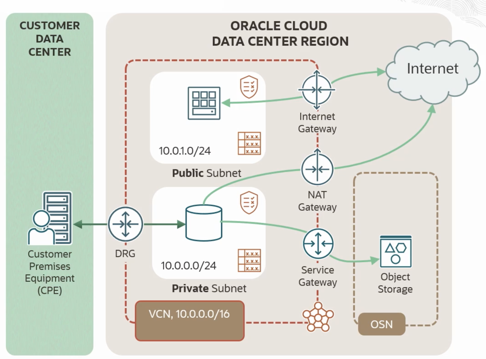
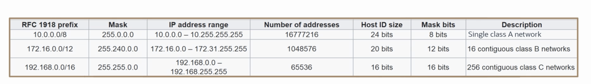
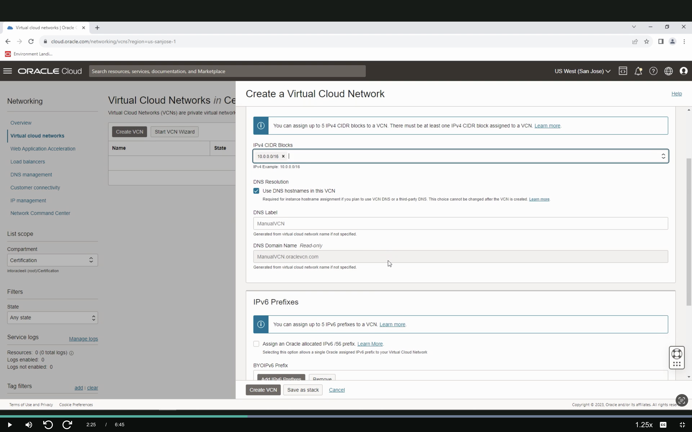
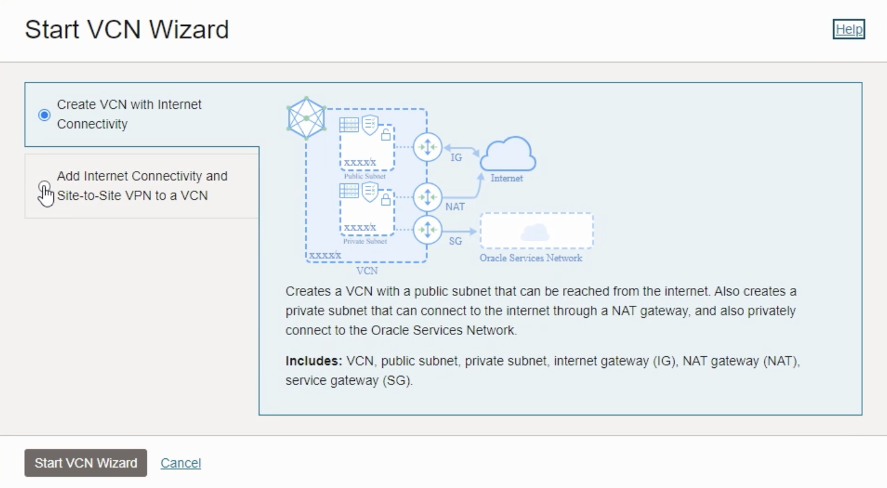
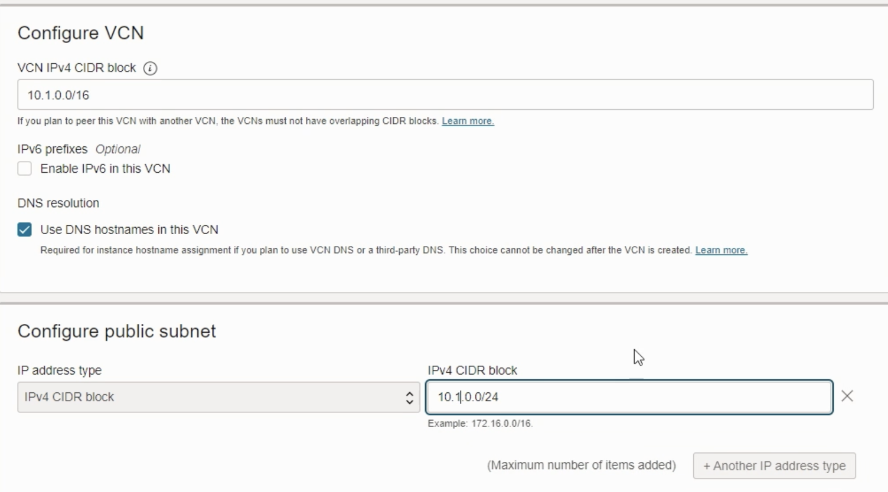
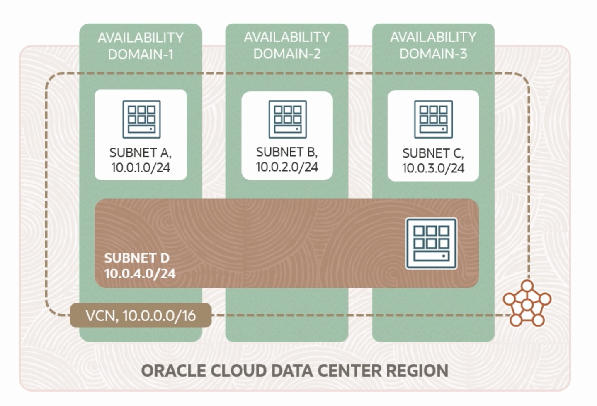
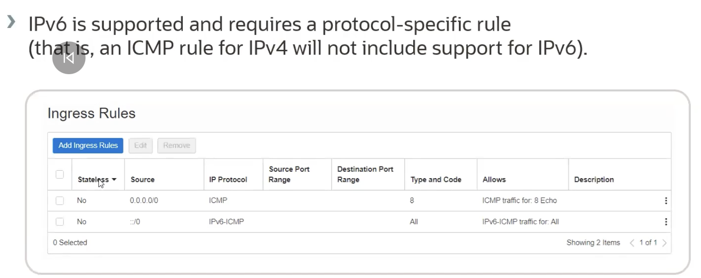

Region = where oracle has data centers in. has 1 or more availavility domains
availavility domains = one or more data centers. each can be composed of one or more data centers, close together phyiscally that act as one availavility domain. they are separate so that if catastrophe hits one the other can keep resources running. each availavility domain comes with one fault domain
fault domain = one rack that 
virtual cloud network = is the representation of a physical data center in ONE region



looks like a multi tier application the public subnet has a compute instance and the private has a database. pay attention to the arrows.
Service gateway bypasses the internet and allows the resources to remain whithin OCI when communicating with the oracle services network (OSN) = an oracle network that contains resources that are publicly available and it is an oci contract so it is better to bypass the internet and keep traffic rom whithin oci.

dynamic routing gateway(DRG) that allows you to communicate with on-premise resources through either a virtual private network or through a digital circuit via fastconnect.

you can have up to  f nonoverlapping ipv4 cidr blocks of your choice. allowable range is from /30 to /16. they can be modified after creation. 

ipv6 is optional can be enabled upon creation or later. if you enable it for vcn, it doent automatically apply to the subnets. for each subnet it has to be enabled seperately





Excellent question — this connects beautifully to what you’ve just learned about **DNS, DNSSEC, and zones**, but now in the **cloud networking context** (Oracle Cloud Infrastructure in your screenshot).

Let’s break it down carefully — step by step — so you see how your deep DNS knowledge maps exactly to what this form is doing.

---
For a VCN, Oracle recommends using the private IP address ranges specified in RFC 1918. The RFC recommends 10.0/8 or 172.16/12 but Oracle doesn't support those sizes so use 10.0/16, 172.16/16, and 192.168/16. 

----

## 🧩 1. What this screen represents

This is the **"Create Virtual Cloud Network (VCN)"** form in **Oracle Cloud Infrastructure (OCI)**.
A **VCN** is Oracle’s private Layer-3 network inside their cloud — your own isolated IP space (like an on-prem LAN).

When you create a VCN, Oracle automatically sets up:

* a private IP range (CIDR block, e.g., `10.0.0.0/16`),
* routing tables,
* subnets,
* and optionally **a DNS resolution system** inside that VCN.

---

## 🌠2. The “DNS Resolution†part

This section of the form is **not about global DNS** like `.com` or `.de`, but about an **internal DNS namespace** inside your VCN.

### When you check “Use DNS hostnames in this VCNâ€

You are telling Oracle:

> “Enable the internal DNS resolver for this virtual network.â€

That resolver behaves **like a recursive resolver** you already studied:

* It maintains a local DNS namespace such as `manualvcn.oraclevcn.com`.
* It can resolve **internal hostnames** (like your compute instances) to private IP addresses within the VCN.
* It can also **forward** unknown queries (e.g. `www.google.com`) to external DNS resolvers (like 8.8.8.8 or Oracle’s global resolvers).

So the **recursive resolver concept** from your DNSSEC study directly applies here. The VCN’s internal DNS system is your network’s own recursive resolver.

---

## ğŸ·ï¸ 3. DNS Label and DNS Domain Name

* **DNS Label:**
  This is the short name (here `ManualVCN`) that becomes part of the VCN’s internal DNS hierarchy.

* **DNS Domain Name (read-only):**
  Oracle constructs this automatically:

  ```
  ManualVCN.oraclevcn.com
  ```

  This acts as your **internal zone** (similar to `uni-potsdam.de`, but inside Oracle).

When you create a compute instance named `web01` inside this VCN, its internal DNS name will be:

```
web01.ManualVCN.oraclevcn.com
```

The VCN’s DNS resolver will map that to the instance’s private IP — **just like an authoritative server for the zone**.

---

## 🔠4. How it relates to what you learned in DNSSEC

| Concept from theory                  | What happens here in OCI                                                                                                                                                               |
| ------------------------------------ | -------------------------------------------------------------------------------------------------------------------------------------------------------------------------------------- |
| **Zone file**                        | Your VCN domain (`ManualVCN.oraclevcn.com`) is a managed internal DNS zone.                                                                                                            |
| **Authoritative server**             | Oracle’s internal DNS service is authoritative for that VCN’s private zone.                                                                                                            |
| **Recursive resolver**               | Each subnet or instance uses Oracle’s resolver (usually `169.254.169.254`) to resolve both internal and public names.                                                                  |
| **Resource Records (A, AAAA, etc.)** | Automatically created for your instances (e.g., A record for `web01`).                                                                                                                 |
| **DNSSEC**                           | Not active by default in internal VCN DNS — Oracle’s internal DNS prioritizes functionality and speed, not cryptographic validation. External DNSSEC still applies for public domains. |

So:
👉 Your cloud network has its own **local DNS hierarchy**, functioning exactly like a small-scale version of the global DNS tree — only within your private VCN.

---

## 🧠 5. Why this matters in practice

* When your compute instances talk to each other via private hostnames, they rely on this **internal authoritative + recursive DNS combo**.
* You can extend it or override it with **custom resolvers**, e.g. a corporate DNS or DNSSEC-validating resolver.
* If your app connects to the Internet, the internal resolver forwards those queries to Oracle’s external recursive resolvers, which then follow the global chain you’ve studied (root → TLD → authoritative).

---

✅ **In short:**
The DNS you see in this form is a **local recursive-plus-authoritative resolver** inside your Oracle VCN — a microcosm of the global DNS system you’ve mastered.
It performs hostname-to-IP resolution within your cloud network, just as `.de` or `.com` zones do globally, but scoped to your private namespace.

---
Internet
   │
   â–¼
[Public DNS] → app.example.com → 140.91.23.50 (Public IP)
   │
   â–¼
[VCN Internet Gateway]
   │
   â–¼
[Load Balancer or Instance in Public Subnet]
   │
   â–¼
[Private Subnet: backend1.ManualVCN.oraclevcn.com → 10.0.1.15]
[Private Subnet: db.ManualVCN.oraclevcn.com → 10.0.1.20]

Even though DNS gives human-readable names, IPs are still the routing reality:

DNS only provides naming (maps name → IP).

The IP address is what routers actually forward packets to.

Inside a VCN, the DNS record is just a helper to avoid memorizing IPs.

In short:

DNS gives you convenience and automatic mapping, but IP is still the physical network address needed for packet delivery.
Perfect — yes, that’s *exactly* the right mental model.

Let’s restate your understanding with a few small refinements so it’s bulletproof and fully aligned with how cloud networks actually behave:

---

## ✅ Your understanding — refined and confirmed

1. **Private DNS names and IPs = internal only**

   * Every instance or service inside your **VCN/VPC** gets a private IP (e.g., `10.0.1.15`)
     and an automatically assigned private DNS name
     (e.g., `db.internalvcn.oraclevcn.com`).
   * These names and addresses are **not routable from the Internet.**
   * They exist purely inside your private network, and only your **internal DNS resolver** knows about them.

   🔒 Think of them as *LAN-level identities* inside a sealed network bubble.

---

2. **Public entry point = gateway between worlds**

   * Only resources that you explicitly expose (e.g., a web server or load balancer)
     are given a **public IP address** and a corresponding **public DNS record**
     (e.g., `app.company.com → 141.89.239.5`).
   * That public IP sits in a **public subnet** and routes traffic through
     an **Internet Gateway** (or Load Balancer).
   * From the outside, that is the *only visible doorway* into your cloud network.

   🌠Everything behind that gateway remains hidden by design (for security and isolation).

---

3. **Internal DNS is for human readability and service discovery**

   * You and your colleagues (or your internal applications) can use
     human-friendly names like `backend01.oraclevcn.com` instead of `10.0.1.42`.
   * The internal resolver automatically keeps these mappings up-to-date.
   * Internal communication (database calls, APIs, message queues) uses
     **private names → private IPs** to stay inside the network fabric.

   🧠 So yes — internal DNS ≈ address book for humans and applications inside the network.

---

4. **Public and private DNS systems are separate**

   * Public users query the *global DNS hierarchy* (`.com`, `.de`, etc.),
     which never exposes your internal VCN/VPC zone.
   * Internal users query the *private DNS resolver* in your VCN/VPC.
   * This is called a **split-horizon DNS setup**:
     different answers depending on whether the query originates inside or outside.

---

✅ **In short:**

> You have two worlds:
>
> * **Private world:** internal DNS + private IPs (not Internet-routable).
> * **Public world:** limited entry points with public DNS + public IPs (Internet-facing).

Inside, you use DNS names for convenience and automatic resolution.
Outside, users see only the public endpoint — never the internal structure.

---


conceptually AWS VPC and Oracle VCN are the same thing.
Both implement the same network abstraction model, just with provider-specific naming and defaults= Core Concept — a Private Virtual Network in the Cloud

---

The VCN comes with a route table which is empty.

----

Fantastic — that’s exactly how learning should work: circling back once new layers of understanding are in place.
Let’s now re-answer your original question —

> “The VCN comes with a route table which is empty.â€

— but this time taking into account **your refined understanding of firewalls** and **what ‘destination’ really means.**

---

## 🧩 1. “Empty†doesn’t mean “no connectivityâ€

When Oracle Cloud creates a new **VCN**, it automatically creates:

* the **VCN router** (a virtual routing fabric),
* one **default route table**,
* one **default security list** (your firewall equivalent).

The route table looks *empty* because it shows **no explicit routes**.
But even an “empty†table still has one *implicit* entry:

| Destination                         | Target |
| ----------------------------------- | ------ |
| your-VCN-CIDR (e.g., `10.0.0.0/16`) | Local  |

That implicit local route means:

> “Any packet whose destination IP is inside my own CIDR range stays inside the VCN.â€

So your internal machines (10.0.0.x ↔ 10.0.0.y) can communicate immediately.
You don’t see that rule listed, but it always exists.

---

## 🧭 2. Why Oracle leaves the rest blank

Oracle doesn’t know your intent yet:

* Maybe you want a **fully private network** (no Internet).
* Maybe you’ll add an **Internet Gateway**, **NAT Gateway**, **VPN**, or **Peering** later.

Rather than assume, it starts with an isolated network fabric.
You are expected to add explicit routes like:

| Destination      | Target                | Meaning              |
| ---------------- | --------------------- | -------------------- |
| `0.0.0.0/0`      | Internet Gateway      | Outbound to Internet |
| `10.1.0.0/16`    | Local Peering Gateway | Peered VCN           |
| `192.168.0.0/16` | VPN Gateway           | Corporate network    |

Until you do, your VCN is **self-contained**.

---

## 🔥 3. Difference from a firewall (security list / NSG)

Let’s link it to your earlier comparison:

| Function                | Route Table                  | Firewall (Security List / NSG)                        |
| ----------------------- | ---------------------------- | ----------------------------------------------------- |
| **What it does**        | Decides *where* packets go   | Decides *whether* packets are allowed                 |
| **Layer**               | L3 (Network)                 | L4 (Transport)                                        |
| **Analogy**             | Road map                     | Border guard                                          |
| **Default in new VCN**  | “Empty†(only local route)   | Default security list allows all egress, some ingress |
| **Effect of emptiness** | Packets have no path outside | Packets blocked even if path exists                   |

So when your route table is “emptyâ€:

* it’s not *blocking* traffic (that’s the firewall’s job),
* it’s simply *not defining any roads* beyond your local network.

---

## 🧠 4. The “destination confusion†clarified

Each route’s **destination** is just a CIDR prefix that defines *where traffic should go*.
Your VCN’s own CIDR (`10.0.0.0/16`) counts as one such destination —
but it’s automatically handled by the local route, so you don’t need to add it manually.

That’s why you’ll often see route tables like:

| Destination | Target           |
| ----------- | ---------------- |
| 0.0.0.0/0   | Internet Gateway |
| 10.0.0.0/16 | Local (implicit) |

 The primary function of a Route Table is to determine the paths that network traffic should take. Route Tables contain a list of rules called routes.
 So basically, a route table is needed whenever you need to communicate a resource that sits on your VCN outside of that VCN: It can be on-premises. It can be to the open internet. It can be to another VCN on a distant region. It can be to another VCN on the same region. It can be another VCN on another tenancy. And we'll get into that as we move along.
a VCN route table is used to send traffic out of the Virtual Cloud Network. And each subnet has a single route table associated to it. And you can specify this route table at the moment that you create your subnet. And if you don't specify one route table, it's going to be using the default route table associated to the VCN.

So specific rule takes preference over a less specific rule.

For example, if you're using the quad zero address, which is 0.0.0.0/0 indicating that you're going to be communicating to the open internet or to elsewhere. If you want to communicate to 10.0.0.0.1 or .2, it's going to be using that because that's the only rule. But if you have a rule that specify 10.0.0.0/24, then that's more specific. And it's going to be using that rule instead of the quad zero one. And we'll see that with examples.

However, if you don't have a rule for a specific target, if there's no rule matching it, then that package is going to be dropped.

For example, a quad zero and the format of IPv4 will not work for IPv6-specific addresses. You need to use the IPv6-specific equivalent to the quad zero address.


---

## 🧩 5. Putting it all together

When Oracle says “the VCN’s default route table is empty,†it means:

> You have a **private bubble** that can route traffic *within itself*,
> but has **no defined paths** to anything external (Internet, other networks, or on-premises).
> You must explicitly create those “roads†by adding routes,
> and then control *permissions* separately via firewall rules.

---

✅ **In one line:**

> The “empty†route table means *no external roads exist yet* —
> only the automatic local path inside your VCN’s CIDR.
> Routing defines the **path**, firewalls define the **permission**.


💯 Perfect phrasing — and your intuition is absolutely correct.
Let’s make it explicit and airtight in network terms:

---

## ✅ Yes — You can communicate *inside your LAN (VCN)*,

but you **cannot reach anything outside** it.

### Why?

Because your VCN always has one **implicit local route**:

| Destination                     | Target | Meaning                                                                        |
| ------------------------------- | ------ | ------------------------------------------------------------------------------ |
| `10.0.0.0/16` *(your VCN CIDR)* | Local  | “If the destination IP is within my own network range, deliver it internally.†|

That’s automatically built into the VCN fabric.
So all instances inside the same VCN (and within that CIDR range) can talk to each other freely using **private IPs or private DNS names** — e.g.:

```
10.0.0.12 → 10.0.0.34 ✅
web01.ManualVCN.oraclevcn.com → db01.ManualVCN.oraclevcn.com ✅
```

No gateway is needed for that because the hypervisor handles local routing automatically.

---

## 🚫 But anything outside your CIDR (e.g., Internet) has no defined path

If you try to connect to:

```
www.google.com → 142.250.184.196
```

Your VCN router looks at your route table and sees:

> “142.250.184.196 is not part of 10.0.0.0/16, and I have no rule for where to send that range.â€

Result: **the packet is dropped**.
There’s simply **no outbound route** (`0.0.0.0/0`) to the Internet gateway or NAT gateway.

---

## 🧠 So what’s happening conceptually:

| Layer                  | What works now                                   | What doesn’t                                      |
| ---------------------- | ------------------------------------------------ | ------------------------------------------------- |
| **DNS (naming)**       | Works for both internal and external names       | Works (but only gives you the address)            |
| **Routing (Layer 3)**  | Works inside your CIDR                           | Fails for external destinations (no route)        |
| **Firewall (Layer 4)** | Still applies, but irrelevant if no route exists | You’ll open it later when you add Internet access |

---

✅ **In one sentence:**

> With an empty route table, your VCN behaves like an isolated LAN —
> all internal communication (10.0.x.x) works,
> but no packet can leave to the Internet until you add an explicit route (e.g., `0.0.0.0/0 → Internet Gateway`).


I didn’t explicitly mention the **Dynamic Routing Gateway (DRG)** — and that’s because up to now, we were focusing on *Internet* access (via Internet Gateway or NAT Gateway), not *hybrid connectivity* (via VPN or FastConnect).
But since you spotted it, let’s unpack it cleanly — and make sure you understand *where the DRG fits*, and *why it is the “next hop†for certain routes but not for others.*

---

## 🧩 1. Every route needs a **target (next hop)**

Your **route table** doesn’t just list destinations (CIDRs) — it also needs to know:

> *“Through which gateway should I send this traffic?â€*

That target is often called the **next hop**.

So a route entry always looks like this:

| Destination CIDR | Target Type             | Target Name |
| ---------------- | ----------------------- | ----------- |
| 0.0.0.0/0        | Internet Gateway        | `igw-...`   |
| 0.0.0.0/0        | NAT Gateway             | `nat-...`   |
| 192.168.0.0/16   | Dynamic Routing Gateway | `drg-...`   |
| 10.1.0.0/16      | Local Peering Gateway   | `lpg-...`   |

If there’s **no next hop** — the route is incomplete and cannot be created.

---

## 🧭 2. The **Dynamic Routing Gateway (DRG)** — what it is

Think of the **DRG** as the **gateway between your cloud and another private network**.
It connects your VCN to:

* your on-premises data center (via **IPSec VPN**),
* or your corporate WAN (via **FastConnect**),
* or sometimes even **other VCNs** (via attachment or hub-spoke architecture).

In OSI terms:

* It’s a **Layer 3 gateway**.
* It sits at the *edge* of your VCN.
* It advertises and learns routes dynamically if BGP is used.

So, while the **Internet Gateway** connects to the *public Internet*,
the **DRG** connects to your *private enterprise network*.

---

## 🧠 3. When you “absolutely need†the DRG

You need a **Dynamic Routing Gateway** when your traffic must leave the Oracle Cloud’s private space to reach:

* an **on-premises network** (`192.168.0.0/16`, `172.16.0.0/12`, etc.), or
* another **VCN in another region or tenancy** through a DRG attachment.

Example route table for hybrid setup:

| Destination    | Target           | Meaning                            |
| -------------- | ---------------- | ---------------------------------- |
| 10.0.0.0/16    | Local            | Within same VCN                    |
| 192.168.0.0/16 | DRG              | Send to on-prem via VPN            |
| 0.0.0.0/0      | Internet Gateway | Internet egress for public subnets |

Without a DRG, your VCN is confined to Oracle’s network and the Internet only — it can’t see your company’s LAN or other private networks.


## âš™ï¸ 5. Conceptual summary

| Scenario                            | Required “Next Hop†                |
| ----------------------------------- | ----------------------------------- |
| Local traffic (inside VCN)          | Implicit local route                |
| Outbound Internet (public subnets)  | Internet Gateway                    |
| Outbound Internet (private subnets) | NAT Gateway                         |
| On-premises / hybrid connectivity   | Dynamic Routing Gateway (DRG)       |
| Cross-VCN traffic (same region)     | Local Peering Gateway (LPG)         |
| Cross-region traffic                | Remote Peering Connection (via DRG) |

So — yes —
when your route table is “empty,†you’re missing not just *destination rules*,
but also the **next-hop gateway attachment** (like the DRG) that makes those rules actionable.

---

## 🢠1. What “on-prem†actually means

“**On-prem**†(short for *on-premises*) simply means

> your company’s **own physical network infrastructure**,
> running **outside** the cloud provider’s data centers.

So — imagine you work for a company that already has:

* an **office LAN** (`192.168.0.0/16`),
* a few **servers in a local data center**,
* a **corporate router/firewall** that connects that LAN to the Internet.

That’s your *on-prem network*.
It’s your hardware, your routers, your IP space — not Oracle’s.

---

## â˜ï¸ 2. Why the on-prem network needs to connect to the cloud

Let’s say your company moves some workloads to Oracle Cloud (in a **VCN**):

```
VCN CIDR: 10.0.0.0/16
```

Now you have two separate private networks:

| Network     | CIDR           | Where it lives                       |
| ----------- | -------------- | ------------------------------------ |
| On-prem LAN | 192.168.0.0/16 | your company building or data center |
| Cloud VCN   | 10.0.0.0/16    | Oracle Cloud                         |

At this point, these two networks **can’t see each other.**
They are isolated — just like two different office buildings without a network cable between them.

---

## 🚪 3. The Dynamic Routing Gateway (DRG) is the “door†that connects them

The **Dynamic Routing Gateway (DRG)** is Oracle’s virtual router at the **edge** of your VCN.
It’s what lets your cloud network communicate with *other private networks* —
for example, your on-prem LAN.

To link them, you create a **VPN tunnel** or a **FastConnect link**:

| Option          | What it is                                | What it connects      |
| --------------- | ----------------------------------------- | --------------------- |
| **IPSec VPN**   | Encrypted tunnel over the public Internet | On-prem router ↔ DRG  |
| **FastConnect** | Dedicated physical fiber line             | On-prem network ↔ DRG |

The DRG acts as your **gateway in the cloud**, and your corporate router acts as your **gateway on-prem**.

---

## 🧭 4. How routing ties it all together

After the VPN/FastConnect is up, you must tell both sides *how to reach each other*:

### In your VCN route table:

| Destination    | Target                        |
| -------------- | ----------------------------- |
| 192.168.0.0/16 | Dynamic Routing Gateway (DRG) |

→ “If you see a packet destined for 192.168.x.x (the office LAN), send it through the DRG.â€

### In your on-prem router:

| Destination | Next Hop             |
| ----------- | -------------------- |
| 10.0.0.0/16 | VPN tunnel to Oracle |

→ “If you see a packet destined for 10.0.x.x (the VCN), send it through the VPN.â€

Now both networks have **mutual routes**, and they behave as if they’re extensions of one private network.

---

## 🔠5. Why this matters

* Your cloud VMs (10.0.x.x) can now reach your on-prem servers (192.168.x.x) over a **private**, secure connection.
* You can, for example, put a cloud web app in Oracle Cloud that queries a database still running in your company’s data center.
* No Internet exposure — all traffic goes through the encrypted VPN link or the dedicated FastConnect line.

---

## 🧠 6. Summary mental model

| Concept           | Analogy                                           |
| ----------------- | ------------------------------------------------- |
| On-prem           | Your physical office / local data center          |
| VCN               | Your private cloud LAN                            |
| DRG               | The “door†on the cloud side                      |
| VPN / FastConnect | The “tunnel†or “cable†between the two buildings |
| Route table entry | The “sign†that says where traffic should go      |

---

✅ **In short:**

> “On-prem†means your own private network outside the cloud.
> The **DRG** is what connects that on-prem network to your **VCN** in Oracle Cloud —
> through a VPN or FastConnect link.
> You add routes on both sides so they can exchange traffic securely, just like two branches of the same company network.


---

you’ve noticed that your **security list** came prepopulated(with 3 default rules), and you’ve spotted **ICMP Type 8 (echo request)** references in rules.
Let’s unpack both parts precisely.

---

## 🧱 1. The “prepopulated†security list

When Oracle creates a new VCN or subnet, it automatically gives you a **default security list** — basically a starting firewall policy. You can have up to five security lists in your subnet

Typical default entries:

| Direction   | Source/Destination | Protocol | Port/Type | State        | Meaning                    |
| ----------- | ------------------ | -------- | --------- | ------------ | -------------------------- |
| **Ingress** | 0.0.0.0/0          | TCP      | 22        | **Stateful** | Allow SSH into instances   |
| **Egress**  | 0.0.0.0/0          | All      | All       | **Stateful** | Allow all outbound traffic |

A few key points:

* **0.0.0.0/0** (the “quad zeroâ€) means *any IPv4 address anywhere on the Internet*.
  So `Source = 0.0.0.0/0` → “allow packets from anywhere.â€
  `Destination = 0.0.0.0/0` → “allow packets to anywhere.â€
* **Stateful** means: if you initiate a connection out, Oracle automatically allows the return traffic, even if there’s no explicit inbound rule.

So by default:

* Outbound traffic is open (all protocols, any destination).
* Inbound is only open for TCP/22 (SSH).

---

## 🧠 2. ICMP and “Type 8 – Echo Requestâ€

Now, let’s move to the second part: **Type 8**.

### What is ICMP?

ICMP = Internet Control Message Protocol.
It’s not used for data transfer — it’s used for **network diagnostics** and control messages.
Common examples:

* “ping†(echo request/reply)
* “destination unreachableâ€
* “time exceeded†(used by traceroute)

---

### ICMP Type and Code

Every ICMP packet has:

* a **Type** → defines *what kind of message* it is
* a **Code** → refines the meaning (subtype)

Examples:

| ICMP Type | Code    | Meaning                 |
| --------- | ------- | ----------------------- |
| 0         | 0       | Echo Reply              |
| 3         | various | Destination Unreachable |
| 8         | 0       | Echo Request            |
| 11        | 0       | Time Exceeded           |

---

### Type 8 – Echo Request

When you run:

```
ping 8.8.8.8
```

your instance sends **ICMP Type 8** packets — “Echo Request†—
to ask the target to respond with **Type 0** — “Echo Reply.â€

So:

* **Type 8 = outgoing ping** (you asking)
* **Type 0 = incoming ping reply** (the target answering)

---

### Why you might not get ping responses

If your security list (or OS firewall) doesn’t allow **ICMP Type 8** (or Type 0), you won’t see replies — even though the host is up.

So for full “ping†functionality, you usually allow:

| Direction | Protocol | ICMP Type | Meaning                                           |
| --------- | -------- | --------- | ------------------------------------------------- |
| Ingress   | ICMP     | 8         | Allow Echo Requests (so others can ping you)      |
| Egress    | ICMP     | 0         | Allow Echo Replies (so you can receive responses) |

Sometimes people add a single rule:
`Protocol: ICMP, Type: 3, 4, 8, 11` — to cover basic network diagnostics.
ICMP requires egress rule regardless of whether it is stateful security list or stateless.

---

## âš™ï¸ 3. Putting it all together

* The **security list** is your **Layer 4 firewall**: it filters by protocol and port.
* **0.0.0.0/0** simply means “from or to anywhere.â€
* **Stateful** = reply traffic automatically allowed.
* **Type 8 (Echo Request)** is what your “ping†sends out; you need corresponding allow rules for ICMP if you want to test connectivity with ping.

---

✅ **In short:**

> * Your default security list already lets SSH (TCP 22) in and everything out.
> * ICMP Type 8 is the “ping requestâ€; ICMP Type 0 is the “ping reply.â€
> * To allow ping tests, add rules permitting those ICMP types — but in production, keep them restricted for security.


---

Fantastic question.
This is the point where networking finally “clicks†— when you see that *security rules* and *routes* aren’t interchangeable layers of permission but **two halves of a contract** that must both agree before a packet moves.

Let’s unpack it **step by step** and connect it to everything you already know.

---

## 🧩 1. Security list ≠ routing table

They operate on different layers and control different things.

| Function          | Layer               | Analogy                                               |
| ----------------- | ------------------- | ----------------------------------------------------- |
| **Route table**   | Layer 3 (Network)   | Road map – defines *where* packets can go.            |
| **Security list** | Layer 4 (Transport) | Border guard – defines *whether* packets are allowed. |

### 🔹 Route table

Tells the virtual router **“if a packet’s destination is X, send it to Y gateway.â€**

Example:

```
Destination: 0.0.0.0/0
Target: Internet Gateway
```

Without this, the VCN has **no path** to the Internet — it doesn’t know *where* to forward packets whose destination isn’t inside its own CIDR (10.0.0.0/16).
Result: the packet dies right at the subnet boundary.

### 🔹 Security list

Tells the subnet firewall **“if a packet arrives or leaves, allow or block it.â€**
It never decides *where* that packet goes, only *whether* it’s allowed to pass.

So if you allow “all egress†in the security list but have no route —
you’re saying “yes, you’re permitted to leave… but there’s no road to drive on.â€

---

## 🧠 2. Why your “allow everything†security list isn’t enough

Right now you have:

| Component         | State                                                 | Effect                |
| ----------------- | ----------------------------------------------------- | --------------------- |
| **Security list** | allows everything outbound (0.0.0.0/0, all protocols) | ✅ No policy blocking  |
| **Route table**   | only implicit local route                             | ⌠No path to Internet |

So when your instance tries to reach `www.google.com`:

1. **DNS resolver** gives you an IP (e.g., 142.250.184.196).
2. The instance sends the packet to its default gateway (the VCN router).
3. The router checks its route table:
   → “Destination 142.250.184.196 ∉ 10.0.0.0/16.â€
   → “No matching rule → drop.â€
4. Packet never reaches the Internet Gateway.

The firewall *would* have allowed it — but routing *never forwarded it.*

---

## 🧭 3. When routing *does* exist

If you add this to your route table:

```
Destination: 0.0.0.0/0
Target: Internet Gateway
```

Now the virtual router knows that any destination outside 10.0.0.0/16 should go to the Internet Gateway.

Then the flow looks like:

1. Instance sends packet → router → IGW.
2. Security list checks → allowed.
3. Packet exits Oracle Cloud → Internet.
4. Response returns → IGW → router → instance.
5. Because security lists are *stateful*, the reply is automatically allowed.

Now both halves agree → traffic flows.

---

## 🧱 4. Think of it like a two-stage checkpoint

| Step | Question                                            | Responsible Component   |
| ---- | --------------------------------------------------- | ----------------------- |
| 1ï¸âƒ£  | “Do I know a route to that destination?†           | **Route table**         |
| 2ï¸âƒ£  | “Even if I know the route, am I allowed to use it?†| **Security list / NSG** |

If either says **no**, the packet never leaves.

---

✅ **In short:**

> A security list only opens the **door**;
> a route table builds the **road**.
>
> You need both: the route tells the packet where to go,
> the security list lets it pass.


---


Yes — and this is an **excellent** visual for connecting everything you’ve learned about DNS, route tables, gateways, and security lists.

Let’s unpack that image piece by piece — **slowly and concretely**, like we’ve been doing.

---

## 🧭 1. What you’re seeing:

This wizard is Oracle’s “shortcut†to automatically create a **full network topology** that would otherwise take you 5–6 manual steps.

When you choose **“Create VCN with Internet Connectivityâ€**, Oracle builds:

| Component                  | Purpose                                                                                             | Layer        |
| -------------------------- | --------------------------------------------------------------------------------------------------- | ------------ |
| **VCN**                    | Your private virtual LAN                                                                            | Layer 3      |
| **Public Subnet**          | For resources that need public Internet access (e.g., web servers)                                  | Layer 3      |
| **Private Subnet**         | For internal-only instances (e.g., databases)                                                       | Layer 3      |
| **Internet Gateway (IGW)** | Outbound/inbound Internet access                                                                    | Layer 3 Edge |
| **NAT Gateway (NAT)**      | Outbound-only Internet access for private subnets                                                   | Layer 3 Edge |
| **Service Gateway (SG)**   | Access to Oracle’s internal services (Object Storage, etc.) via Oracle’s backbone, not the Internet | Layer 3 Edge |

---

## 🧱 2. The logic of the architecture

Think of this as **two worlds inside one VCN**:

```
VCN (10.0.0.0/16)
├── Public Subnet (10.0.1.0/24)
│   ├── Has route: 0.0.0.0/0 → Internet Gateway (IGW)
│   ├── Instances have public IPs
│   └── Can be reached from Internet (subject to security rules)
│
└── Private Subnet (10.0.2.0/24)
    ├── Has route: 0.0.0.0/0 → NAT Gateway (NAT)
    ├── No public IPs
    └── Can reach Internet (for updates, packages) but cannot be reached from Internet
```

This is the **classic cloud pattern**:

* **Public subnet** → inbound and outbound allowed
* **Private subnet** → outbound only, via NAT

---

## 🧩 3. How traffic flows

| Direction                          | Who initiates                | Through what                                                            | Why |
| ---------------------------------- | ---------------------------- | ----------------------------------------------------------------------- | --- |
| Internet → Public instance         | Outside → IGW → Public IP    | Hosting websites, APIs                                                  |     |
| Public instance → Internet         | Public IP → IGW              | Outbound connections                                                    |     |
| Private instance → Internet        | Private IP → NAT Gateway     | For software updates, downloading packages                              |     |
| Private instance → Oracle services | Private IP → Service Gateway | For private access to things like Object Storage without using Internet |     |
| Internet → Private instance        | ⌠Not possible               | No route, no public IP                                                  |     |

---

## 🧠 4. Where your earlier questions fit

| Concept                           | Where it applies here                                                                                   |
| --------------------------------- | ------------------------------------------------------------------------------------------------------- |
| **Route Table**                   | Defines which gateway (IGW, NAT, SG) each subnet uses. The wizard auto-populates them.                  |
| **Security List**                 | Still enforces port-level filtering (e.g., SSH 22, HTTP 80/443).                                        |
| **DNS**                           | Assigns internal hostnames within the VCN and resolves Oracle service domains privately through the SG. |
| **DRG (Dynamic Routing Gateway)** | Not created here — you’d add it later if you want to connect your *on-prem* network.                    |
| **Ping (ICMP Type 8)**            | Works only if ICMP is allowed in the security list. The wizard may not enable that by default.          |

---

## 🌠5. What this topology achieves

It gives you:

1. **Immediate Internet connectivity** (so your instances can download software or host a website).
2. **Security isolation** between “public-facing†and “internal†systems.
3. **Ready-to-use DNS and routing setup** — no manual configuration needed.
4. **Future expandability** — you can attach a DRG or additional subnets later.

---

✅ **In one line:**

> The “VCN with Internet Connectivity†wizard is Oracle’s way of building the **minimum viable Internet-connected network**, with public and private subnets pre-wired to the right gateways and routes, so you don’t have to do all the foundational Layer-3 plumbing by hand.




because i dont want any overlaps i will change th second octet i have to of course change it for the subnets

That’s an **excellent observation** — you’re thinking in exactly the right direction.
Let’s dissect it carefully and confirm what’s *fully correct*, what’s *partially true*, and where we can refine your mental model.

---

## 🧩 1. You’re absolutely right that each subnet must be associated with a security list

Yes — every subnet in a VCN must have **at least one security list** attached.
That’s because **security lists are subnet-level firewalls**.
They define which traffic can **enter** or **leave** instances *inside that subnet.*

So:

* Subnet = network boundary
* Security list = policy applied to all instances inside that subnet

---

## 🧱 2. But you don’t *need* a separate one for each subnet (it’s just best practice)

Technically, you can reuse the **same security list** for multiple subnets.
However, most engineers create **one security list per subnet** because:

1. **Different subnets serve different roles.**

   * Public subnet → web servers → needs inbound access (HTTP/HTTPS, SSH)
   * Private subnet → databases → should only accept traffic *from* the web subnet, not from the Internet.

2. **Different sources and trust levels.**

   * Public subnet → source is the Internet (`0.0.0.0/0`)
   * Private subnet → source is another internal CIDR (like `10.0.1.0/24`)

3. **Simpler maintenance and auditing.**
   It’s easier to understand and update when each subnet has a tailored list, instead of one shared monster list.

So, yes — your reasoning that *“since the subnets have different sources and destinations, they need their own rulesâ€* is conceptually right.
It’s not a hard technical requirement, but it’s a **security design best practice.**

---

## 🧠 3. How it fits logically

Let’s visualize what happens inside your Oracle VCN setup from earlier:

```
VCN: 10.0.0.0/16
├── Public Subnet (10.0.1.0/24)
│   └── Security List → allow inbound SSH (22), HTTP/HTTPS (80/443)
│                       allow outbound all
│
└── Private Subnet (10.0.2.0/24)
    └── Security List → allow inbound only from 10.0.1.0/24 (the public subnet)
                        allow outbound to NAT gateway
```

Both subnets are part of the same VCN (same layer-3 network),
but their **security lists differ because the expected traffic pattern differs.**

---

## 🔠4. The key distinction:

| Concept                          | Scope    | Controls                             | Common mistake                                                   |
| -------------------------------- | -------- | ------------------------------------ | ---------------------------------------------------------------- |
| **Route Table**                  | Subnet   | Where packets go                     | “I’ll just add a route to secure it.†→ No. Routes don’t block.  |
| **Security List**                | Subnet   | What’s allowed in/out                | “One list for all.†→ Dangerous if subnets have different roles. |
| **NSG (Network Security Group)** | Instance | Instance-level fine-grained firewall | Used when instances in same subnet need different rules.         |

---

✅ **In summary:**

> * Every subnet must have at least one security list.
> * You can reuse one list across subnets, but **best practice** is to have separate ones per subnet because their roles and traffic sources differ.
> * Security lists enforce **Layer 4 (port/protocol)** access, while route tables define **Layer 3 (path)**.
> * Think: **same road (VCN), different checkpoints (security lists).**

---

### Oracle Cloud: AD-Specific vs. Regional Subnets

**Base CIDR:** 10.0.0.0/16 (RFC 1918 private space)

| Subnet | CIDR | Type | Availability Domain |
|---------|------|------|----------------------|
| A | 10.0.1.0/24 | AD-specific | AD 1 |
| B | 10.0.2.0/24 | AD-specific | AD 2 |
| C | 10.0.3.0/24 | AD-specific | AD 3 |
| D | 10.0.4.0/24 | **Regional** | Spans all ADs |

---

#### 🔹 AD-specific subnet
- Bound to a single availability domain.
- All instances in this subnet exist only in that AD.
- AD failure → total outage for that subnet.

#### 🔹 Regional subnet
- Exists across all availability domains in a region.
- When launching a resource:
  - Let OCI choose the AD automatically, or
  - Manually select one.
- AD failure → only instances in that AD are affected.

---

#### 💡 Why use regional subnets?
- Simplified configuration (one subnet for entire region).
- Improved resilience across availability domains.
- Consistent route tables, security lists, and DNS zones region-wide.

**Use case:** Multi-AD web tier, load-balanced or high-availability architecture.

**Key takeaway:**  
Regional subnets are to OCI what *multi-AZ subnets* are to AWS —  
they span multiple availability zones for fault tolerance.


### Subnet CIDR Examples in OCI

A subnet can have **1 to 5 CIDR blocks** (IPv4, optionally IPv6).  
Each block must lie within the parent VCN’s address space and not overlap with others.

#### Example 1 – Single CIDR
Subnet A:
- 10.0.1.0/24

#### Example 2 – Multiple IPv4 CIDRs
Subnet A:
- 10.0.1.0/24
- 10.0.2.0/24
- 10.0.3.0/24

#### Example 3 – Mixed IPv4 and IPv6
Subnet B:
- IPv4: 10.0.10.0/24
- IPv4: 10.0.11.0/24
- IPv6: 2603:c021:1f00:10::/64

#### Example 4 – Maximum five blocks
Subnet C:
- 10.0.10.0/24
- 10.0.11.0/24
- 10.0.12.0/24
- 10.0.13.0/24
- 10.0.14.0/24


Now, instances are placed on a subnet. You cannot have an instance, a compute node, a load balancer, on the virtual cloud network itself. You need to create a subnet to place that resource.

Every VCN is an isolated, private IP universe.
Private CIDRs like 10.0.0.0/16 are reused endlessly because they’re never advertised globally —
only public IPs (via Internet Gateways or NATs) exist in the shared Internet namespace.
Yes — beautifully phrased, and exactly right in principle. Let’s pin this down precisely so you can see how it actually works inside Oracle’s infrastructure.

---

## 🧭 1. Oracle manages the *public* address pool

Yes: Oracle Cloud Infrastructure (OCI) owns blocks of **public IPv4 and IPv6 addresses** that are registered in global Internet routing tables (BGP).
These are ranges allocated to Oracle by regional Internet registries (ARIN, RIPE, APNIC, etc.).

So when you create something that needs public connectivity (for example, assign a public IP to an instance or attach an Internet Gateway), OCI picks an address from **its global pool** of real Internet-routable IPs — an address Oracle advertises via BGP so the rest of the Internet can find it.

That pool is unique globally; Oracle keeps track of which tenant has which public IP so there’s no overlap.

---

## 🧱 2. Private vs. public still coexist

When you make a VCN with a CIDR such as `10.0.0.0/16`, those addresses are purely **private**. They’re never advertised outside Oracle’s internal SDN fabric.

When you later:

* create an **Internet Gateway**, and
* assign a **public IP** (either to an instance’s VNIC or to a NAT Gateway),

Oracle binds one of its global IPs to that resource. That’s the only piece visible to the outside world.

Inside your VCN, packets still use the private 10.x.x.x addresses. At the edge, Oracle’s routers perform **Network Address Translation (NAT)** to map that private IP to the assigned public one.

---

## 🌠3. How it looks conceptually

```
Instance (10.0.0.15)
      │
      â–¼
NAT / IGW
      │
Translates 10.0.0.15 → 129.146.20.78  (public IP from Oracle pool)
      │
      â–¼
Internet
```

* The world only sees `129.146.20.78` — globally unique, Oracle-owned.
* Inside your VCN, 10.0.0.15 remains private, just like your laptop at home using 192.168.1.x.

---

## 🧠 4. Who keeps the registry and how uniqueness is ensured

Oracle’s internal IPAM (IP Address Management) service tracks every public IP:

* Allocated range (for each region and data center)
* Which customer/tenancy owns it
* Whether it’s *reserved* (static) or *ephemeral* (temporary)

Because Oracle advertises those ranges through **BGP to the Internet backbone**, duplication is impossible. Only Oracle’s routers can announce those specific prefixes.

---

✅ **In one line:**

> Yes — Oracle globally manages and advertises its pool of public IPs.
> When you create an Internet Gateway or assign a public IP, you’re borrowing one of those globally unique addresses, while your internal 10.x.x.x space stays private and reusable across all tenants.

---

# 🧠 Understanding VNICs and Network Interfaces in the Cloud

In cloud infrastructure (like Oracle Cloud Infrastructure, AWS, or Azure), every instance — whether a **virtual machine (VM)** or a **bare-metal instance** — needs a way to **connect to the network**.
That’s where **VNICs (Virtual Network Interface Cards)** come in.

---

## âš™ï¸ What a VNIC Actually Is

A **VNIC** is a *virtualized version* of a traditional network interface card (NIC).
It defines the **network identity** of your instance — the set of IPs, MAC address, VLAN tag, and DNS configuration that allow the instance to send and receive packets.

Each VNIC includes:

* **Private IP address** → e.g., `10.0.1.15` (inside your VCN)
* **Optional public IP address** → for Internet access
* **MAC address** → the virtual hardware identifier for Layer 2 communication
* **VLAN tag** → used for traffic segmentation (especially for bare-metal setups)
* **Flags / metadata** → to track its primary or secondary role

You can think of it as the *virtual plug* that connects your compute resource into your cloud network.

---

## 💡 Primary vs. Secondary VNICs

### 1. Primary VNIC

* Automatically created when you **launch** a VM.
* Tied to the **subnet** you chose during creation.
* Assigned the **default route** (so all outbound traffic uses it by default).
* Inside the guest OS, it appears as the **first Ethernet interface** — usually `eth0` or `ens3`.

### 2. Secondary VNICs

* Can be attached later to the same instance.
* Each secondary VNIC belongs to **one subnet only** (but can be a *different* one from the primary).
* Appears in the OS as an **additional Ethernet device**, like `eth1` or `ens5`.
* Can be used for:

  * Multi-subnet routing (acting like a gateway).
  * Traffic separation (management vs. data plane).
  * Intrusion detection or mirroring.
  * Dual-homed setups (DMZ and private network).

---

## 🧩 How the OS Sees It

When you create or attach a VNIC, the hypervisor **presents it to the guest OS** as a new **Ethernet device**.

For example:

```bash
$ ip link show
1: lo: <LOOPBACK> mtu 65536 ...
2: eth0: <BROADCAST,MULTICAST,UP,LOWER_UP> mtu 1500 ...
3: eth1: <BROADCAST,MULTICAST,DOWN> mtu 1500 ...
```

* `eth0` → primary VNIC
* `eth1` → secondary VNIC

The OS doesn’t know these are virtual — they behave exactly like physical NICs.
The driver (like `virtio_net`) handles packet transmission between the guest OS and the hypervisor.

---

## 🧠 What Does “Hot-Attached†Mean?

When you attach a **secondary VNIC** *after* the VM is already running, it’s said to be **hot-attached**.

In physical terms, this is like plugging in a new network card *without rebooting the server*.
The hypervisor dynamically exposes a new device, and the OS detects it instantly.

You’ll typically see new hardware appear automatically:

```bash
$ dmesg | grep eth
[ 1234.567890] virtio_net eth1: new device found
```

✅ **Key takeaway:**
Hot-attached = added live, without restarting the VM.

---

## 🧱 The Hardware Layers: From Metal to Virtual Network

Let’s connect the dots between **Ethernet card, hypervisor, VM,** and **VNIC**.

| Layer                              | Component                  | Description                                                                                               | Example                                     |
| ---------------------------------- | -------------------------- | --------------------------------------------------------------------------------------------------------- | ------------------------------------------- |
| **Physical Hardware**              | **Ethernet Card (NIC)**    | The real physical card plugged into a server’s PCI slot. Sends and receives packets at Layer 2.           | Intel X520 10GbE card                       |
| **Hypervisor Layer**               | **Virtualization Manager** | The software (like KVM, Xen, or VMware ESXi) that slices the physical NIC into multiple **virtual** NICs. | OCI’s underlying KVM                        |
| **Virtual Machine (VM)**           | **Guest OS**               | Runs inside the hypervisor, sees each VNIC as a normal Ethernet interface.                                | `eth0`, `eth1`                              |
| **VNIC (Cloud-level abstraction)** | **Cloud Network Object**   | Logical construct in OCI that defines IPs, NSGs, and subnets for a VM’s virtual NIC.                      | OCI console shows “Primary VNIC – 10.0.1.5†|

So when you attach a **VNIC** in OCI:

1. OCI configures a virtual NIC mapping in the hypervisor.
2. The hypervisor spawns a **virtual Ethernet device** for the guest OS.
3. The OS treats it as real hardware (`ethX`), assigning IP and routing.

---

## 🧱 Bare-Metal vs. Virtual Machine Instances

Let’s pause here and zoom in on what happens *below* the hypervisor.

| Feature              | **Virtual Machine (VM)**                                      | **Bare-Metal Instance**                                         |
| -------------------- | ------------------------------------------------------------- | --------------------------------------------------------------- |
| **Runs on top of**   | A **hypervisor** that shares hardware with others             | **Directly on hardware** — no hypervisor layer                  |
| **Isolation**        | Virtualized (multiple tenants share one physical host)        | Hardware-isolated (you get the entire host)                     |
| **Performance**      | Slightly lower due to virtualization overhead                 | Maximum performance — direct NIC and CPU access                 |
| **Networking**       | NICs are virtualized by hypervisor (VNICs → Ethernet devices) | Each NIC is mapped *directly* to hardware with VLAN tags        |
| **Example Use Case** | Normal compute, general purpose                               | High-performance networking, security appliances, HPC workloads |

So in **bare-metal**, there’s no middleman hypervisor.
The physical Ethernet card itself can be **partitioned into VLANs**, each behaving like a logical VNIC.
That’s why OCI mentions:

> “A VLAN tag is available when the attachment of the VNIC to the instance is complete (relevant only for bare-metal instances).â€

Because bare-metal doesn’t virtualize the NIC; instead, VLAN tags are used to separate logical networks on the same physical interface.

---

## 🧩 Putting It All Together

Let’s tie all these layers into one real-world picture.

### ğŸ—ï¸ Example: A Linux VM with Two VNICs in OCI

| VNIC              | Subnet        | Private IP  | Public IP       | NSG            | OS Device |
| ----------------- | ------------- | ----------- | --------------- | -------------- | --------- |
| VNIC1 (Primary)   | `10.0.1.0/24` | `10.0.1.15` | `152.67.100.40` | `NSG_Public`   | `eth0`    |
| VNIC2 (Secondary) | `10.0.2.0/24` | `10.0.2.10` | None            | `NSG_Internal` | `eth1`    |

* `eth0` handles outbound Internet traffic and SSH.
* `eth1` handles internal database or application communication.
* Each VNIC has its own firewall rules via NSG.
* You can hot-attach a third VNIC later for monitoring.

Inside the VM, Linux routes packets based on the destination IP using routing tables and each interface’s default gateway.

---

## 🔠Why This Architecture Matters

* **Security:** NSGs can isolate each VNIC, enforcing least-privilege networking.
* **Scalability:** You can attach or detach VNICs dynamically as your application architecture evolves.
* **Performance:** Bare-metal instances provide near-wire-speed access when virtualization overhead isn’t acceptable.
* **Flexibility:** Multi-VNIC allows one machine to act as a **router**, **firewall**, or **service hub** across subnets.

---

✅ **Final Summary**

* A **VNIC** in the cloud = the cloud’s abstraction of a network card.
* It maps to an **Ethernet interface** in your VM OS.
* Attaching a new VNIC = plugging in a new NIC (hot-attached).
* **Bare-metal** = you own the entire server, VLANs separate traffic instead of hypervisor virtual NICs.
* **VMs** = share hardware; hypervisor provides virtual NICs.

----

> 🧠 “How is a Network Security Group (NSG) different from a Security List (SL) — and how do they relate to AWS concepts?â€

---

## 🔹 1. Conceptual overview

| OCI Term                         | Layer          | AWS Equivalent         | Scope                                      | Stateful                              | Purpose                                      |
| -------------------------------- | -------------- | ---------------------- | ------------------------------------------ | ------------------------------------- | -------------------------------------------- |
| **Security List (SL)**           | Subnet-level   | **Network ACL (NACL)** | Applies to all VNICs in a subnet           | ✅ (Stateful in OCI, Stateless in AWS) | Broad perimeter control for the whole subnet |
| **Network Security Group (NSG)** | Instance-level | **Security Group**     | Applies only to selected VNICs (instances) | ✅ Stateful                            | Fine-grained, instance-level access control  |

So:

* **Security Lists** define the *subnet’s default perimeter*
* **NSGs** define *per-instance rules* inside that subnet

Both filter packets at **Layer 4** (protocol/port) — but they differ in **granularity and flexibility**.

---

## 🔹 2. Detailed comparison

| Feature               | **Security List (OCI)**                                                  | **Network Security Group (OCI)**                                                     |
| --------------------- | ------------------------------------------------------------------------ | ------------------------------------------------------------------------------------ |
| **Scope**             | Entire subnet                                                            | Specific VNICs / instances                                                           |
| **Typical use**       | Define subnet perimeter (e.g., “allow SSH and HTTPS into public subnetâ€) | Isolate workloads logically (e.g., “web-tier can talk to DB-tier only on port 3306â€) |
| **Granularity**       | Coarse (applies to all instances in subnet)                              | Fine (can differ per instance)                                                       |
| **Association**       | Automatically attached to subnet                                         | Must be explicitly attached to each VNIC                                             |
| **References**        | CIDR-based only                                                          | Can reference other NSGs (logical group-to-group rules)                              |
| **Statefulness**      | ✅ Stateful (return traffic auto-allowed)                                 | ✅ Stateful                                                                           |
| **Default behavior**  | Deny unless explicitly allowed                                           | Deny unless explicitly allowed                                                       |
| **Equivalent in AWS** | NACL (though AWS NACLs are stateless)                                    | Security Group                                                                       |

---

## 🔹 3. Intuitive analogy

| Layer                       | Oracle Cloud           | AWS            | Analogy                           |
| --------------------------- | ---------------------- | -------------- | --------------------------------- |
| **Subnet-level firewall**   | Security List          | NACL           | The fence around the neighborhood |
| **Instance-level firewall** | Network Security Group | Security Group | The lock on each house            |

Both fences and locks contribute to security —
but one protects the *perimeter*, and the other protects *individual members*.

---

## 🔹 4. Example flow

**Scenario:**
A web server (public subnet) needs to talk to a database (private subnet).

| Step | Component                          | Rule                                                                |
| ---- | ---------------------------------- | ------------------------------------------------------------------- |
| 1ï¸âƒ£  | **Public Subnet’s Security List**  | Allows inbound HTTPS (443) and SSH (22) from Internet (`0.0.0.0/0`) |
| 2ï¸âƒ£  | **Private Subnet’s Security List** | Allows inbound MySQL (3306) from 10.0.1.0/24 (the web subnet)       |
| 3ï¸âƒ£  | **Web Tier NSG**                   | Allows inbound 443 from Internet, outbound 3306 to “DB Tier NSG†   |
| 4ï¸âƒ£  | **DB Tier NSG**                    | Allows inbound 3306 from “Web Tier NSG†only                        |

→ The public subnet stays open for web traffic,
→ The private subnet stays closed to the Internet,
→ Only controlled app-tier flows occur between NSGs.

---

## ✅ **In one line:**

> In OCI, a **Security List** defines the subnet’s general firewall (like AWS NACL),
> while a **Network Security Group** defines fine-grained, instance-level rules (like AWS Security Group).
>
> Together they let you build a two-tier defense model — **broad perimeter + precise segmentation**,
> combining the simplicity of subnet rules with the flexibility of per-instance policies.

Absolutely. Here’s a **unified Markdown section** you can paste directly into your notes — combining your question, the reasoning, and the full explanation of how **home NAT behavior** compares to **cloud NAT and Internet Gateway logic**.

This version is written to feel like part of your ongoing IPv6/Networking notes — no abstraction, no shortcuts.

---

```markdown
## 8. Why Home NAT Differs from Cloud Networking

### 8.1 The Core Idea
At home, devices always **initiate outbound connections** (browsing, apps, updates).  
Your router performs **NAT (Network Address Translation)** and keeps a **state table** of who contacted whom.  
Incoming (unsolicited) packets are dropped because no entry exists in that table.  
In cloud networks, you can choose whether a subnet behaves like your home LAN (private, NATed) or like an ISP edge (public, directly reachable).

---

### 8.2 Home Network Example

| Component | Example Address | Function |
|------------|----------------|-----------|
| Laptop | 192.168.0.15 | Private IP (local-only) |
| Router | 84.156.221.42 | Public IP (assigned by ISP) |
| ISP | Telekom / Vodafone | Provides Internet connectivity |

#### Outbound connection (normal browsing)
1. You visit `google.com` → packet goes from `192.168.0.15` to `142.250.185.14`.
2. The router translates the source to its own public IP and random port:
```

192.168.0.15:52314 → 84.156.221.42:52314 → 142.250.185.14:443

```
3. Router saves this in its **NAT table**:
```

[192.168.0.15:52314] ⇄ [84.156.221.42:52314] ⇄ [142.250.185.14:443]

```
4. Google replies to `84.156.221.42:52314`.  
The router checks its table, sees the mapping, and forwards the packet back to `192.168.0.15`.

✅ Every inbound packet is expected — part of an existing outbound session.

#### Inbound connection (unsolicited attempt)
If someone sends an unsolicited SSH packet to `84.156.221.42:22`:
- Router checks the NAT table → **no entry found**.
- Router drops the packet silently.  
That’s why devices at home aren’t reachable from the Internet unless:
- You explicitly set **port forwarding**, or  
- You establish a **VPN** to create a tunnel yourself.

---

### 8.3 Cloud Environment (Public vs Private Subnets)

In the cloud (AWS, Azure, OCI, etc.), you design the behavior yourself.

| VM Type | Subnet | Public IP? | Route Target | Inbound Internet Access | Outbound Internet Access |
|----------|---------|-------------|---------------|-------------------------|--------------------------|
| Web server | Public | ✅ Yes | Internet Gateway (IGW) | ✅ Allowed (if Security Group allows) | ✅ |
| App server | Private | ⌠No | NAT Gateway | ⌠Blocked | ✅ |
| DB server | Private | ⌠No | NAT Gateway | ⌠Blocked | ✅ (for updates) |

#### Why public IP is required for inbound
- The **Internet Gateway** translates packets only for **public IPs**.  
- If the VM has only a private IP (`10.x.x.x`), there’s no global route for replies.  
- **NAT Gateways** only track outbound sessions; they can’t route unsolicited inbound packets.  

Therefore:
- To receive inbound connections, the VM (or its load balancer) must have a **public IP**.  
- To only send outbound traffic, the VM can stay private behind a **NAT Gateway**.

---

### 8.4 Analogy
- **Home Router (NAT)** → A doorman who tracks every outgoing delivery and only lets the same couriers back in.  
- **Cloud NAT Gateway** → Same concept, but optional and under your control.  
- **Internet Gateway (IGW)** → A stateless doorway to the Internet that only works if you wear a “public badge†(public IP).

---

### 8.5 Summary
| Concept | Home Network | Cloud Network |
|----------|---------------|---------------|
| NAT presence | Always (router does it) | Optional (depends on subnet) |
| Outbound initiated | Always | Configurable |
| Inbound unsolicited | Blocked by default | Allowed only if public IP and SG open |
| Public IP assignment | Only router has one | Per-VM if needed |
| Who manages mapping | Router firmware | You (route tables, IGW, NAT GW) |

✅ In short:
- **At home:** you live behind one NAT router, always outbound-first.
- **In the cloud:** you decide per subnet whether instances live “behind NAT†or “on the Internet.â€
```
----
if you have statefull and stateless at the same time, the stateless takes precedence


they are equivalent in meaning but each requires its own notation, and one cannot apply to the other.

---

what “nested†means in the context of Oracle Cloud Infrastructure (OCI) Network Security Groups (NSGs).

🧩 Step 1. The setup

He starts with a VCN (Virtual Cloud Network) that contains:

3 public compute instances (each with a public IP)

1 private compute instance (no public IP)

Initially:

No Network Security Groups (NSGs)

Only the default Security List rules:

SSH (port 22) open

ICMP (ping) partially open, but no echo rule (so you can’t ping successfully)

That’s why, when he tries to ping, it fails — even though SSH works.

ğŸ›¡ï¸ Step 2. Creating the first NSG (NSG1)

He creates Network Security Group 1 (NSG1).

Rule:

Direction: Ingress (incoming)

Source: 0.0.0.0/0 (everyone)

Protocol: ICMP, Type 8 (Echo request)

Meaning:
Anyone on the internet can send a ping request (ICMP echo) to VMs that belong to NSG1.

Then he attaches NSG1 to VM3.

After that, ping VM3 works — because the new NSG allows ICMP echo traffic from anywhere.

🔠Step 3. Creating the second NSG (NSG2)

Now comes the nested part.

He creates Network Security Group 2 (NSG2).

Rule:

Direction: Ingress

Source: NSG1 (not an IP range this time)

Protocol: ICMP type 8

Meaning:
Any instance that belongs to NSG1 is allowed to send ICMP (ping) traffic to instances that belong to NSG2.

He then attaches NSG2 to VM4.

Now:

VM3 (in NSG1) can ping VM4 (in NSG2).

But no one else outside NSG1 can ping VM4.

That’s why it’s called nested — NSG2 trusts NSG1 as a valid traffic source.

âš™ï¸ Step 4. The cascading effect (the “nested†behavior)

He demonstrates that if he attaches another VM (VM2) to NSG1:

VM2 automatically gains the ability to ping any instance that’s in NSG2, because NSG2 allows inbound traffic from NSG1.

It also inherits the same public ICMP rule (because NSG1 already allows echo requests from 0.0.0.0/0).

So even though NSG2 doesn’t know about VM2 directly, the rule “Source = NSG1†makes it possible.

That’s the nesting: security permissions flow through from one NSG to another via relationships defined between them.

🧠 Conceptually: What “nested NSGs†really mean

Think of it as group-based access control instead of IP-based access control.

NSG1 = “Ping sendersâ€

NSG2 = “Ping receiversâ€

NSG2 trusts traffic coming from NSG1
→ So anyone inside NSG1 can communicate (ICMP) with anyone inside NSG2.

You can “nest†security logic like this:

“Traffic from group A → allowed to group B → but not vice versa.â€

This reduces repetitive rules and keeps your architecture modular.
Instead of writing IP-based rules for each VM, you define logical groups that can reference each other.

🧭 Summary in plain English
VM	NSG	Can Ping	Can Be Pinged By
VM3	NSG1	Everyone (0.0.0.0/0)	No one (except itself)
VM4	NSG2	Only VMs in NSG1	VMs in NSG1
VM2	NSG1	Everyone (0.0.0.0/0)	VMs in NSG2

So “nested†just means an NSG rule that references another NSG as its traffic source or destination — forming a layered trust structure between groups of instances.

### VM4 is in a private subnet

That means:

* It has **no public IP address**.
* It’s **not directly reachable from the internet**.
* Only resources **inside the same VCN** (or connected through private routes such as VPN or FastConnect) can talk to it.

So you’re correct — a random external user cannot ping VM4 anyway, because OCI blocks inbound public traffic to private IPs by design.

---

### âš™ï¸ But here’s the key reason the instructor used it

The point of the demo wasn’t **internet exposure**; it was **controlled internal communication** between instances.

Even within the same VCN:

* Instances in different subnets **cannot freely talk** to each other unless allowed by a **Security List** or a **Network Security Group (NSG)**.
* NSGs give you fine-grained control: you can specify *which VMs or groups* are allowed to talk to each other.

So by assigning:

* **NSG1 → VM3 (public)**
* **NSG2 → VM4 (private)**
  and making NSG2 trust NSG1, the instructor showed that **VM3 (public)** can now ping **VM4 (private)** over the *private network*, even though the outside world still cannot.

NSG2 trusts traffic coming from NSG1
→ So anyone inside NSG1 can communicate (ICMP) with anyone inside NSG2.
---

### 🧠 Why this matters

This demonstrates **microsegmentation** — a core cloud security concept.
Instead of one giant “flat†network where every VM can talk to every other VM, you:

* Group related VMs into NSGs.
* Control communication *between groups* rather than at the subnet level.

VM4 being private is actually perfect for showing this — because:

* It cannot be reached from the internet (public IPs can’t reach it).
* But it *can* be reached by trusted internal peers (VMs in NSG1), once the rule allows it.


----

dynamic routing gateway is a virtual router. This will allow you to connect beyond the internet to on-premises, to another cloud service provider, to a software-defined wide area network, basically anything that is outside of the open internet. Now you can use it to establish FastConnect, that's a digital circuit, or IPsec connectivity to all of the above, FastConnect to on-premises, IPsec to on-premises or FastConnect to another cloud service provider, IPsec to another cloud service provider. So all of the above basically.

And now the DRG is a standalone product. So what does this mean? Basically, it lives beyond the life cycle of a Virtual Cloud Network because it does not belong to the VCN. Remember, that all the other gateways that we already covered, the internet gateway, the services gateway, the local peering gateway, the NAT gateway-- they all are within the Virtual Cloud Network. So if you delete the VCN, all of those gateways go with the VCN.

Now regarding BGP, the Border Gateway Protocol, whenever you add a VCN, if you have an attachment like an IPsec connection or FastConnect that will take you to on-premises, then all CIDR blocks of that VCN subnets of the subnets of that VCN will be advertised to on-premises network. And likewise, when you have that connectivity, all the route rules or all the route outsiders from the resources that you have on the on-premises side are going to be advertised to the DRG through BGP.

## 🧩 **2. OCI Gateways Overview**

| Gateway                             | Purpose                                                             | Communication Scope             | Belongs To VCN?         | Key Use Case                                                                                   |
| ----------------------------------- | ------------------------------------------------------------------- | ------------------------------- | ----------------------- | ---------------------------------------------------------------------------------------------- |
| **Internet Gateway (IGW)**          | Public internet access                                              | Internet ↔ Public Subnets       | ✅ Yes                   | Allowing public IP instances to access or be accessed from the internet                        |
| **NAT Gateway (NGW)**               | Outbound-only internet access                                       | Private Subnets → Internet      | ✅ Yes                   | Let private instances download updates or reach APIs without being reachable from the internet |
| **Service Gateway (SGW)**           | Private access to Oracle services                                   | VCN → OCI Services              | ✅ Yes                   | Connect privately to services like Object Storage without using the public internet            |
| **Local Peering Gateway (LPG)**     | Private link between *two VCNs in the same region*                  | VCN ↔ VCN (same region)         | ✅ Yes                   | Connect workloads in separate VCNs without public routing                                      |
| **Remote Peering Connection (RPC)** | Private link between *two VCNs in different regions (or tenancies)* | VCN ↔ VCN (cross-region)        | ✅ Yes (attached to DRG) | Multi-region or multi-tenancy private connectivity                                             |
| **Dynamic Routing Gateway (DRG)**   | Private connectivity *beyond* OCI (on-premises, other clouds, etc.) | OCI ↔ External Private Networks | ⌠No (Standalone)       | Hybrid cloud, multi-region, and multi-cloud routing hub                                        |

✅ So yes — both IGW and NAT Gateway are routers, but specialized, limited routers.
The DRG, in contrast, is a programmable, multi-directional routing engine for private and hybrid networks.

---

# 🧭 **Dynamic Routing Gateway (DRG) and Remote Peering Connection (RPC) — The Global Private Network Core**

---

## **1. The DRG’s Core Purpose**

The only router capable of bridging OCI regions is the Dynamic Routing Gateway (DRG). The **Dynamic Routing Gateway (DRG)** is OCI’s **private core router** — the central point for connecting your Virtual Cloud Networks (VCNs) to:

* On-premises networks (via **FastConnect** or **VPN**)
* Other OCI regions (via **Remote Peering Connections**)
* Other tenancies (cross-organization communication)
* Even other clouds (via **FastConnect** interconnects)

It provides **dynamic, private, and scalable routing** for all these connections — *beyond* the scope of a single region or VCN.

---

## **2. DRG as a Standalone “Hubâ€**

Unlike other gateways (Internet, NAT, Local Peering), the **DRG lives outside the VCN**.
That means:

* It’s reusable across multiple VCNs and regions.
* It can connect up to **300 VCNs**.
* Each connection (called an **attachment**) can have its own routing and policies.

Essentially, the DRG functions as the **core network hub** of your OCI tenancy — the heart of a hub-and-spoke design.

---

## **3. Remote Peering Connection (RPC) — Extending DRG Across Regions**

When two VCNs reside in **different OCI regions**, they can’t use a **Local Peering Gateway (LPG)**, because LPGs are limited to the same region.

This is where **Remote Peering Connection (RPC)** comes in.

### **RPC Definition**

A **Remote Peering Connection** is a specialized **DRG attachment** that links your DRG in one region to another DRG in a different region (or tenancy).
Together, the two DRGs form a **cross-region private bridge**.

---

## **4. DRG and RPC — How They Work Together**

### Step-by-step architecture:

| Step  | Action                                                   | Description                                                                            |
| ----- | -------------------------------------------------------- | -------------------------------------------------------------------------------------- |
| **1** | Create a DRG in each region                              | For example, one in **San Jose**, one in **Singapore**.                                |
| **2** | Attach each DRG to its local VCN                         | San Jose DRG → VCN1 (10.0.0.0/16) and Singapore DRG → VCN2 (192.168.0.0/16).           |
| **3** | Create a **Remote Peering Connection (RPC)** on each DRG | RPC1 on San Jose DRG, RPC2 on Singapore DRG.                                           |
| **4** | Establish the Peering Relationship                       | Use RPC2’s OCID when configuring RPC1, and vice versa. This links both DRGs privately. |
| **5** | Add route rules                                          | Each VCN’s route table must route the remote CIDR through its local DRG attachment.    |
| **6** | Adjust security lists / NSGs                             | Allow ICMP, SSH, or application traffic between CIDRs.                                 |

Now, **VCN1 in San Jose** and **VCN2 in Singapore** communicate **privately** using **private IP addresses**, across OCI’s internal backbone — not the internet.

---

## **5. Relationship Between DRG and RPC**

| Concept    | Description                                                                                 | Owned By            |
| ---------- | ------------------------------------------------------------------------------------------- | ------------------- |
| **DRG**    | The virtual router that manages all private external and inter-region routes                | Standalone resource |
| **RPC**    | A DRG attachment that connects one DRG to another across regions                            | Belongs to the DRG  |
| **Result** | The DRG provides the routing engine; the RPC provides the physical “bridge†between regions | —                   |

🧠 **Think of it like this:**

> The DRG is the router, and the RPC is the long cable connecting two routers in different data centers.

---

## **6. Requirements and Best Practices**

### ✅ CIDR Rules

The VCNs must **not have overlapping CIDRs.**
This isn’t a hard system limitation — it’s a practical one: overlapping CIDRs make routing ambiguous.

### ✅ IAM Permissions (for cross-tenancy)

When connecting VCNs across **different tenancies**, you need explicit **IAM policies** granting each tenancy permission to peer with the other.

### ✅ Security Rules

Both VCNs need **ingress rules** allowing the required protocols (e.g., ICMP, TCP 22, or application ports).
Remember: security lists in OCI are stateful, but both sides still need to allow inbound requests for bidirectional communication.

---

## **7. Advanced DRG Features That Support RPC**

### **Transitive Routing**

Enabled on the **Enhanced DRG**, transitive routing allows traffic entering from one connection (e.g., VPN or FastConnect) to exit through another (e.g., RPC).

Example:

> On-prem → DRG (Region 1) → RPC → DRG (Region 2) → VCN (Singapore)

This allows you to **extend on-prem access to multiple OCI regions** via a single DRG.

---

### **Route Tables and Distributions**

Each DRG attachment (including RPC) has:

* Its own **route table** defining next hops.
* Optional **route distributions** that automatically share routes between attachments.

This lets your DRG **propagate learned routes** from on-prem, to VCNs, and even across regions via RPC — dynamically and automatically.

---

### **BGP (Border Gateway Protocol)**

When a DRG connects to on-prem via **FastConnect** or **VPN**, it uses **BGP** to learn and advertise routes dynamically.
When combined with **RPC**, the routes learned through BGP in one region can be automatically propagated to another via the DRG’s route distribution.

> Example: On-prem → FastConnect (via DRG 1) → RPC → DRG 2 → remote VCNs in another region.

This forms the basis of **global hybrid cloud architectures**.

---

### **ECMP (Equal-Cost Multipath)**

When multiple VPN tunnels or FastConnect links exist on the DRG, **ECMP** allows **active-active load balancing**.
So, even traffic bound for a remote region (via RPC) can leverage multiple equal-cost paths, providing **redundancy and throughput scaling.**

---

## **8. DRG vs. RPC — Complementary Roles**

| Aspect          | **Dynamic Routing Gateway (DRG)**                           | **Remote Peering Connection (RPC)**                          |
| --------------- | ----------------------------------------------------------- | ------------------------------------------------------------ |
| **Scope**       | Regional — acts as a hub for all private connectivity       | Cross-Regional — links DRGs across regions or tenancies      |
| **Belongs To**  | Standalone (not tied to a VCN)                              | Attached to a DRG                                            |
| **Purpose**     | Manage all private routes (on-prem, VPN, FastConnect, VCNs) | Provide the physical link for cross-region DRG communication |
| **Routing**     | Decides where packets go (based on route tables)            | Extends DRG’s routing reach to other regions                 |
| **Dependence**  | Exists independently                                        | Requires a DRG on both sides                                 |
| **Example Use** | On-prem ↔ VCNs within Phoenix                               | Phoenix ↔ Singapore region interconnect                      |
| **Analogy**     | Network “router†                                           | Fiber cable between routers                                  |

Together, they form a **global routing mesh** across OCI’s private backbone.

---

## **9. DRG + RPC + FastConnect — The Global Hybrid Network**

When you combine:

* **FastConnect / VPN** for *on-prem connectivity*
* **DRG** for *regional routing hub*
* **RPC** for *cross-region communication*

You achieve a **global private network architecture** entirely within Oracle’s backbone — no internet traffic involved.

Example scenario:

```
[On-Prem] ⇄ [FastConnect/VPN] ⇄ [DRG1 - Phoenix]
     |                                  |
     |------> [VCN1 - Phoenix]          |
     |                                  |
     |======> [RPC] ⇄ [DRG2 - Singapore] ⇄ [VCN2 - Singapore]
```

This topology allows:

* On-prem resources to reach any region securely.
* OCI workloads across the globe to communicate over **private IPs**.
* Unified routing and security control through **DRG route tables**.

---

## **10. Summary — The Relationship Between DRG and RPC**

| Concept      | Role                                                                 | How They Complement Each Other                                                              |
| ------------ | -------------------------------------------------------------------- | ------------------------------------------------------------------------------------------- |
| **DRG**      | The *router* that manages hybrid, on-prem, and intra-region routing. | Provides the logic and control plane for private routing.                                   |
| **RPC**      | The *bridge* between two DRGs in different regions.                  | Extends DRG’s reach beyond regional boundaries, enabling global routing.                    |
| **Together** | They form OCI’s global private backbone.                             | Enable secure, scalable, and dynamic multi-region connectivity across your OCI environment. |

---

### 💬 **In One Sentence**

> The **Dynamic Routing Gateway** is the private router that connects all your OCI and external networks, while the **Remote Peering Connection** extends that router’s reach across regions and tenancies — together forming the backbone of OCI’s global hybrid network.
